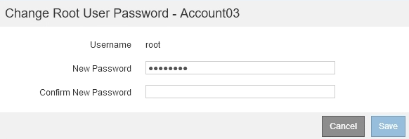

= Ändern des Kennworts für den lokalen Root-Benutzer eines Mandanten
:allow-uri-read: 
:icons: font
:imagesdir: ../media/

[role="lead"]
Möglicherweise müssen Sie das Passwort für den lokalen Root-Benutzer eines Mandanten ändern, wenn der Root-Benutzer aus dem Konto gesperrt ist.

.Was Sie benötigen
* Sie müssen über einen unterstützten Browser beim Grid Manager angemeldet sein.
* Sie müssen über spezifische Zugriffsberechtigungen verfügen.

.Über diese Aufgabe
Wenn Single Sign On (SSO) für Ihr StorageGRID-System aktiviert ist, kann sich der lokale Root-Benutzer nicht beim Mandantenkonto anmelden. Um Root-Benutzeraufgaben auszuführen, müssen Benutzer einer föderierten Gruppe angehören, die über die Root-Zugriffsberechtigung für den Mandanten verfügt.

.Schritte
. Wählen Sie *Mieter*.
+
Die Seite „Mandantenkonten“ wird angezeigt und enthält alle vorhandenen Mandantenkonten.

+
image::../media/tenant_accounts_page.png[Seite „Mandantenkonten“]

. Wählen Sie das Mandantenkonto aus, das Sie bearbeiten möchten.
+
Wenn Ihr System mehr als 20 Elemente enthält, können Sie festlegen, wie viele Zeilen auf jeder Seite gleichzeitig angezeigt werden. Verwenden Sie das Suchfeld, um nach einem Mandantenkonto zu suchen, indem Sie den Namen oder die Mandanten-ID anzeigen.

+
Die Schaltflächen „Details anzeigen“, „Bearbeiten“ und „Aktionen“ werden aktiviert.

. Wählen Sie im Dropdown-Menü *Aktionen* die Option *Root Passwort ändern* aus.
+

. Geben Sie das neue Kennwort für das Mandantenkonto ein.
. Wählen Sie *Speichern*.

.Verwandte Informationen
link:controlling-administrator-access-to-storagegrid.html["Kontrolle des Administratorzugriffs auf StorageGRID"]
