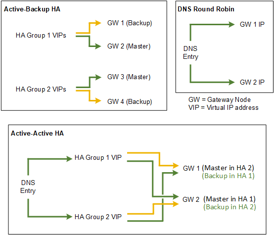

= Konfigurationsoptionen für HA-Gruppen
:allow-uri-read: 
:icons: font
:imagesdir: ../media/

[role="lead"]
Die folgenden Diagramme bieten Beispiele für verschiedene Möglichkeiten zum Konfigurieren von HA-Gruppen. Jede Option hat vor- und Nachteile.

Wenn mehrere sich überschneidende HA-Gruppen erstellt werden, wie im „aktiv/aktiv-HA-Beispiel“ dargestellt, wird der Gesamtdurchsatz mit der Anzahl der Nodes und HA-Gruppen skaliert. Mit drei oder mehr Nodes und drei oder mehr HA-Gruppen können außerdem Vorgänge mithilfe einer der VIPs fortgesetzt werden – selbst bei Wartungsarbeiten, bei denen ein Node offline geschaltet werden muss.

Die Tabelle enthält eine Zusammenfassung der Vorteile der einzelnen HA-Konfigurationen, die in der Abbildung dargestellt sind.

[cols="1a,1a,1a"]
|===
| Konfiguration | Vorteile | Nachteile 

 a| 
Aktiv/Backup HA
 a| 
* Management über StorageGRID ohne externe Abhängigkeiten
* Schnelles Failover.

 a| 
* In einer HA-Gruppe ist nur ein Node aktiv. Mindestens ein Node pro HA-Gruppe bleibt im Ruhezustand.

 a| 
DNS Round Robin
 a| 
* Erhöhter Aggregatdurchsatz:
* Keine leerlaufenden Hosts

 a| 
* Langsamer Failover, der vom Client-Verhalten abhängen kann.
* Konfiguration von Hardware außerhalb von StorageGRID erforderlich
* Benötigt eine vom Kunden implementierte Zustandsprüfung.

 a| 
Aktiv/Aktiv
 a| 
* Der Datenverkehr wird über mehrere HA-Gruppen verteilt.
* Hoher Aggregatdurchsatz, der mit der Anzahl der HA-Gruppen skaliert werden kann
* Schnelles Failover.

 a| 
* Komplexer zu konfigurieren.
* Konfiguration von Hardware außerhalb von StorageGRID erforderlich
* Benötigt eine vom Kunden implementierte Zustandsprüfung.

|===