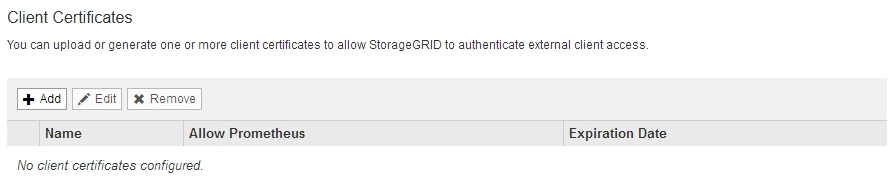
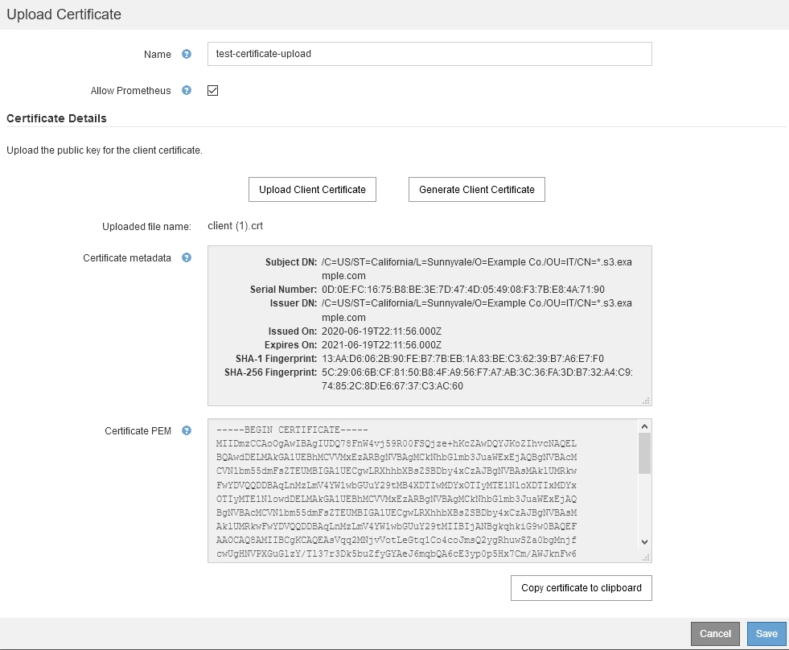

= Administrator-Client-Zertifikate werden konfiguriert
:allow-uri-read: 
:icons: font
:imagesdir: ../media/

[role="lead"]
Sie können Clientzertifikate verwenden, um autorisierten externen Clients den Zugriff auf die StorageGRID Prometheus-Datenbank zu ermöglichen. Clientzertifikate bieten eine sichere Möglichkeit zur Verwendung externer Tools zur Überwachung von StorageGRID.

Wenn Sie mit einem externen Monitoring-Tool auf StorageGRID zugreifen müssen, müssen Sie mithilfe des Grid Managers ein Clientzertifikat hochladen oder generieren und die Zertifikatsinformationen in das externe Tool kopieren.

== Hinzufügen von Administrator-Client-Zertifikaten

Zum Hinzufügen eines Clientzertifikats können Sie Ihr eigenes Zertifikat bereitstellen oder mit dem Grid Manager ein Zertifikat erstellen.

.Was Sie benötigen
* Sie müssen über die Berechtigung Root Access verfügen.
* Sie müssen über einen unterstützten Browser beim Grid Manager angemeldet sein.
* Sie müssen die IP-Adresse oder den Domänennamen des Admin-Knotens kennen.
* Sie müssen das Zertifikat für den StorageGRID-Verwaltungsserver konfiguriert haben und über das entsprechende CA-Paket verfügen
* Wenn Sie Ihr eigenes Zertifikat hochladen möchten, müssen der öffentliche Schlüssel und der private Schlüssel für das Zertifikat auf Ihrem lokalen Computer verfügbar sein.

.Schritte
. Wählen Sie im Grid Manager die Option *Konfiguration* > *Zugriffskontrolle* > *Clientzertifikate* aus.
+
Die Seite Clientzertifikate wird angezeigt.

+

. Wählen Sie *Hinzufügen*.
+
Die Seite Zertifikat hochladen wird angezeigt.

+
image::../media/certificate_admin_upload.png[Zertifikat - Admin - Hochladen]

. Geben Sie einen Namen zwischen 1 und 32 Zeichen für das Zertifikat ein.
. Um über Ihr externes Monitoring-Tool auf die Prometheus-Kennzahlen zuzugreifen, aktivieren Sie das Kontrollkästchen *Prometheus erlauben*.
. Hochladen oder Generieren eines Zertifikats:
+
.. Um ein Zertifikat hochzuladen, gehen Sie <<upload_cert,Hier>>.
.. Gehen Sie zum Generieren eines Zertifikats <<generate_cert,Hier>>.

. [[Upload_cert]]] zum Hochladen eines Zertifikats:
+
.. Wählen Sie *Client-Zertifikat Hochladen*.
.. Suchen Sie nach dem öffentlichen Schlüssel für das Zertifikat.
+
Nachdem Sie den öffentlichen Schlüssel für das Zertifikat hochgeladen haben, werden die Felder *Certificate Metadaten* und *Certificate PEM* ausgefüllt.

+

.. Wählen Sie *Zertifikat in Zwischenablage kopieren* und fügen Sie das Zertifikat in Ihr externes Überwachungstool ein.
.. Verwenden Sie ein Bearbeitungswerkzeug, um den privaten Schlüssel in Ihr externes Überwachungstool zu kopieren und einzufügen.
.. Wählen Sie *Speichern*, um das Zertifikat im Grid Manager zu speichern.

. [[Generate_cert]]] zum Generieren eines Zertifikats:
+
.. Wählen Sie *Client-Zertifikat Erstellen*.
.. Geben Sie den Domänennamen oder die IP-Adresse des Admin-Knotens ein.
.. Geben Sie optional einen X.509-Studienteilnehmer ein, der auch als Distinguished Name (DN) bezeichnet wird, um den Administrator zu identifizieren, der das Zertifikat besitzt.
.. Wählen Sie optional die Anzahl der Tage aus, an denen das Zertifikat gültig ist. Der Standardwert ist 730 Tage.
.. Wählen Sie *Erzeugen*.
+
Die Felder *Certificate Metadaten*, *Certificate PEM* und *Certificate Private Key* sind ausgefüllt.

+
image::../media/certificate_admin_upload_generated.png[Zertifikat - Admin - Upload Generiert]

.. Wählen Sie *Zertifikat in Zwischenablage kopieren* und fügen Sie das Zertifikat in Ihr externes Überwachungstool ein.
.. Wählen Sie *Privatschlüssel in Zwischenablage kopieren* und fügen Sie den Schlüssel in Ihr externes Überwachungstool ein.
+

IMPORTANT: Nach dem Schließen des Dialogfelds können Sie den privaten Schlüssel nicht anzeigen. Kopieren Sie den Schlüssel an einen sicheren Ort.

.. Wählen Sie *Speichern*, um das Zertifikat im Grid Manager zu speichern.

. Konfigurieren Sie die folgenden Einstellungen für Ihr externes Monitoring-Tool, z. B. Grafana.
+
Ein Grafana-Beispiel ist im folgenden Screenshot dargestellt:

+
image::../media/grafana_add_url_and_auth.png[Grafana - URL und Auth hinzufügen]

+
.. *Name*: Geben Sie einen Namen für die Verbindung ein.
+
StorageGRID benötigt diese Informationen nicht, Sie müssen jedoch einen Namen angeben, um die Verbindung zu testen.

.. *URL*: Geben Sie den Domain-Namen oder die IP-Adresse für den Admin-Node ein. Geben Sie HTTPS und Port 9091 an.
+
Beispiel: `+https://admin-node.example.com:9091+`

.. Aktivieren Sie *TLS Client Authorization* und *mit CA Cert*.
.. Kopieren Sie das Zertifikat des Management Interface Server oder CA-Pakets unter TLS/SSL-Auth-Details auf das**CA-Zertifikat**.
.. *ServerName*: Geben Sie den Domainnamen des Admin-Knotens ein.
+
Servername muss mit dem Domänennamen übereinstimmen, wie er im Management Interface Server Certificate angezeigt wird.

.. Speichern und testen Sie das Zertifikat und den privaten Schlüssel, das Sie aus StorageGRID oder einer lokalen Datei kopiert haben.
+
Sie können jetzt mit Ihrem externen Monitoring Tool auf die Prometheus Kennzahlen von StorageGRID zugreifen.

+
Weitere Informationen zu den Metriken finden Sie in den Anweisungen für das Monitoring und die Fehlerbehebung von StorageGRID.

.Verwandte Informationen
link:using-storagegrid-security-certificates.html["StorageGRID-Sicherheitszertifikate werden verwendet"]

link:configuring-custom-server-certificate-for-grid-manager-tenant-manager.html["Konfigurieren eines benutzerdefinierten Serverzertifikats für den Grid Manager und den Tenant Manager"]

link:../monitor/index.html["Monitor  Fehlerbehebung"]

== Bearbeiten von Administrator-Clientzertifikaten

Sie können ein Zertifikat bearbeiten, um seinen Namen zu ändern, Prometheus-Zugriff zu aktivieren oder zu deaktivieren oder ein neues Zertifikat hochzuladen, wenn das aktuelle abgelaufen ist.

.Was Sie benötigen
* Sie müssen über die Berechtigung Root Access verfügen.
* Sie müssen über einen unterstützten Browser beim Grid Manager angemeldet sein.
* Sie müssen die IP-Adresse oder den Domänennamen des Admin-Knotens kennen.
* Wenn Sie ein neues Zertifikat und einen privaten Schlüssel hochladen möchten, müssen diese auf Ihrem lokalen Computer verfügbar sein.

.Schritte
. Wählen Sie *Konfiguration* > *Zugriffskontrolle* > *Client-Zertifikate*.
+
Die Seite Clientzertifikate wird angezeigt. Die vorhandenen Zertifikate sind aufgelistet.

+
In der Tabelle sind die Daten zum Ablauf des Zertifikats aufgeführt. Wenn ein Zertifikat bald abläuft oder bereits abgelaufen ist, wird in der Tabelle eine Meldung angezeigt, und eine Warnmeldung wird ausgelöst.

+
image::../media/certificate_admin_list.png[Zertifikat - Admin - Liste]

. Wählen Sie das Optionsfeld links neben dem Zertifikat, das Sie bearbeiten möchten.
. Wählen Sie *Bearbeiten*.
+
Das Dialogfeld Zertifikat bearbeiten wird angezeigt.

+
image::../media/certificate_admin_edit.png[Zertifikat - Admin - Bearbeiten]

. Nehmen Sie die gewünschten Änderungen am Zertifikat vor.
. Wählen Sie *Speichern*, um das Zertifikat im Grid Manager zu speichern.
. Wenn Sie ein neues Zertifikat hochgeladen haben:
+
.. Wählen Sie *Zertifikat in Zwischenablage kopieren* aus, um das Zertifikat in Ihr externes Überwachungstool einzufügen.
.. Verwenden Sie ein Bearbeitungswerkzeug, um den neuen privaten Schlüssel in Ihr externes Überwachungstool zu kopieren und einzufügen.
.. Speichern und testen Sie das Zertifikat und den privaten Schlüssel in Ihrem externen Monitoring-Tool.

. Wenn Sie ein neues Zertifikat generiert haben:
+
.. Wählen Sie *Zertifikat in Zwischenablage kopieren* aus, um das Zertifikat in Ihr externes Überwachungstool einzufügen.
.. Wählen Sie *Privatschlüssel in Zwischenablage kopieren*, um das Zertifikat in Ihr externes Überwachungstool einzufügen.
+

IMPORTANT: Nach dem Schließen des Dialogfelds können Sie den privaten Schlüssel nicht anzeigen oder kopieren. Kopieren Sie den Schlüssel an einen sicheren Ort.

.. Speichern und testen Sie das Zertifikat und den privaten Schlüssel in Ihrem externen Monitoring-Tool.

== Entfernen von Administrator-Client-Zertifikaten

Wenn Sie kein Zertifikat mehr benötigen, können Sie es entfernen.

.Was Sie benötigen
* Sie müssen über die Berechtigung Root Access verfügen.
* Sie müssen über einen unterstützten Browser beim Grid Manager angemeldet sein.

.Schritte
. Wählen Sie *Konfiguration* > *Zugriffskontrolle* > *Client-Zertifikate*.
+
Die Seite Clientzertifikate wird angezeigt. Die vorhandenen Zertifikate sind aufgelistet.

+
image::../media/certificate_admin_list.png[Zertifikat - Admin - Liste]

. Wählen Sie das Optionsfeld links neben dem Zertifikat, das Sie entfernen möchten.
. Wählen Sie *Entfernen*.
+
Ein Bestätigungsdialogfeld wird angezeigt.

+
image::../media/certificate_confirm_delete.png[Zertifikat – Löschen Bestätigen]

. Wählen Sie *OK*.
+
Das Zertifikat wird entfernt.

