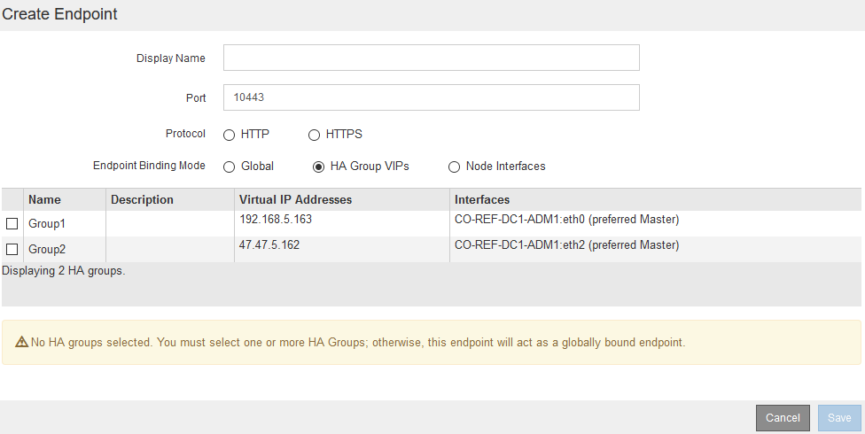
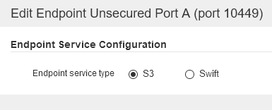

= Konfigurieren von Load Balancer-Endpunkten
:allow-uri-read: 
:icons: font
:imagesdir: ../media/

[role="lead"]
Sie können Load Balancer-Endpunkte erstellen, bearbeiten und entfernen.

== Erstellen von Load Balancer-Endpunkten

Jeder Load Balancer-Endpunkt legt einen Port, ein Netzwerkprotokoll (HTTP oder HTTPS) und einen Servicetyp (S3 oder Swift) fest. Wenn Sie einen HTTPS-Endpunkt erstellen, müssen Sie ein Serverzertifikat hochladen oder erstellen.

.Was Sie benötigen
* Sie müssen über die Berechtigung Root Access verfügen.
* Sie müssen über einen unterstützten Browser beim Grid Manager angemeldet sein.
* Wenn Sie zuvor Ports neu zugeordnet haben, die Sie für den Load Balancer-Dienst verwenden möchten, müssen Sie die Neuzuordnungen entfernt haben.
+

IMPORTANT: Wenn Sie Ports neu zugeordnet haben, können Sie nicht dieselben Ports zum Konfigurieren von Load Balancer-Endpunkten verwenden. Sie können Endpunkte mit neu zugeordneten Ports erstellen, aber diese Endpunkte werden nicht dem Load Balancer-Service, sondern den ursprünglichen CLB-Ports und -Service neu zugeordnet. Befolgen Sie die Schritte in der Recovery- und Wartungsanleitung zum Entfernen von Port-Remaps.

+

NOTE: Der CLB-Service ist veraltet.

.Schritte
. Wählen Sie *Konfiguration* > *Netzwerkeinstellungen* > *Balancer-Endpunkte Laden*.
+
Die Seite Load Balancer Endpoints wird angezeigt.

+
image::../media/load_balancer_endpoints.png[Load Balancer-Endpunkte]

. Wählen Sie *Endpunkt hinzufügen*.
+
Das Dialogfeld Endpunkt erstellen wird angezeigt.

+
image::../media/load_balancer_endpoint_create_http.png[LB-Endpunkt erstellen]

. Geben Sie einen Anzeigenamen für den Endpunkt ein, der in der Liste auf der Seite Load Balancer Endpoints angezeigt wird.
. Geben Sie eine Portnummer ein, oder lassen Sie die vorausgefüllte Portnummer unverändert.
+
Wenn Sie die Portnummer 80 oder 443 eingeben, wird der Endpunkt nur auf Gateway-Knoten konfiguriert, da diese Ports auf Admin-Nodes reserviert sind.

+

NOTE: Von anderen Grid-Services verwendete Ports sind nicht zulässig. In den Netzwerkrichtlinien finden Sie eine Liste der Ports, die für die interne und externe Kommunikation verwendet werden.

. Wählen Sie *HTTP* oder *HTTPS* aus, um das Netzwerkprotokoll für diesen Endpunkt festzulegen.
. Wählen Sie einen Endpunktbindungsmodus aus.
+
** *Global* (Standard): Der Endpunkt ist auf allen Gateway Nodes und Admin Nodes auf der angegebenen Portnummer zugänglich.
+
image::../media/load_balancer_endpoint_global_binding_mode.png[Globaler Bindungsmodus Für Endpunkt]

** *HA Group VIPs*: Der Endpunkt ist nur über die für die ausgewählten HA-Gruppen definierten virtuellen IP-Adressen zugänglich. In diesem Modus definierte Endpunkte können die gleiche Port-Nummer wiederverwenden, solange die von diesen Endpunkten definierten HA-Gruppen nicht miteinander überlappen.
+
Wählen Sie die HA-Gruppen mit den virtuellen IP-Adressen aus, auf denen der Endpunkt angezeigt werden soll.

+

** *Node-Schnittstellen*: Der Endpunkt ist nur auf den angegebenen Knoten und den Netzwerkschnittstellen zugänglich. In diesem Modus definierte Endpunkte können dieselbe Portnummer wiederverwenden, solange sich diese Schnittstellen nicht gegenseitig überschneiden.
+
Wählen Sie die Knotenschnittstellen aus, auf denen der Endpunkt angezeigt werden soll.

+
image::../media/load_balancer_endpoint_node_interfaces_binding_mode.png[Bindungsmodus Für Endpoint Node-Schnittstellen]

. Wählen Sie *Speichern*.
+
Das Dialogfeld Endpunkt bearbeiten wird angezeigt.

. Wählen Sie *S3* oder *Swift* aus, um den Verkehrstyp festzulegen, den dieser Endpunkt bedienen wird.
+

. Wenn Sie *HTTP* ausgewählt haben, wählen Sie *Speichern*.
+
Der ungesicherte Endpunkt wird erstellt. In der Tabelle auf der Seite Load Balancer Endpoints werden der Anzeigename, die Portnummer, das Protokoll und die Endpunkt-ID des Endpunkts aufgeführt.

. Wenn Sie *HTTPS* ausgewählt haben und ein Zertifikat hochladen möchten, wählen Sie *Zertifikat hochladen*.
+
image::../media/load_balancer_endpoint_upload_cert.png[Zertifikat Hochladen]

+
.. Suchen Sie nach dem Serverzertifikat und dem privaten Zertifikatschlüssel.
+
Damit S3-Clients eine Verbindung über einen S3-API-Endpunkt-Domain-Namen herstellen können, verwenden Sie ein Multi-Domain- oder Platzhalterzertifikat, das mit allen Domänennamen übereinstimmt, die der Client zum Herstellen der Verbindung zum Grid verwenden kann. Beispielsweise kann das Serverzertifikat den Domänennamen verwenden `*._example_.com`.

+
link:configuring-s3-api-endpoint-domain-names.html["Konfigurieren von S3-API-Endpunkt-Domain-Namen"]

.. Optional können Sie nach einem CA-Bundle suchen.
.. Wählen Sie *Speichern*.
+
Die PEM-kodierten Zertifikatdaten für den Endpunkt werden angezeigt.

. Wenn Sie *HTTPS* ausgewählt haben und ein Zertifikat erstellen möchten, wählen Sie *Zertifikat erstellen*.
+
image::../media/load_balancer_endpoint_generate_cert.png[Cert Generieren]

+
.. Geben Sie einen Domain-Namen oder eine IP-Adresse ein.
+
Sie können Platzhalter verwenden, um die vollständig qualifizierten Domänennamen aller Admin-Nodes und Gateway-Nodes darzustellen, auf denen der Load Balancer Service ausgeführt wird. Beispiel: `*.sgws.foo.com` Verwendet den Platzhalter * für die Darstellung `gn1.sgws.foo.com` Und `gn2.sgws.foo.com`.

+
link:configuring-s3-api-endpoint-domain-names.html["Konfigurieren von S3-API-Endpunkt-Domain-Namen"]

.. Wählen Sie image:../media/icon_plus_sign_black_on_white.gif["Plus-Zeichen"] So fügen Sie weitere Domain-Namen oder IP-Adressen hinzu:
+
Wenn Sie Hochverfügbarkeitsgruppen (HA-Gruppen) verwenden, fügen Sie die Domain-Namen und IP-Adressen der virtuellen HA-IPs hinzu.

.. Geben Sie optional einen X.509-Studienteilnehmer ein, der auch als Distinguished Name (DN) bezeichnet wird, um zu ermitteln, wer das Zertifikat besitzt.
.. Wählen Sie optional die Anzahl der Tage aus, an denen das Zertifikat gültig ist. Der Standardwert ist 730 Tage.
.. Wählen Sie *Erzeugen*.
+
Die Zertifikatmetadaten und die PEM-kodierten Zertifikatdaten für den Endpunkt werden angezeigt.

. Klicken Sie Auf *Speichern*.
+
Der Endpunkt wird erstellt. In der Tabelle auf der Seite Load Balancer Endpoints werden der Anzeigename, die Portnummer, das Protokoll und die Endpunkt-ID des Endpunkts aufgeführt.

.Verwandte Informationen
link:../maintain/index.html["Verwalten Sie  erholen"]

link:../network/index.html["Netzwerkrichtlinien"]

link:managing-high-availability-groups.html["Verwalten von Hochverfügbarkeitsgruppen"]

link:managing-untrusted-client-networks.html["Verwalten von nicht vertrauenswürdigen Client-Netzwerken"]

== Bearbeiten von Load Balancer-Endpunkten

Für einen ungesicherten (HTTP) Endpunkt können Sie den Diensttyp des Endpunkts zwischen S3 und Swift ändern. Für einen gesicherten Endpunkt (HTTPS) können Sie den Diensttyp des Endpunkts bearbeiten und das Sicherheitszertifikat anzeigen oder ändern.

.Was Sie benötigen
* Sie müssen über die Berechtigung Root Access verfügen.
* Sie müssen über einen unterstützten Browser beim Grid Manager angemeldet sein.

.Schritte
. Wählen Sie *Konfiguration* > *Netzwerkeinstellungen* > *Balancer-Endpunkte Laden*.
+
Die Seite Load Balancer Endpoints wird angezeigt. Die vorhandenen Endpunkte sind in der Tabelle aufgeführt.

+
Endpunkte mit bald auslaufenden Zertifikaten sind in der Tabelle aufgeführt.

+
image::../media/load_balancer_endpoint_edit_or_remove.png[Endpunkt Bearbeiten]

. Wählen Sie den Endpunkt aus, den Sie bearbeiten möchten.
. Klicken Sie auf *Endpunkt bearbeiten*.
+
Das Dialogfeld Endpunkt bearbeiten wird angezeigt.

+
Für einen ungesicherten (HTTP) Endpunkt wird nur der Abschnitt Konfiguration des Endpoint Service des Dialogfelds angezeigt. Für einen gesicherten Endpunkt (HTTPS) werden die Abschnitte Endpoint Service Configuration und die Zertifikate des Dialogfelds angezeigt, wie im folgenden Beispiel dargestellt.

+
image::../media/load_balancer_endpoint_edit.png[Endpunkt Für Den Lastenverteiler Bearbeiten]

. Nehmen Sie die gewünschten Änderungen am Endpunkt vor.
+
Für einen ungesicherten (HTTP-)Endpunkt können Sie:

+
** Ändern Sie den Endpunkt-Servicetyp zwischen S3 und Swift.
** Ändern Sie den Endpunktbindungsmodus. Für einen gesicherten Endpunkt (HTTPS) können Sie:
** Ändern Sie den Endpunkt-Servicetyp zwischen S3 und Swift.
** Ändern Sie den Endpunktbindungsmodus.
** Zeigen Sie das Sicherheitszertifikat an.
** Hochladen oder Generieren eines neuen Sicherheitszertifikats, wenn das aktuelle Zertifikat abgelaufen ist oder kurz vor Ablauf steht.
+
Wählen Sie eine Registerkarte aus, um detaillierte Informationen zum StorageGRID-Standardserverzertifikat oder zum hochgeladenen Zertifikat einer Zertifizierungsstelle anzuzeigen.

+

NOTE: Um das Protokoll für einen vorhandenen Endpunkt, zum Beispiel von HTTP zu HTTPS, zu ändern, müssen Sie einen neuen Endpunkt erstellen. Befolgen Sie die Anweisungen zum Erstellen von Load Balancer-Endpunkten, und wählen Sie das gewünschte Protokoll aus.

. Klicken Sie Auf *Speichern*.

.Verwandte Informationen
<<Erstellen von Load Balancer-Endpunkten>>

== Entfernen von Load Balancer-Endpunkten

Wenn Sie keinen Endpunkt mehr für den Load Balancer benötigen, können Sie ihn entfernen.

.Was Sie benötigen
* Sie müssen über die Berechtigung Root Access verfügen.
* Sie müssen über einen unterstützten Browser beim Grid Manager angemeldet sein.

.Schritte
. Wählen Sie *Konfiguration* > *Netzwerkeinstellungen* > *Balancer-Endpunkte Laden*.
+
Die Seite Load Balancer Endpoints wird angezeigt. Die vorhandenen Endpunkte sind in der Tabelle aufgeführt.

+
image::../media/load_balancer_endpoint_edit_or_remove.png[Endpunkt Bearbeiten]

. Wählen Sie das Optionsfeld links neben dem Endpunkt, den Sie entfernen möchten.
. Klicken Sie auf *Endpunkt entfernen*.
+
Ein Bestätigungsdialogfeld wird angezeigt.

+
image::../media/load_balancer_endpoint_confirm_removal.png[Bestätigen Sie Das Entfernen Von Endgeräten]

. Klicken Sie auf *OK*.
+
Der Endpunkt wird entfernt.

