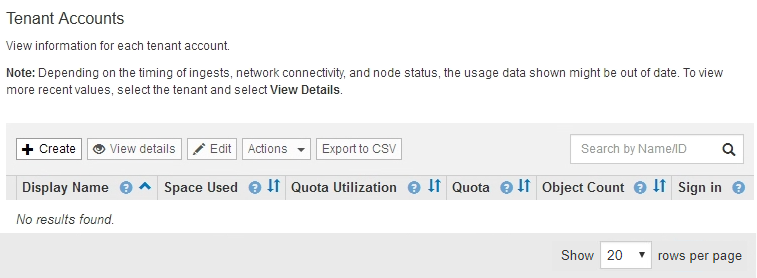
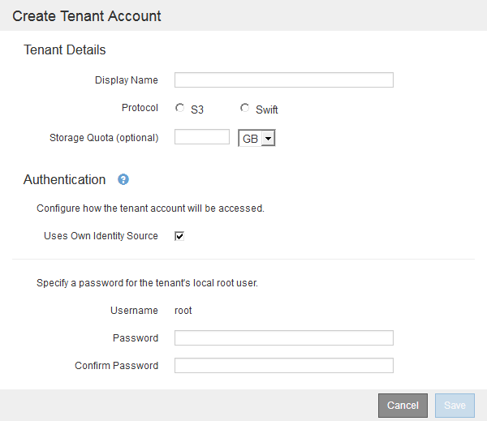

= Erstellen eines Mandantenkontos
:allow-uri-read: 
:icons: font
:imagesdir: ../media/

[role="lead"]
Sie müssen mindestens ein Mandantenkonto erstellen, um den Zugriff auf den Storage in Ihrem StorageGRID-System zu kontrollieren.

.Was Sie benötigen
* Sie müssen über einen unterstützten Browser beim Grid Manager angemeldet sein.
* Sie müssen über spezifische Zugriffsberechtigungen verfügen.

.Schritte
. Wählen Sie *Mieter*.
+
Die Seite „Mandantenkonten“ wird angezeigt und enthält alle vorhandenen Mandantenkonten.

+

. Wählen Sie *Erstellen*.
+
Die Seite Mandantenkonto erstellen wird angezeigt. Die auf der Seite enthaltenen Felder hängen davon ab, ob Single Sign-On (SSO) für das StorageGRID-System aktiviert wurde.

+
** Wenn SSO nicht verwendet wird, sieht die Seite Mandantenkonto erstellen so aus.
+

** Wenn SSO aktiviert ist, sieht die Seite Mandantenkonto erstellen so aus.
+
image::../media/create_tenant_account_sso.gif[SSO für Mandantenkonto erstellen aktiviert]

.Verwandte Informationen
link:using-identity-federation.html["Identitätsföderation verwenden"]

link:configuring-sso.html["Konfigurieren der Single Sign-On-Konfiguration"]
