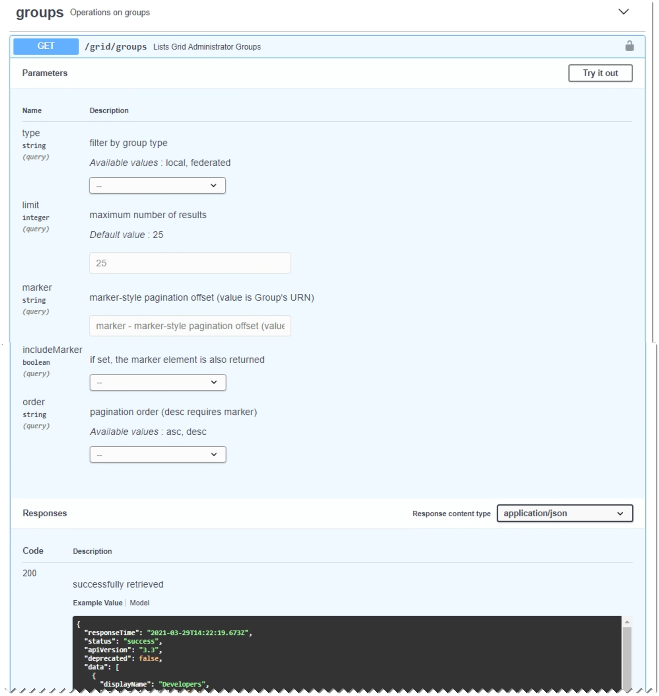

= API-Anforderungen werden ausgegeben
:allow-uri-read: 
:icons: font
:imagesdir: ../media/

[role="lead"]
Die Swagger-Benutzeroberfläche bietet vollständige Details und Dokumentation für jeden API-Vorgang.

.Was Sie benötigen
* Sie müssen über einen unterstützten Browser beim Grid Manager angemeldet sein.
* Sie müssen über spezifische Zugriffsberechtigungen verfügen.

IMPORTANT: Alle API-Operationen, die Sie mit der API Docs Webseite durchführen, sind Live-Operationen. Achten Sie darauf, dass Konfigurationsdaten oder andere Daten nicht versehentlich erstellt, aktualisiert oder gelöscht werden.

.Schritte
. Wählen Sie in der Kopfzeile des Grid Managers die Option *Hilfe* > *API-Dokumentation* aus.
. Wählen Sie den gewünschten Vorgang aus.
+
Wenn Sie einen API-Vorgang erweitern, werden die verfügbaren HTTP-Aktionen angezeigt, z. B. GET, PUT, UPDATE und DELETE.

. Wählen Sie eine HTTP-Aktion aus, um die Anforderungsdetails anzuzeigen, einschließlich der Endpunkt-URL, einer Liste aller erforderlichen oder optionalen Parameter, einem Beispiel für den Anforderungskörper (falls erforderlich) und den möglichen Antworten.
+

. Stellen Sie fest, ob für die Anforderung zusätzliche Parameter erforderlich sind, z. B. eine Gruppe oder eine Benutzer-ID. Dann erhalten Sie diese Werte. Sie müssen möglicherweise zuerst eine andere API-Anfrage stellen, um die Informationen zu erhalten, die Sie benötigen.
. Bestimmen Sie, ob Sie den Text für die Beispielanforderung ändern müssen. In diesem Fall können Sie auf *Modell* klicken, um die Anforderungen für jedes Feld zu erfahren.
. Klicken Sie auf *Probieren Sie es aus*.
. Geben Sie alle erforderlichen Parameter ein, oder ändern Sie den Anforderungskörper nach Bedarf.
. Klicken Sie Auf *Ausführen*.
. Überprüfen Sie den Antwortcode, um festzustellen, ob die Anfrage erfolgreich war.

