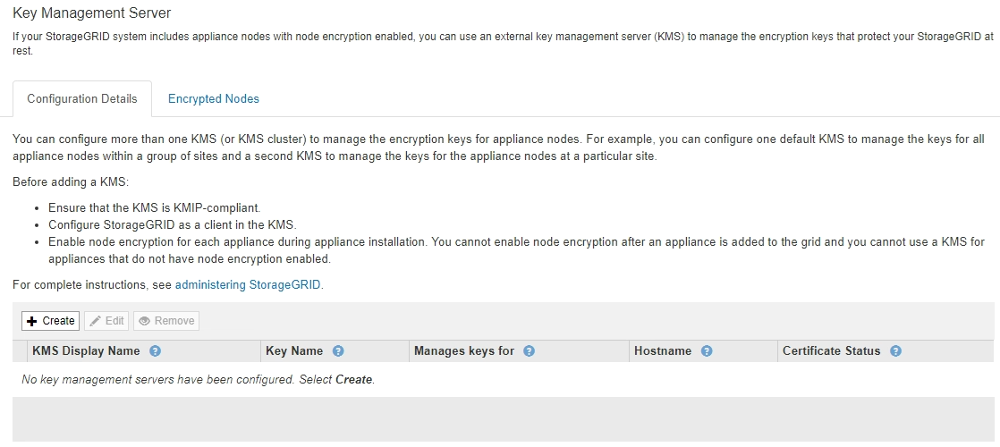

= Schritt 1: Geben Sie KMS-Details ein
:allow-uri-read: 
:icons: font
:imagesdir: ../media/

[role="lead"]
In Schritt 1 (KMS-Details eingeben) des Assistenten zum Hinzufügen eines Schlüsselverwaltungsservers geben Sie Details zum KMS- oder KMS-Cluster an.

.Schritte
. Wählen Sie *Konfiguration* > *Systemeinstellungen* > *Schlüsselverwaltungsserver* Aus.
+
Die Seite Key Management Server wird angezeigt, wobei die Registerkarte Konfigurationsdetails ausgewählt ist.

+

. Wählen Sie *Erstellen*.
+
Schritt 1 (KMS-Details eingeben) des Assistenten zum Hinzufügen eines Schlüsselverwaltungsservers wird angezeigt.

+
image::../media/kms_step_1_enter_kms_details.png[KMS Schritt 1 Geben Sie KMS-Details ein]

. Geben Sie die folgenden Informationen für den KMS und den StorageGRID-Client ein, den Sie in diesem KMS konfiguriert haben.
+
[cols="1a,1a"]
|===
| Feld | Beschreibung 

 a| 
KMS-Anzeigename
 a| 
Einen beschreibenden Namen, der Ihnen bei der Identifizierung dieses KMS hilft. Muss zwischen 1 und 64 Zeichen liegen.

 a| 
Schlüsselname
 a| 
Der exakte Schlüssel-Alias für den StorageGRID-Client im KMS. Muss zwischen 1 und 255 Zeichen liegen.

 a| 
Verwaltet Schlüssel für
 a| 
Der StorageGRID-Site, die diesem KMS zugeordnet wird. Wenn möglich, sollten Sie alle standortspezifischen Verschlüsselungsmanagement-Server konfigurieren, bevor Sie einen Standard-KMS konfigurieren, der für alle Standorte gilt, die nicht von einem anderen KMS verwaltet werden.

** Wählen Sie einen Standort aus, wenn dieser KMS Verschlüsselungen für die Appliance-Nodes an einem bestimmten Standort managt.
** Wählen Sie *Sites, die nicht von einem anderen KMS (Standard KMS)* verwaltet werden, um einen Standard-KMS zu konfigurieren, der für alle Sites gilt, die keinen dedizierten KMS haben, und für alle Sites, die Sie in nachfolgenden Erweiterungen hinzufügen.
+
*Hinweis:* beim Speichern der KMS-Konfiguration Tritt Ein Validierungsfehler auf, wenn Sie eine Site auswählen, die zuvor durch den Standard-KMS verschlüsselt wurde, aber Sie haben die aktuelle Version des ursprünglichen Verschlüsselungsschlüssels nicht dem neuen KMS zur Verfügung gestellt.

 a| 
Port
 a| 
Der Port, den der KMS-Server für die KMIP-Kommunikation (Key Management Interoperability Protocol) verwendet. Die Standardeinstellung ist 5696, d. h. der KMIP-Standardport.

 a| 
Hostname
 a| 
Der vollständig qualifizierte Domänenname oder die IP-Adresse für den KMS.

*Hinweis:* das SAN-Feld des Serverzertifikats muss den FQDN oder die IP-Adresse enthalten, die Sie hier eingeben. Andernfalls kann StorageGRID keine Verbindung zum KMS oder zu allen Servern eines KMS-Clusters herstellen.

|===
. Wenn Sie einen KMS-Cluster verwenden, wählen Sie das Pluszeichen aus image:../media/icon_plus_sign_black_on_white_old.png["Symbol Plus Zeichen"] Um einen Hostnamen für jeden Server im Cluster hinzuzufügen.
. Wählen Sie *Weiter*.
+
Schritt 2 (Serverzertifikat hochladen) des Assistenten zum Hinzufügen eines Schlüsselverwaltungsservers wird angezeigt.

