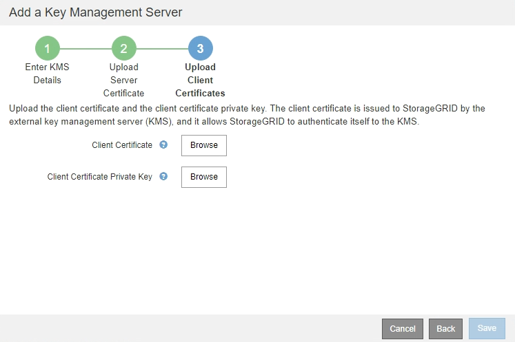

= Schritt 3: Laden Sie Client-Zertifikate Hoch
:allow-uri-read: 
:icons: font
:imagesdir: ../media/

[role="lead"]
In Schritt 3 (Upload Client Certificates) des Assistenten Add a Key Management Server laden Sie das Clientzertifikat und den privaten Schlüssel des Clientzertifikats hoch. Das Client-Zertifikat ermöglicht StorageGRID, sich am KMS zu authentifizieren.

.Schritte
. Ab *Schritt 3 (Upload Client Certificates)* navigieren Sie zum Speicherort des Clientzertifikats.
+

. Laden Sie die Clientzertifikatdatei hoch.
+
Die Metadaten des Client-Zertifikats werden angezeigt.

. Navigieren Sie zum Speicherort des privaten Schlüssels für das Clientzertifikat.
. Laden Sie die Datei mit dem privaten Schlüssel hoch.
+
Die Metadaten für das Clientzertifikat und der private Schlüssel für das Clientzertifikat werden angezeigt.

+
image::../media/kms_step_3_client_certificate_metadata.png[KMS Schritt 3 Client-Zertifikat-Metadaten]

. Wählen Sie *Speichern*.
+
Die Verbindungen zwischen dem Verschlüsselungsmanagement-Server und den Appliance-Nodes werden getestet. Wenn alle Verbindungen gültig sind und der korrekte Schlüssel auf dem KMS gefunden wird, wird der neue Schlüsselverwaltungsserver der Tabelle auf der Seite des Key Management Servers hinzugefügt.

+

NOTE: Unmittelbar nach dem Hinzufügen eines KMS wird der Zertifikatsstatus auf der Seite Key Management Server als Unbekannt angezeigt. Es kann StorageGRID bis zu 30 Minuten dauern, bis der aktuelle Status eines jeden Zertifikats angezeigt wird. Sie müssen Ihren Webbrowser aktualisieren, um den aktuellen Status anzuzeigen.

. Wenn beim Auswählen von *Speichern* eine Fehlermeldung angezeigt wird, überprüfen Sie die Nachrichtendetails und wählen Sie dann *OK* aus.
+
Beispiel: Wenn ein Verbindungstest fehlgeschlagen ist, können Sie einen Fehler bei unbearbeitbarer Einheit mit 422: Nicht verarbeitbarer Einheit erhalten.

. Wenn Sie die aktuelle Konfiguration speichern müssen, ohne die externe Verbindung zu testen, wählen Sie *Erzwingen Sie Speichern*.
+
image::../media/kms_force_save.png[KMS Erzwingen Sie Speichern]

+

IMPORTANT: Durch die Auswahl von *Erzwingen speichern* wird die KMS-Konfiguration gespeichert, die externe Verbindung von jedem Gerät zu diesem KMS wird jedoch nicht getestet. Wenn Probleme mit der Konfiguration bestehen, können Sie Appliance-Nodes, für die die Node-Verschlüsselung am betroffenen Standort aktiviert ist, möglicherweise nicht neu starten. Wenn der Zugriff auf Ihre Daten nicht mehr vollständig ist, können Sie diese Probleme beheben.

. Überprüfen Sie die Bestätigungswarnung, und wählen Sie *OK*, wenn Sie sicher sind, dass Sie das Speichern der Konfiguration erzwingen möchten.
+
image::../media/kms_force_save_warning.png[KMS Erzwingen Sie die Warnung zum Speichern]

+
Die KMS-Konfiguration wird gespeichert, die Verbindung zum KMS wird jedoch nicht getestet.

