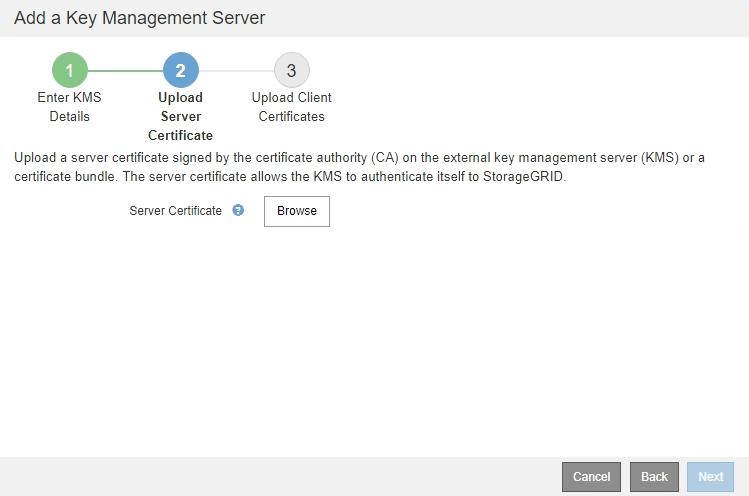

= Schritt: Serverzertifikat Hochladen
:allow-uri-read: 
:icons: font
:imagesdir: ../media/

[role="lead"]
In Schritt 2 (Serverzertifikat hochladen) des Assistenten zum Hinzufügen eines Schlüsselverwaltungsservers laden Sie das Serverzertifikat (oder das Zertifikatspaket) für den KMS hoch. Das Serverzertifikat ermöglicht es dem externen KMS, sich bei StorageGRID zu authentifizieren.

.Schritte
. Navigieren Sie ab *Schritt 2 (Serverzertifikat hochladen)* zum Speicherort des gespeicherten Serverzertifikats oder Zertifikatpakets.
+

. Laden Sie die Zertifikatdatei hoch.
+
Die Metadaten des Serverzertifikats werden angezeigt.

+
image::../media/kms_step_2_server_certificate_metadata.png[KMS Schritt 2 Server-Zertifikat-Metadaten]

+

NOTE: Wenn Sie ein Zertifikatbündel hochgeladen haben, werden die Metadaten für jedes Zertifikat auf der eigenen Registerkarte angezeigt.

. Wählen Sie *Weiter*.
+
Schritt 3 (Upload Client Certificates) des Assistenten Add a Key Management Server wird angezeigt.

