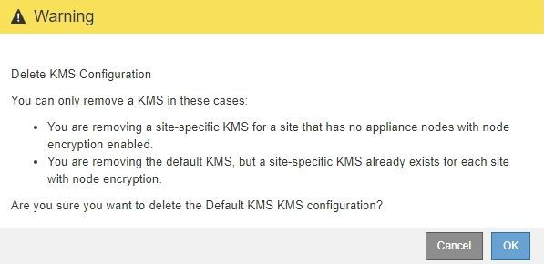

= Entfernen eines Verschlüsselungsmanagement-Servers (KMS)
:allow-uri-read: 
:icons: font
:imagesdir: ../media/

[role="lead"]
In einigen Fällen möchten Sie einen Schlüsselverwaltungsserver entfernen. Sie können beispielsweise einen standortspezifischen KMS entfernen, wenn Sie den Standort deaktiviert haben.

.Was Sie benötigen
* Sie müssen den geprüft haben link:kms-considerations-and-requirements.html["Überlegungen und Anforderungen für die Verwendung eines Verschlüsselungsmanagement-Servers"].
* Sie müssen über die Berechtigung Root Access verfügen.
* Sie müssen über einen unterstützten Browser beim Grid Manager angemeldet sein.

.Über diese Aufgabe
In diesen Fällen können Sie einen KMS entfernen:

* Wenn der Standort außer Betrieb genommen wurde oder wenn der Standort keine Appliance-Nodes mit aktivierter Node-Verschlüsselung enthält, können Sie einen standortspezifischen KMS entfernen.
* Der Standard-KMS kann entfernt werden, wenn für jeden Standort bereits ein standortspezifischer KMS vorhanden ist, bei dem Appliance-Nodes mit aktivierter Node-Verschlüsselung vorhanden sind.

.Schritte
. Wählen Sie *Konfiguration* > *Systemeinstellungen* > *Schlüsselverwaltungsserver* Aus.
+
Die Seite Key Management Server wird angezeigt und zeigt alle konfigurierten Schlüsselverwaltungsserver an.

+
image::../media/kms_configuration_details_table.png[KMS-Konfigurationsdetails KMS-Tabelle]

. Wählen Sie das Optionsfeld für den KMS, den Sie entfernen möchten, und wählen Sie *Entfernen*.
. Prüfen Sie die Überlegungen im Warndialogfeld.
+

. Wählen Sie *OK*.
+
Die KMS-Konfiguration wurde entfernt.

