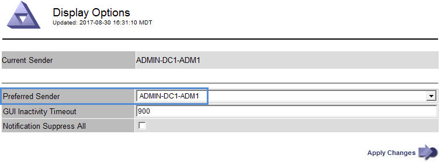

= Auswählen eines bevorzugten Senders
:allow-uri-read: 
:icons: font
:imagesdir: ../media/

[role="lead"]
Wenn Ihre StorageGRID-Bereitstellung mehrere Administratorknoten enthält, können Sie auswählen, welcher Admin-Knoten der bevorzugte Absender von Benachrichtigungen sein soll. Standardmäßig ist der primäre Admin-Node ausgewählt, aber jeder Admin-Node kann der bevorzugte Absender sein.

.Was Sie benötigen
* Sie müssen über einen unterstützten Browser beim Grid Manager angemeldet sein.
* Sie müssen über spezifische Zugriffsberechtigungen verfügen.

.Über diese Aufgabe
Auf der Seite *Konfiguration* > *Systemeinstellungen* > *Anzeigeoptionen* wird angezeigt, welcher Admin-Node derzeit als bevorzugter Absender ausgewählt wurde. Der primäre Admin-Node ist standardmäßig ausgewählt.

Bei normalen Systemvorgängen sendet nur der bevorzugte Absender folgende Benachrichtigungen:

* AutoSupport Nachrichten
* SNMP-Benachrichtigungen
* E-Mails benachrichtigen
* Alarm-E-Mails (älteres System)

Alle anderen Admin-Knoten (Standby-Sender) überwachen jedoch den bevorzugten Sender. Wenn ein Problem erkannt wird, kann ein Standby-Sender diese Benachrichtigungen auch senden.

In diesen Fällen können sowohl der bevorzugte Sender als auch ein Standby-Sender Benachrichtigungen senden:

* Wenn Admin-Knoten von einander "`islanded`" werden, werden sowohl der bevorzugte Sender als auch die Standby-Sender versuchen, Benachrichtigungen zu senden, und mehrere Kopien von Benachrichtigungen können empfangen werden.
* Nachdem ein Standby-Sender Probleme mit dem bevorzugten Sender erkannt hat und mit dem Senden von Benachrichtigungen beginnt, kann der bevorzugte Sender seine Fähigkeit zum Senden von Benachrichtigungen wiederherstellen. In diesem Fall können doppelte Benachrichtigungen gesendet werden. Der Standby-Sender hört auf, Benachrichtigungen zu senden, wenn Fehler auf dem bevorzugten Sender nicht mehr erkannt werden.

NOTE: Wenn Sie Alarmbenachrichtigungen und AutoSupport-Meldungen testen, senden alle Admin-Knoten die Test-E-Mail. Wenn Sie die Warnbenachrichtigungen testen, müssen Sie sich bei jedem Admin-Knoten anmelden, um die Verbindung zu überprüfen.

.Schritte
. Wählen Sie *Konfiguration* > *Systemeinstellungen* > *Anzeigeoptionen*.
. Wählen Sie im Menü Anzeigeoptionen die Option *Optionen*.
. Wählen Sie in der Dropdown-Liste den Admin-Knoten aus, den Sie als bevorzugten Sender festlegen möchten.
+

. Klicken Sie Auf *Änderungen Übernehmen*.
+
Der Admin-Node wird als bevorzugter Absender von Benachrichtigungen festgelegt.

