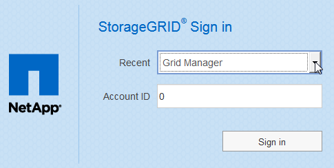

= Melden Sie sich beim Grid Manager an
:allow-uri-read: 
:icons: font
:imagesdir: ../media/

[role="lead"]
Sie greifen auf die Anmeldeseite des Grid Manager zu, indem Sie den vollständig qualifizierten Domänennamen (FQDN) oder die IP-Adresse eines Admin-Knotens in die Adressleiste eines unterstützten Webbrowsers eingeben.

.Was Sie benötigen
* Sie müssen über Ihre Anmeldedaten verfügen.
* Sie müssen über die URL für den Grid Manager verfügen.
* Sie müssen einen unterstützten Webbrowser verwenden.
* Cookies müssen in Ihrem Webbrowser aktiviert sein.
* Sie müssen über spezifische Zugriffsberechtigungen verfügen.

.Über diese Aufgabe
Jedes StorageGRID System umfasst einen primären Admin-Node und eine beliebige Anzahl nicht primärer Admin-Nodes. Sie können sich bei einem beliebigen Admin-Knoten beim Grid-Manager anmelden, um das StorageGRID-System zu verwalten. Die Admin-Nodes sind jedoch nicht genau die gleichen:

* Die auf einem Admin-Knoten ausgemachten Alarmbestätigungen (Legacy-System) werden nicht auf andere Admin-Knoten kopiert. Aus diesem Grund sehen die für Alarme angezeigten Informationen auf jedem Administratorknoten möglicherweise nicht gleich aus.
* Einige Wartungsvorgänge können nur vom primären Admin-Node ausgeführt werden.

Wenn Admin-Nodes in einer HA-Gruppe (High Availability, Hochverfügbarkeit) enthalten sind, stellen Sie eine Verbindung über die virtuelle IP-Adresse der HA-Gruppe oder einen vollständig qualifizierten Domänennamen her, der der der virtuellen IP-Adresse zugeordnet ist. Der primäre Admin-Node sollte als bevorzugter Master der Gruppe ausgewählt werden, sodass Sie beim Zugriff auf den Grid-Manager auf den primären Admin-Node zugreifen können, wenn der primäre Admin-Node nicht verfügbar ist.

.Schritte
. Starten Sie einen unterstützten Webbrowser.
. Geben Sie in der Adressleiste des Browsers die URL für den Grid Manager ein:
+
`https://_FQDN_or_Admin_Node_IP_/`

+
Wo `_FQDN_or_Admin_Node_IP_` Ist ein vollständig qualifizierter Domain-Name oder die IP-Adresse eines Admin-Knotens oder die virtuelle IP-Adresse einer HA-Gruppe von Admin-Nodes.

+
Wenn Sie auf den Grid Manager auf einem anderen Port als dem Standard-Port für HTTPS (443) zugreifen müssen, geben Sie Folgendes ein, wobei `_FQDN_or_Admin_Node_IP_` Ist ein vollständig qualifizierter Domain-Name oder IP-Adresse und Port ist die Port-Nummer:

+
`https://_FQDN_or_Admin_Node_IP:port_/`

. Wenn Sie aufgefordert werden, eine Sicherheitswarnung zu erhalten, installieren Sie das Zertifikat mithilfe des Browser-Installationsassistenten.
. Melden Sie sich beim Grid Manager an:
+
** Wenn Single Sign On (SSO) nicht für Ihr StorageGRID-System verwendet wird:
+
... Geben Sie Ihren Benutzernamen und Ihr Kennwort für den Grid Manager ein.
... Klicken Sie Auf *Anmelden*.
+
image:../media/sign_in_grid_manager_no_sso.gif["Anmeldeseite"]

** Wenn SSO für Ihr StorageGRID-System aktiviert ist und Sie in diesem Browser zum ersten Mal auf die URL zugreifen:
+
... Klicken Sie auf *Anmelden*. Sie können das Feld Konto-ID leer lassen.
+
image::../media/sso_sign_in_first_time.gif[Anmelde-Bildschirm, wenn SSO aktiviert ist und keine Cookies verwendet werden]

... Geben Sie auf der SSO-Anmeldeseite Ihres Unternehmens Ihre Standard-SSO-Anmeldedaten ein. Beispiel:
+
image::../media/sso_organization_page.gif[Beispiel für die Anmeldeseite der Organisation für SSO]

** Wenn SSO für Ihr StorageGRID-System aktiviert ist und Sie zuvor auf den Grid Manager oder ein Mandantenkonto zugegriffen haben:
+
... Führen Sie einen der folgenden Schritte aus:
+
**** Geben Sie *0* (die Konto-ID für den Grid Manager) ein, und klicken Sie auf *Anmelden*.
**** Wählen Sie *Grid Manager* aus, wenn er in der Liste der letzten Konten angezeigt wird, und klicken Sie auf *Anmelden*.
+

... Melden Sie sich mit Ihren Standard-SSO-Anmeldedaten auf der SSO-Anmeldeseite Ihres Unternehmens an. Wenn Sie sich angemeldet haben, wird die Startseite des Grid Managers angezeigt, die das Dashboard enthält. Informationen zu den bereitgestellten Informationen finden Sie unter „`Viewing the Dashboard`“ in den Monitoring- und Fehlerbehebungsanweisungen für StorageGRID.

+
image::../media/grid_manager_dashboard.png[Dashboard]

. Wenn Sie sich bei einem anderen Admin-Knoten anmelden möchten:
+
[cols="1a,1a"]
|===
| Option | Schritte 

 a| 
SSO ist nicht aktiviert
 a| 
.. Geben Sie in der Adressleiste des Browsers den vollständig qualifizierten Domänennamen oder die IP-Adresse des anderen Admin-Knotens ein. Geben Sie die Portnummer nach Bedarf an.
.. Geben Sie Ihren Benutzernamen und Ihr Kennwort für den Grid Manager ein.
.. Klicken Sie Auf *Anmelden*.

 a| 
SSO aktiviert
 a| 
Geben Sie in der Adressleiste des Browsers den vollständig qualifizierten Domänennamen oder die IP-Adresse des anderen Admin-Knotens ein.

Wenn Sie sich bei einem Admin-Knoten angemeldet haben, können Sie auf andere Admin-Knoten zugreifen, ohne sich erneut anmelden zu müssen. Wenn Ihre SSO-Sitzung jedoch abläuft, werden Sie erneut zur Eingabe Ihrer Anmeldedaten aufgefordert.

*Hinweis:* SSO ist auf dem Port des eingeschränkten Grid Manager nicht verfügbar. Sie müssen den Standard-HTTPS-Port (443) verwenden, wenn Benutzer sich mit Single Sign-On authentifizieren möchten.

|===

.Verwandte Informationen
link:web-browser-requirements.html["Anforderungen an einen Webbrowser"]

link:controlling-access-through-firewalls.html["Zugriffskontrolle durch Firewalls"]

link:configuring-server-certificates.html["Serverzertifikate werden konfiguriert"]

link:configuring-sso.html["Konfigurieren der Single Sign-On-Konfiguration"]

link:managing-admin-groups.html["Verwalten von Admin-Gruppen"]

link:managing-high-availability-groups.html["Verwalten von Hochverfügbarkeitsgruppen"]

link:../tenant/index.html["Verwenden Sie ein Mandantenkonto"]

link:../monitor/index.html["Monitor  Fehlerbehebung"]
