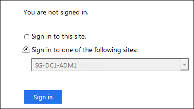

= Testen von Vertrauen von Vertrauensstellen
:allow-uri-read: 
:icons: font
:imagesdir: ../media/

[role="lead"]
Bevor Sie die Verwendung von Single Sign On (SSO) für StorageGRID durchsetzen, müssen Sie sicherstellen, dass Single Sign On und Single Logout (SLO) korrekt konfiguriert sind. Wenn Sie für jeden Admin-Node eine Vertrauensbasis erstellt haben, bestätigen Sie, dass Sie SSO und SLO für jeden Admin-Node verwenden können.

.Was Sie benötigen
* Sie müssen über einen unterstützten Browser beim Grid Manager angemeldet sein.
* Sie müssen über spezifische Zugriffsberechtigungen verfügen.
* Sie haben eine oder mehrere Vertrauensstellen in AD FS konfiguriert.

.Schritte
. Wählen Sie *Konfiguration* > *Zugriffskontrolle* > *Single Sign-On*.
+
Die Seite Single Sign-On wird angezeigt, wobei die Option *Sandbox Mode* ausgewählt ist.

. Suchen Sie in den Anweisungen für den Sandbox-Modus den Link zur Anmeldeseite Ihres Identitätsanbieters.
+
Die URL wird aus dem Wert abgeleitet, den Sie im Feld *Federated Service Name* eingegeben haben.

+
image::../media/sso_sandbox_mode_url.gif[URL für die Anmeldeseite des Identitätsanbieters]

. Klicken Sie auf den Link oder kopieren Sie die URL in einen Browser, um auf die Anmeldeseite Ihres Identitätsanbieters zuzugreifen.
. Um zu bestätigen, dass Sie SSO zur Anmeldung bei StorageGRID verwenden können, wählen Sie *Anmelden bei einer der folgenden Sites*, wählen Sie die bevertrauende Partei-ID für Ihren primären Admin-Knoten und klicken Sie auf *Anmelden*.
+

+
Sie werden aufgefordert, Ihren Benutzernamen und Ihr Kennwort einzugeben.

. Geben Sie Ihren föderierten Benutzernamen und Ihr Kennwort ein.
+
** Wenn die SSO-Anmelde- und -Abmeldevorgänge erfolgreich sind, wird eine Erfolgsmeldung angezeigt.
+
image::../media/sso_sandbox_mode_sign_in_success.gif[SSO-Authentifizierung und Meldung zum Abmeldung des Testerfolgs]

** Wenn der SSO-Vorgang nicht erfolgreich ist, wird eine Fehlermeldung angezeigt. Beheben Sie das Problem, löschen Sie die Cookies des Browsers, und versuchen Sie es erneut.

. Wiederholen Sie die vorherigen Schritte, um zu bestätigen, dass Sie sich bei anderen Admin-Nodes anmelden können.
+
Wenn alle SSO-Anmelde- und Abmeldevorgänge erfolgreich sind, können Sie SSO aktivieren.

