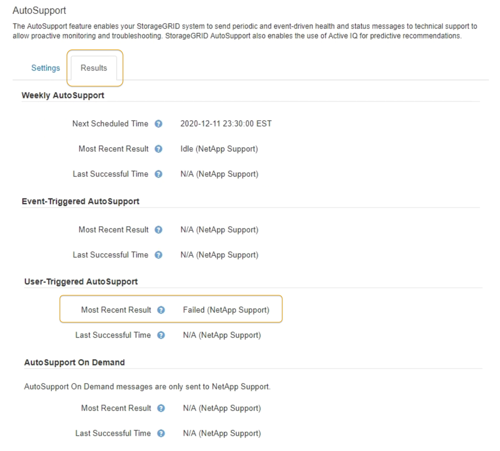

= Fehlerbehebung bei AutoSupport Meldungen
:allow-uri-read: 
:icons: font
:imagesdir: ../media/

[role="lead"]
Wenn das Senden einer AutoSupport Meldung fehlschlägt, führt das StorageGRID System abhängig vom Typ der AutoSupport Meldung unterschiedliche Aktionen durch. Sie können den Status von AutoSupport-Meldungen überprüfen, indem Sie *Unterstützung* > *Werkzeuge* > *AutoSupport* > *Ergebnisse* auswählen.

NOTE: Wenn Sie E-Mail-Benachrichtigungen im gesamten System unterdrücken, werden ereignisgesteuerte AutoSupport Meldungen unterdrückt. (Wählen Sie *Konfiguration* > *Systemeinstellungen* > *Anzeigeoptionen*. Wählen Sie dann *Benachrichtigung Alle unterdrücken*.)

Wenn die AutoSupport-Meldung nicht gesendet wird, wird „`failed`“ auf der Registerkarte *Results* der Seite *AutoSupport* angezeigt.

== Wöchentlicher AutoSupport-Nachrichtenfehler

Wenn eine wöchentliche AutoSupport-Meldung nicht gesendet werden kann, werden im StorageGRID System folgende Aktionen ausgeführt:

. Aktualisiert das Attribut für das aktuellste Ergebnis, um es erneut zu versuchen.
. Versucht, die AutoSupport Meldung alle vier Minuten für eine Stunde 15 Mal erneut zu senden.
. Nach einer Stunde des Sendefehlens aktualisiert das Attribut „Aktuelles Ergebnis“ auf „Fehlgeschlagen“.
. Versucht, eine AutoSupport-Nachricht zum nächsten geplanten Zeitpunkt erneut zu senden.
. Behält den regulären AutoSupport-Zeitplan bei, wenn die Meldung fehlschlägt, weil der NMS-Dienst nicht verfügbar ist und wenn eine Meldung vor sieben Tagen gesendet wird.
. Wenn der NMS-Dienst wieder verfügbar ist, sendet sofort eine AutoSupport-Nachricht, wenn eine Nachricht für sieben Tage oder länger nicht gesendet wurde.

== Vom Benutzer ausgelöste oder ereignisgesteuerte AutoSupport-Meldung ist fehlgeschlagen

Wenn eine vom Benutzer ausgelöste oder eine AutoSupport Meldung, die aufgrund eines Ereignisses ausgelöst wird, nicht gesendet wird, ergreift das StorageGRID System folgende Maßnahmen:

. Zeigt eine Fehlermeldung an, wenn der Fehler bekannt ist. Wenn z. B. ein Benutzer das SMTP-Protokoll auswählt, ohne korrekte E-Mail-Konfigurationseinstellungen vorzunehmen, wird der folgende Fehler angezeigt: `AutoSupport messages cannot be sent using SMTP protocol due to incorrect settings on the E-mail Server page.`
. Versucht nicht, die Nachricht erneut zu senden.
. Protokolliert den Fehler in `nms.log`.

Wenn ein Fehler auftritt und SMTP das ausgewählte Protokoll ist, überprüfen Sie, ob der E-Mail-Server des StorageGRID-Systems korrekt konfiguriert ist und Ihr E-Mail-Server ausgeführt wird (*Support* > *Alarme (alt)* > *> Legacy E-Mail-Setup*). Die folgende Fehlermeldung kann auf der AutoSupport-Seite angezeigt werden: `AutoSupport messages cannot be sent using SMTP protocol due to incorrect settings on the E-mail Server page.`

Erfahren Sie, wie Sie die Einstellungen für E-Mail-Server im konfigurieren link:../monitor/index.html["Monitor  Anweisungen zur Fehlerbehebung"].

== Korrigieren eines Fehlers bei AutoSupport-Meldungen

Wenn ein Fehler auftritt und SMTP das ausgewählte Protokoll ist, überprüfen Sie, ob der E-Mail-Server des StorageGRID-Systems korrekt konfiguriert ist und Ihr E-Mail-Server ausgeführt wird. Die folgende Fehlermeldung kann auf der AutoSupport-Seite angezeigt werden: `AutoSupport messages cannot be sent using SMTP protocol due to incorrect settings on the E-mail Server page.`

.Verwandte Informationen
link:../monitor/index.html["Monitor  Fehlerbehebung"]
