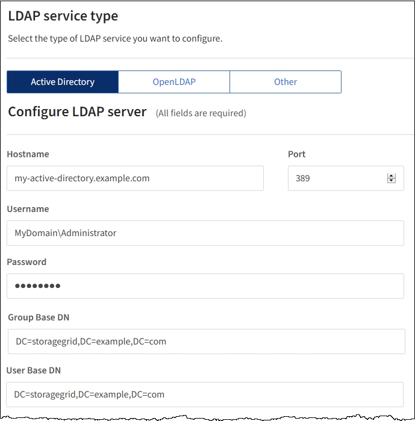

= Identitätsföderation verwenden
:allow-uri-read: 
:icons: font
:imagesdir: ../media/

[role="lead"]
Durch die Verwendung von Identity Federation lassen sich Gruppen und Benutzer schneller einrichten, und Benutzer können sich mithilfe vertrauter Anmeldedaten bei StorageGRID anmelden.

== Identitätsföderation wird konfiguriert

Sie können einen Identitätsverbund konfigurieren, wenn Administratorgruppen und Benutzer in einem anderen System wie Active Directory, OpenLDAP oder Oracle Directory Server verwaltet werden sollen.

.Was Sie benötigen
* Sie müssen über einen unterstützten Browser beim Grid Manager angemeldet sein.
* Sie müssen über spezifische Zugriffsberechtigungen verfügen.
* Wenn Sie Single Sign-On (SSO) aktivieren möchten, müssen Sie Active Directory als föderierte Identitätsquelle und AD FS als Identitäts-Provider verwenden. Siehe „`Anforderungen für die Verwendung von Single Sign-On.`“
* Sie müssen Active Directory, OpenLDAP oder Oracle Directory Server als Identitäts-Provider verwenden.
+

NOTE: Wenn Sie einen nicht aufgeführten LDAP v3-Dienst verwenden möchten, müssen Sie sich an den technischen Support wenden.

* Wenn Sie Transport Layer Security (TLS) für die Kommunikation mit dem LDAP-Server verwenden möchten, muss der Identitäts-Provider TLS 1.2 oder 1.3 verwenden.

.Über diese Aufgabe
Sie müssen eine Identitätsquelle für den Grid Manager konfigurieren, wenn Sie die folgenden Typen von föderierten Gruppen importieren möchten:

* Verwaltungsgruppen. Die Benutzer in Admin-Gruppen können sich beim Grid Manager anmelden und anhand der Verwaltungsberechtigungen, die der Gruppe zugewiesen sind, Aufgaben ausführen.
* Mandanten-Benutzergruppen für Mandanten, die ihre eigene Identitätsquelle nicht verwenden Benutzer in Mandantengruppen können sich beim Mandanten-Manager anmelden und Aufgaben ausführen, basierend auf den Berechtigungen, die der Gruppe im Mandanten-Manager zugewiesen sind.

.Schritte
. Wählen Sie *Konfiguration* > *Zugriffskontrolle* > *Identitätsföderation*.
. Wählen Sie *Identitätsföderation aktivieren*.
+
Die Felder zum Konfigurieren des LDAP-Servers werden angezeigt.

. Wählen Sie im Abschnitt LDAP-Servicetyp den Typ des LDAP-Dienstes aus, den Sie konfigurieren möchten.
+
Sie können *Active Directory*, *OpenLDAP* oder *Other* auswählen.

+

NOTE: Wenn Sie *OpenLDAP* auswählen, müssen Sie den OpenLDAP-Server konfigurieren. Weitere Informationen zur Konfiguration eines OpenLDAP-Servers finden Sie in den Richtlinien.

+

NOTE: Wählen Sie *Other* aus, um Werte für einen LDAP-Server zu konfigurieren, der Oracle Directory Server verwendet.

. Wenn Sie *Sonstige* ausgewählt haben, füllen Sie die Felder im Abschnitt LDAP-Attribute aus.
+
** *Eindeutiger Benutzername*: Der Name des Attributs, das die eindeutige Kennung eines LDAP-Benutzers enthält. Dieses Attribut ist äquivalent zu `sAMAccountName` Für Active Directory und `uid` Für OpenLDAP. Wenn Sie Oracle Directory Server konfigurieren, geben Sie ein `uid`.
** *Benutzer-UUID*: Der Name des Attributs, das den permanenten eindeutigen Identifier eines LDAP-Benutzers enthält. Dieses Attribut ist äquivalent zu `objectGUID` Für Active Directory und `entryUUID` Für OpenLDAP. Wenn Sie Oracle Directory Server konfigurieren, geben Sie ein `nsuniqueid`. Der Wert jedes Benutzers für das angegebene Attribut muss eine 32-stellige Hexadezimalzahl im 16-Byte- oder String-Format sein, wobei Bindestriche ignoriert werden.
** *Group Unique Name*: Der Name des Attributs, das den eindeutigen Identifier einer LDAP-Gruppe enthält. Dieses Attribut ist äquivalent zu `sAMAccountName` Für Active Directory und `cn` Für OpenLDAP. Wenn Sie Oracle Directory Server konfigurieren, geben Sie ein `cn`.
** *Group UUID*: Der Name des Attributs, das den permanenten eindeutigen Identifier einer LDAP-Gruppe enthält. Dieses Attribut ist äquivalent zu `objectGUID` Für Active Directory und `entryUUID` Für OpenLDAP. Wenn Sie Oracle Directory Server konfigurieren, geben Sie ein `nsuniqueid`. Der Wert jeder Gruppe für das angegebene Attribut muss eine 32-stellige Hexadezimalzahl im 16-Byte- oder String-Format sein, wobei Bindestriche ignoriert werden.

. Geben Sie im Abschnitt LDAP-Server konfigurieren die erforderlichen Informationen zum LDAP-Server und zur Netzwerkverbindung ein.
+
** *Hostname*: Der Server-Hostname oder die IP-Adresse des LDAP-Servers.
** *Port*: Der Port, über den eine Verbindung zum LDAP-Server hergestellt wird.
+

NOTE: Der Standardport für STARTTLS ist 389 und der Standardport für LDAPS ist 636. Sie können jedoch jeden beliebigen Port verwenden, solange Ihre Firewall korrekt konfiguriert ist.

** *Benutzername*: Der vollständige Pfad des Distinguished Name (DN) für den Benutzer, der eine Verbindung zum LDAP-Server herstellt.
+

NOTE: Für Active Directory können Sie auch den unten angegebenen Anmeldenamen oder den Benutzerprinzipalnamen festlegen.

+
Der angegebene Benutzer muss über die Berechtigung zum Auflisten von Gruppen und Benutzern sowie zum Zugriff auf die folgenden Attribute verfügen:

+
*** `sAMAccountName` Oder `uid`
*** `objectGUID`, `entryUUID`, Oder `nsuniqueid`
*** `cn`
*** `memberOf` Oder `isMemberOf`

** *Passwort*: Das mit dem Benutzernamen verknüpfte Passwort.
** *Gruppenbasis DN*: Der vollständige Pfad des Distinguished Name (DN) für einen LDAP-Unterbaum, nach dem Sie nach Gruppen suchen möchten. Im Active Directory-Beispiel (unten) können alle Gruppen, deren Distinguished Name relativ zum Basis-DN (DC=storagegrid,DC=example,DC=com) ist, als föderierte Gruppen verwendet werden.
+

NOTE: Die *Group Unique Name*-Werte müssen innerhalb der *Group-Basis-DN*, zu der sie gehören, eindeutig sein.

** *User Base DN*: Der vollständige Pfad des Distinguished Name (DN) eines LDAP-Unterbaums, nach dem Sie nach Benutzern suchen möchten.
+

NOTE: Die *User Unique Name*-Werte müssen innerhalb der *User Base DN*, zu der sie gehören, eindeutig sein.

. Wählen Sie im Abschnitt *Transport Layer Security (TLS)* eine Sicherheitseinstellung aus.
+
** *Verwenden Sie STARTTLS (empfohlen)*: Verwenden Sie STARTTLS, um die Kommunikation mit dem LDAP-Server zu sichern. Dies ist die empfohlene Option.
** *LDAPS verwenden*: Die Option LDAPS (LDAP über SSL) verwendet TLS, um eine Verbindung zum LDAP-Server herzustellen. Diese Option wird aus Kompatibilitätsgründen unterstützt.
** *Verwenden Sie keine TLS*: Der Netzwerkverkehr zwischen dem StorageGRID-System und dem LDAP-Server wird nicht gesichert.
+

NOTE: Die Verwendung der Option *keine TLS* verwenden wird nicht unterstützt, wenn Ihr Active Directory-Server die LDAP-Signatur erzwingt. Sie müssen STARTTLS oder LDAPS verwenden.

. Wenn Sie STARTTLS oder LDAPS ausgewählt haben, wählen Sie das Zertifikat aus, mit dem die Verbindung gesichert werden soll.
+
** *Verwenden Sie das Betriebssystem CA-Zertifikat*: Verwenden Sie das auf dem Betriebssystem installierte Standard-CA-Zertifikat, um Verbindungen zu sichern.
** *Benutzerdefiniertes CA-Zertifikat verwenden*: Verwenden Sie ein benutzerdefiniertes Sicherheitszertifikat.
+
Wenn Sie diese Einstellung auswählen, kopieren Sie das benutzerdefinierte Sicherheitszertifikat in das Textfeld CA-Zertifikat und fügen Sie es ein.

. Wählen Sie optional *Verbindung testen*, um die Verbindungseinstellungen für den LDAP-Server zu validieren.
+
Wenn die Verbindung gültig ist, wird oben rechts auf der Seite eine Bestätigungsmeldung angezeigt.

. Wenn die Verbindung gültig ist, wählen Sie *Speichern*.
+
Der folgende Screenshot zeigt Beispielkonfigurationswerte für einen LDAP-Server, der Active Directory verwendet.

+

.Verwandte Informationen
link:supported-ciphers-for-outgoing-tls-connections.html["Unterstützte Chiffren für ausgehende TLS-Verbindungen"]

link:requirements-for-sso.html["Anforderungen für die Nutzung von Single Sign On"]

link:creating-tenant-account.html["Erstellen eines Mandantenkontos"]

link:../tenant/index.html["Verwenden Sie ein Mandantenkonto"]

=== Richtlinien für die Konfiguration eines OpenLDAP-Servers

Wenn Sie einen OpenLDAP-Server für die Identitätsföderation verwenden möchten, müssen Sie bestimmte Einstellungen auf dem OpenLDAP-Server konfigurieren.

==== Überlagerungen in Memberof und Refint

Die Überlagerungen Memberof und Refint sollten aktiviert sein. Weitere Informationen finden Sie im Administratorhandbuch für OpenLDAP in den Anweisungen zur Wartung der Reverse-Group-Mitgliedschaft.

==== Indizierung

Sie müssen die folgenden OpenLDAP-Attribute mit den angegebenen Stichwörtern für den Index konfigurieren:

* `olcDbIndex: objectClass eq`
* `olcDbIndex: uid eq,pres,sub`
* `olcDbIndex: cn eq,pres,sub`
* `olcDbIndex: entryUUID eq`

Stellen Sie außerdem sicher, dass die in der Hilfe für den Benutzernamen genannten Felder für eine optimale Leistung indiziert sind.

Weitere Informationen zur Wartung der Umkehrgruppenmitgliedschaft finden Sie im Administratorhandbuch für OpenLDAP.

.Verwandte Informationen
http://["OpenLDAP-Dokumentation: Version 2.4 Administratorhandbuch"^]

== Synchronisierung mit der Identitätsquelle erzwingen

Das StorageGRID-System synchronisiert regelmäßig föderierte Gruppen und Benutzer von der Identitätsquelle aus. Sie können die Synchronisierung erzwingen, wenn Sie Benutzerberechtigungen so schnell wie möglich aktivieren oder einschränken möchten.

.Was Sie benötigen
* Sie müssen über einen unterstützten Browser beim Grid Manager angemeldet sein.
* Sie müssen über spezifische Zugriffsberechtigungen verfügen.
* Die Identitätsquelle muss aktiviert sein.

.Schritte
. Wählen Sie *Konfiguration* > *Zugriffskontrolle* > *Identitätsföderation*.
+
Die Seite Identity Federation wird angezeigt. Die Schaltfläche *Synchronisieren* befindet sich am unteren Rand der Seite.

+
image::../media/identity_federation_synchronize.gif[Screenshot von Konfiguration > Identitätsföderation > Schaltfläche Synchronisieren]

. Klicken Sie Auf *Synchronisieren*.
+
Eine Bestätigungsmeldung gibt an, dass die Synchronisierung erfolgreich gestartet wurde. Der Synchronisierungsprozess kann je nach Umgebung einige Zeit in Anspruch nehmen.

+

NOTE: Die Warnmeldung * Identity Federation Failure* wird ausgelöst, wenn es ein Problem gibt, das die Synchronisierung von föderierten Gruppen und Benutzern aus der Identitätsquelle verursacht.

== Identitätsföderation deaktivieren

Sie können den Identitätsverbund für Gruppen und Benutzer vorübergehend oder dauerhaft deaktivieren. Wenn die Identitätsföderation deaktiviert ist, besteht keine Kommunikation zwischen StorageGRID und der Identitätsquelle. Allerdings bleiben alle von Ihnen konfigurierten Einstellungen erhalten, sodass Sie die Identitätsföderation zukünftig einfach wieder aktivieren können.

.Was Sie benötigen
* Sie müssen über einen unterstützten Browser beim Grid Manager angemeldet sein.
* Sie müssen über spezifische Zugriffsberechtigungen verfügen.

.Über diese Aufgabe
Bevor Sie die Identitätsföderation deaktivieren, sollten Sie Folgendes beachten:

* Verbundene Benutzer können sich nicht anmelden.
* Föderierte Benutzer, die sich derzeit anmelden, erhalten bis zu ihrem Ablauf Zugriff auf das StorageGRID-System, können sich jedoch nach Ablauf der Sitzung nicht anmelden.
* Die Synchronisierung zwischen dem StorageGRID-System und der Identitätsquelle erfolgt nicht, und Warnmeldungen oder Alarme werden nicht für Konten ausgelöst, die nicht synchronisiert wurden.
* Das Kontrollkästchen *Identitätsföderation aktivieren* ist deaktiviert, wenn Single Sign-On (SSO) auf *Enabled* oder *Sandbox Mode* gesetzt ist. Der SSO-Status auf der Seite Single Sign-On muss *deaktiviert* sein, bevor Sie die Identitätsföderation deaktivieren können.

.Schritte
. Wählen Sie *Konfiguration* > *Zugriffskontrolle* > *Identitätsföderation*.
. Deaktivieren Sie das Kontrollkästchen * Identitätsföderation aktivieren*.
. Klicken Sie Auf *Speichern*.

.Verwandte Informationen
link:disabling-single-sign-on.html["Deaktivieren der Einzelanmeldung"]
