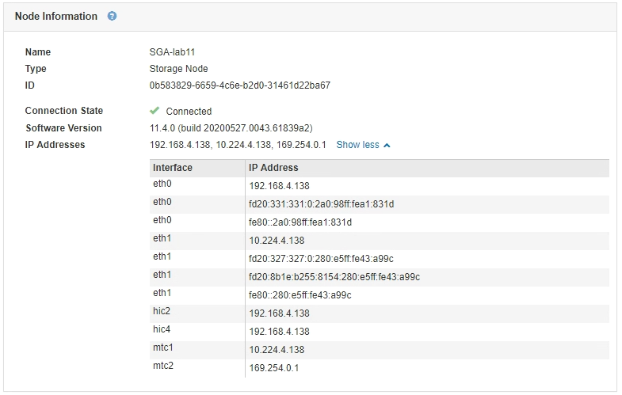

= Anzeigen von IP-Adressen
:allow-uri-read: 
:icons: font
:imagesdir: ../media/

[role="lead"]
Sie können die IP-Adresse für jeden Grid-Node im StorageGRID System anzeigen. Sie können diese IP-Adresse dann verwenden, um sich bei dem Grid-Node über die Befehlszeile anzumelden und verschiedene Wartungsvorgänge auszuführen.

.Was Sie benötigen
Sie müssen über einen unterstützten Browser beim Grid Manager angemeldet sein.

.Über diese Aufgabe
Informationen zum Ändern von IP-Adressen finden Sie in den Wiederherstellungsanleitungen und Wartungsanweisungen.

.Schritte
. Wählen Sie *Nodes* > *_Grid Node_* > *Übersicht*.
. Klicken Sie rechts neben dem Titel der IP-Adressen auf *Mehr anzeigen*.
+
Die IP-Adressen für diesen Grid-Node werden in einer Tabelle aufgeführt.

+

.Verwandte Informationen
link:../maintain/index.html["Verwalten Sie  erholen"]
