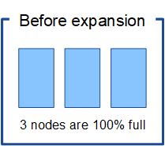

= Überlegungen zur Lastverteilung bei Daten, die mit Erasure Coding versehen sind
:allow-uri-read: 
:icons: font
:imagesdir: ../media/

[role="lead"]
Wenn Sie eine Erweiterung zum Hinzufügen von Storage-Nodes durchführen und Ihre ILM-Richtlinie eine oder mehrere ILM-Regeln zum Löschen von Code-Daten enthält, müssen Sie nach Abschluss der Erweiterung möglicherweise das EC-Ausgleichverfahren durchführen.

Wenn Sie beispielsweise nicht die empfohlene Anzahl von Speicherknoten in einer Erweiterung hinzufügen können, müssen Sie möglicherweise das EC-Ausgleichverfahren ausführen, damit zusätzliche Objekte mit Löschungscode gespeichert werden können.

== Was ist die Neuausrichtung der EG?

Bei der EC-Ausbalancierung handelt es sich um ein StorageGRID-Verfahren, das nach einer Erweiterung des Storage-Nodes erforderlich sein kann. Das Verfahren wird als Kommandozeilenskript vom primären Admin-Knoten ausgeführt. Bei Ausführung des EC-Ausgleichs verteilt StorageGRID Fragmente, die mit Erasure Coding codiert wurden, auf die vorhandenen und neu erweiterten Storage-Nodes an einem Standort.

Wenn das EC-Ausgleichverfahren ausgeführt wird:

* Es werden nur Objektdaten verschoben, die mit Erasure-Coding-Verfahren codiert wurden. Es werden keine replizierten Objektdaten verschoben.
* Die Daten werden an einem Standort neu verteilt. Es werden keine Daten zwischen Standorten verschoben.
* Die Daten werden auf alle Storage-Nodes an einem Standort verteilt. Daten werden nicht innerhalb von Storage Volumes neu verteilt.

Wenn das EC-Ausgleichverfahren abgeschlossen ist:

* Die Daten, die mithilfe von Erasure-Coding-Verfahren codiert wurden, werden von Storage-Nodes mit weniger verfügbarem Speicherplatz zu Storage-Nodes mit mehr verfügbarem Speicherplatz verschoben.
* Verwendete (%) Werte können sich zwischen Storage Nodes unterscheiden, da der EC-Ausgleichvorgang keine replizierten Objektkopien verschiebt.
* Die Datensicherung von Objekten, die mit Erasure Coding versehen sind, wird unverändert beibehalten.

Wenn das EC-Ausgleichverfahren ausgeführt wird, ist die Performance von ILM-Vorgängen sowie S3- und Swift-Client-Operationen wahrscheinlich beeinträchtigt. Aus diesem Grund sollten Sie dieses Verfahren nur in begrenzten Fällen durchführen.

== Wann sollte ein EC-Ausgleich nicht durchgeführt werden

Als Beispiel für den Fall, dass Sie keinen EC-Ausgleich durchführen müssen, sollten Sie Folgendes berücksichtigen:

* StorageGRID wird an einem Standort ausgeführt, der drei Storage-Nodes enthält.
* Die ILM-Richtlinie verwendet eine 2+1-Regel zur Einhaltung von Datenkonsistenz für alle Objekte, die größer als 0.2 MB sind, und eine Replizierungsregel mit 2 Kopien für kleinere Objekte.
* Alle Speicherknoten sind voll geworden, und die Warnung *Low Object Storage* wurde auf dem Hauptschweregrade ausgelöst. Die empfohlene Aktion ist, eine Erweiterungsmaßnahme zum Hinzufügen von Speicherknoten durchzuführen.
+

Um den Standort in diesem Beispiel zu erweitern, wird empfohlen, drei oder mehr neue Speicherknoten hinzuzufügen. StorageGRID benötigt drei Storage-Nodes für das Erasure Coding von 2+1, damit die zwei Datenfragmente und das ein Paritätsfragment auf verschiedenen Nodes platziert werden können.

Nachdem Sie die drei Storage-Nodes hinzugefügt haben, bleiben die ursprünglichen Storage-Nodes voll, die Objekte können jedoch weiterhin in das Erasure Coding-Schema 2+1 auf den neuen Nodes aufgenommen werden. Das Ausführen des EC-Ausgleichs-Verfahrens wird in diesem Fall nicht empfohlen: Durch das Ausführen des Verfahrens wird die Performance vorübergehend verringert, was sich auf den Client-Betrieb auswirken könnte.

image::../media/used_space_after_3_node_expansion.png[Belegter Speicherplatz Nach Erweiterung Mit 3 Knoten]

== Wann muss ein EC-Ausgleich durchgeführt werden

Als Beispiel für den Fall, dass Sie den EC-Ausgleichvorgang durchführen sollten, betrachten Sie das gleiche Beispiel, gehen Sie aber davon aus, dass Sie nur zwei Storage-Nodes hinzufügen können. Da für das Verfahren zur Einhaltung von Datenkonsistenz (Erasure Coding) 2+1 mindestens drei Storage-Nodes erforderlich sind, können die neuen Nodes nicht für Daten mit Erasure Coding verwendet werden.

image::../media/used_space_after_2_node_expansion.png[Belegter Speicherplatz Nach Erweiterung Mit 2 Knoten]

Um dieses Problem zu lösen und die neuen Speicherknoten zu nutzen, können Sie das EC-Ausgleichverfahren ausführen. Im Rahmen dieses Verfahrens StorageGRID werden Daten und Paritätsfragmente, die mit Datenkonsistenz (Erasure Coding) versehen werden, auf alle Storage-Nodes am Standort neu verteilt. Wenn in diesem Beispiel der EC-Ausgleichvorgang abgeschlossen ist, sind alle fünf Nodes nun nur zu 60 % voll und die Objekte können auf allen Storage-Nodes weiterhin in das Erasure Coding-Schema 2+1 aufgenommen werden.

image::../media/used_space_after_ec_rebalance.png[Belegter Speicherplatz nach EC-Restalance]

== Überlegungen zur Neuausrichtung der EG

Im Allgemeinen sollten Sie nur in begrenzten Fällen das EC-Ausgleichverfahren durchführen. Insbesondere sollten Sie eine Neuausrichtung der EG nur durchführen, wenn alle folgenden Aussagen wahr sind:

* Sie verwenden das Erasure Coding für Ihre Objektdaten.
* Die Warnung *Low Object Storage* wurde für einen oder mehrere Storage Nodes an einem Standort ausgelöst, was darauf hinweist, dass die Knoten zu mindestens 80 % voll sind.
* Sie können die empfohlene Anzahl neuer Speicherknoten für das verwendete Erasure-Coding-Schema nicht hinzufügen.
+
link:adding-storage-capacity-for-erasure-coded-objects.html["Hinzufügen von Storage-Kapazität für Objekte mit Erasure-Coding-Verfahren"]

* Während das EC-Ausgleichverfahren läuft, tolerieren Ihre S3- und Swift-Clients eine niedrigere Performance bei Schreib- und Leseoperationen.

== Wie das EC-Ausgleichungsverfahren mit anderen Wartungsaufgaben interagiert

Sie können bestimmte Wartungsverfahren nicht gleichzeitig durchführen, während Sie das EC-Ausgleichverfahren ausführen.

[cols="1a,2a"]
|===
| Verfahren | Während des EC-Ausgleichs erlaubt? 

 a| 
Weitere EC-Ausgleichverfahren
 a| 
Nein

Sie können nur ein EC-Ausgleichverfahren gleichzeitig ausführen.

 a| 
Verfahren zur Deaktivierung

EC-Datenreparaturauftrag
 a| 
Nein

* Während des EC-Ausgleichs werden Sie daran gehindert, eine Stilllegung oder eine EC-Datenreparatur zu starten.
* Sie können den EC-Ausgleichvorgang nicht starten, während ein Ausmustern von Storage Nodes oder eine EC-Datenreparatur ausgeführt wird.

 a| 
Expansionsverfahren
 a| 
Nein

Wenn Sie neue Storage-Nodes zu einer Erweiterung hinzufügen müssen, sollten Sie warten, bis Sie alle neuen Nodes hinzugefügt haben. Wenn während des Hinzufügens eines neuen Storage-Nodes ein Verfahren zur Ausgleich der EC ausgeführt wird, werden die Daten nicht zu diesen Nodes verschoben.

 a| 
Upgrade-Verfahren
 a| 
Nein

Wenn Sie ein Upgrade der StorageGRID-Software durchführen müssen, sollten Sie das Upgrade-Verfahren vor oder nach dem Ausführen des EC-Ausgleichs durchführen. Bei Bedarf können Sie den EC-Ausgleichvorgang beenden, um ein Software-Upgrade durchzuführen.

 a| 
Klonvorgang für Appliance-Node
 a| 
Nein

Wenn Sie einen Appliance-Storage-Node klonen müssen, sollten Sie warten, bis der EC-Ausgleichvorgang ausgeführt wurde, nachdem Sie den neuen Node hinzugefügt haben. Wenn während des Hinzufügens eines neuen Storage-Nodes ein Verfahren zur Ausgleich der EC ausgeführt wird, werden die Daten nicht zu diesen Nodes verschoben.

 a| 
Hotfix-Verfahren
 a| 
Ja.

Sie können einen StorageGRID-Hotfix anwenden, während der EC-Ausgleichvorgang ausgeführt wird.

 a| 
Andere Wartungsarbeiten
 a| 
Nein

Sie müssen das EC-Ausgleichverfahren beenden, bevor Sie andere Wartungsverfahren durchführen.

|===

== Wie das EC-Ausgleichverfahren mit ILM interagiert

Während des EC-Ausgleichs ausgeführt wird, vermeiden Sie ILM-Änderungen, die den Standort vorhandener Objekte, die mit Erasure-Coding-Verfahren codiert wurden, ändern könnten. Beginnen Sie beispielsweise nicht mit der Verwendung einer ILM-Regel, die ein anderes Erasure Coding-Profil hat. Wenn Sie solche ILM-Änderungen vornehmen müssen, sollten Sie den EC-Ausgleichvorgang abbrechen.

.Verwandte Informationen
link:rebalancing-erasure-coded-data-after-adding-storage-nodes.html["Balancieren Sie Daten aus, die im Erasure-Coding-Verfahren codiert wurden, nach dem Hinzufügen von Storage"]
