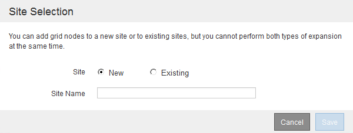

= Durchführung der Erweiterung
:allow-uri-read: 
:icons: font
:imagesdir: ../media/

[role="lead"]
Wenn die Erweiterung durchgeführt wird, werden die neuen Grid-Nodes zu Ihrer bestehenden StorageGRID Implementierung hinzugefügt.

.Was Sie benötigen
* Sie müssen über einen unterstützten Browser beim Grid Manager angemeldet sein.
* Sie müssen über die Berechtigung Wartung oder Stammzugriff verfügen.
* Sie müssen über eine Passphrase für die Bereitstellung verfügen.
* Sie müssen alle Grid-Nodes, die in dieser Erweiterung hinzugefügt werden, implementiert haben.
* Beim Hinzufügen von Speicherknoten müssen Sie bestätigt haben, dass alle Datenreparaturvorgänge, die im Rahmen einer Wiederherstellung durchgeführt werden, abgeschlossen sind. Siehe die Schritte zum Überprüfen von Datenreparaturjobs in den Anweisungen für Wiederherstellung und Wartung.
* Wenn Sie einen neuen Standort hinzufügen, müssen Sie ILM-Regeln prüfen und aktualisieren, bevor Sie die Erweiterung starten, um sicherzustellen, dass Objektkopien erst nach Abschluss der Erweiterung auf dem neuen Standort gespeichert werden. Wenn eine Regel beispielsweise den Standard-Speicherpool (Alle Speicherknoten) verwendet, müssen Sie einen neuen Speicherpool erstellen, der nur die vorhandenen Speicherknoten enthält, und die ILM-Regel aktualisieren, um den neuen Speicherpool zu verwenden. Andernfalls werden Objekte auf den neuen Standort kopiert, sobald der erste Node an diesem Standort aktiv ist. Weitere Informationen finden Sie in den Anweisungen zum Verwalten von Objekten mit Information Lifecycle Management.

.Über diese Aufgabe
Während der Erweiterung umfasst die folgenden Phasen:

. Sie konfigurieren die Erweiterung, indem Sie angeben, ob Sie neue Grid-Nodes oder einen neuen Standort hinzufügen und die Grid-Nodes genehmigen, die Sie hinzufügen möchten.
. Sie starten die Erweiterung.
. Während der Erweiterungsprozess ausgeführt wird, laden Sie eine neue Wiederherstellungspaket-Datei herunter.
. Sie überwachen den Status der Grid-Konfigurationsaufgaben, die automatisch ausgeführt werden. Die Aufgabengruppe hängt davon ab, welche Typen von Grid-Nodes hinzugefügt werden und ob ein neuer Standort hinzugefügt wird.
+

IMPORTANT: Bei einigen Aufgaben kann die Ausführung auf einem großen Grid sehr viel Zeit in Anspruch nehmen. Das Streaming von Cassandra auf einen neuen Storage-Node kann beispielsweise nur wenige Minuten dauern, wenn die Cassandra-Datenbank relativ leer ist. Wenn die Cassandra-Datenbank jedoch eine große Menge an Objekt-Metadaten enthält, kann diese Phase mehrere Stunden oder länger dauern. Sie können sich den Prozentsatz „`sTreamed`“ ansehen, der während der Phase „`STarting Cassandra and Streaming Data`“ angezeigt wird, um festzustellen, wie vollständig der Cassandra-Streaming-Vorgang ist.

.Schritte
. Wählen Sie *Wartung* > *Wartungsaufgaben* > *Erweiterung*.
+
Die Seite Rastererweiterung wird angezeigt. Im Abschnitt Ausstehende Knoten werden alle Knoten aufgeführt, die hinzugefügt werden können.

+
image::../media/grid_expansion_page.png[Screenshot mit der Seite „Rastererweiterung“]

. Klicken Sie Auf *Erweiterung Konfigurieren*.
+
Das Dialogfeld Standortauswahl wird angezeigt.

+

. Wählen Sie den Erweiterungstyp aus, den Sie starten:
+
** Wenn Sie eine neue Site hinzufügen, wählen Sie *Neu*, und geben Sie den Namen der neuen Site ein.
** Wenn Sie einem vorhandenen Standort Rasterknoten hinzufügen, wählen Sie *vorhandene*.

. Klicken Sie Auf *Speichern*.
. Überprüfen Sie die Liste *Ausstehende Knoten* und vergewissern Sie sich, dass alle von Ihnen bereitgestellten Grid-Knoten angezeigt werden.
+
Bei Bedarf können Sie den Cursor über die *Grid Network MAC Address* eines Knotens bewegen, um Details zu diesem Knoten anzuzeigen.

+
image::../media/grid_node_details.gif[Screenshot mit Grid Node-Details]

+

NOTE: Wenn ein Grid-Node fehlt, bestätigen Sie, dass er erfolgreich bereitgestellt wurde.

. Genehmigen Sie in der Liste der ausstehenden Knoten die Grid-Knoten für diese Erweiterung.
+
.. Aktivieren Sie das Optionsfeld neben dem ersten ausstehenden Rasterknoten, den Sie genehmigen möchten.
.. Klicken Sie Auf *Genehmigen*.
+
Das Konfigurationsformular für den Grid-Node wird angezeigt.

+
image::../media/grid_node_configuration.gif[Konfigurationsformular für Grid Node]

.. Ändern Sie bei Bedarf die allgemeinen Einstellungen:
+
*** *Standort*: Der Name des Standorts, dem der Grid-Node zugeordnet ist. Wenn Sie mehrere Nodes hinzufügen, vergewissern Sie sich, dass Sie für jeden Node den korrekten Standort auswählen. Wenn Sie einen neuen Standort hinzufügen, werden alle Nodes zum neuen Standort hinzugefügt.
*** *Name*: Der Hostname, der dem Knoten zugewiesen wird, und der Name, der im Grid Manager angezeigt wird.
*** *NTP-Rolle*: Die NTP-Rolle (Network Time Protocol) des Grid-Knotens. Die Optionen sind *Automatic*, *Primary* und *Client*. Bei Auswahl von *automatisch* wird die primäre Rolle Administratorknoten, Speicherknoten mit ADC-Diensten, Gateway-Nodes und beliebigen Grid-Nodes mit nicht statischen IP-Adressen zugewiesen. Allen anderen Grid-Nodes wird die Client-Rolle zugewiesen.
+

NOTE: Weisen Sie die primäre NTP-Rolle mindestens zwei Nodes an jedem Standort zu. Dadurch erhalten Sie redundanten Zugriff auf externe Zeitquellen.

*** *ADC Service* (nur Speicherknoten): Ob dieser Speicherknoten den Dienst Administrative Domain Controller (ADC) ausführen wird. Der ADC-Dienst verfolgt den Standort und die Verfügbarkeit von Grid-Services. Mindestens drei Storage-Nodes an jedem Standort müssen den ADC-Service enthalten. Der ADC-Dienst kann nicht einem Node hinzugefügt werden, nachdem er bereitgestellt wurde.
+
**** Wenn Sie diesen Knoten hinzufügen, um einen Speicherknoten zu ersetzen, wählen Sie *Ja* aus, wenn der Knoten, den Sie ersetzen, den ADC-Dienst enthält. Da ein Storage-Node nicht stillgelegt werden kann, wenn zu wenige ADC-Dienste verbleiben, wird sichergestellt, dass ein neuer ADC-Service verfügbar ist, bevor der alte Service entfernt wird.
**** Wählen Sie andernfalls *automatisch* aus, damit das System feststellen kann, ob dieser Knoten den ADC-Dienst erfordert. Erfahren Sie mehr über das ADC-Quorum in den Anweisungen zur Wiederherstellung und Wartung.

.. Ändern Sie bei Bedarf die Einstellungen für das Grid-Netzwerk, das Admin-Netzwerk und das Client-Netzwerk.
+
*** *IPv4-Adresse (CIDR)*: Die CIDR-Netzwerkadresse für die Netzwerkschnittstelle. Beispiel: 172.16.10.100/24
*** *Gateway*: Das Standard-Gateway des Grid-Knotens. Beispiel: 172.16.10.1
*** *Subnetze (CIDR)*: Ein oder mehrere Unternetzwerke für das Admin-Netzwerk.

.. Klicken Sie Auf *Speichern*.
+
Der genehmigte Grid-Node wird in die Liste der genehmigten Nodes verschoben.

+
image::../media/grid_expansion_approved_nodes.png[Screenshot mit genehmigten Knoten]

+
*** Um die Eigenschaften eines genehmigten Grid-Knotens zu ändern, wählen Sie das entsprechende Optionsfeld aus, und klicken Sie auf *Bearbeiten*.
*** Um einen genehmigten Rasterknoten zurück in die Liste ausstehender Knoten zu verschieben, wählen Sie dessen Optionsfeld aus und klicken Sie auf *Zurücksetzen*.
*** Um einen genehmigten Grid-Node dauerhaft zu entfernen, schalten Sie den Node aus. Wählen Sie dann das entsprechende Optionsfeld aus, und klicken Sie auf *Entfernen*.

.. Wiederholen Sie diese Schritte für jeden ausstehenden Rasterknoten, den Sie genehmigen möchten.
+

NOTE: Wenn möglich, sollten Sie alle ausstehenden Grid-Notizen genehmigen und eine einzelne Erweiterung durchführen. Wenn Sie mehrere kleine Erweiterungen durchführen, ist mehr Zeit erforderlich.

. Wenn Sie alle Grid-Nodes genehmigt haben, geben Sie die *Provisioning-Passphrase* ein, und klicken Sie auf *erweitern*.
+
Nach einigen Minuten wird diese Seite aktualisiert, um den Status des Erweiterungsverfahrens anzuzeigen. Wenn Aufgaben ausgeführt werden, die sich auf einzelne Grid-Nodes auswirken, enthält der Abschnitt Status des Grid-Knotens den aktuellen Status für jeden Grid-Node.

+

NOTE: Während dieses Prozesses zeigt das Installationsprogramm für StorageGRID-Geräte, dass die Installation von Phase 3 auf Stufe 4 verschoben wird, und schließt die Installation ab. Wenn Phase 4 abgeschlossen ist, wird der Controller neu gestartet.

+
image::../media/grid_expansion_progress.png[Dieses Bild wird durch den umgebenden Text erläutert.]

+

NOTE: Eine Standorterweiterung umfasst eine zusätzliche Aufgabe zur Konfiguration von Cassandra für den neuen Standort.

. Sobald der Link *Download Recovery Package* angezeigt wird, laden Sie die Recovery Package Datei herunter.
+
Sie müssen eine aktualisierte Kopie der Wiederherstellungspaket-Datei so schnell wie möglich herunterladen, nachdem Grid-Topologieänderungen am StorageGRID-System vorgenommen wurden. Die Recovery Package-Datei ermöglicht es Ihnen, das System wiederherzustellen, wenn ein Fehler auftritt.

+
.. Klicken Sie auf den Download-Link.
.. Geben Sie die Provisionierungs-Passphrase ein, und klicken Sie auf *Download starten*.
.. Wenn der Download abgeschlossen ist, öffnen Sie das `.zip` Datei und bestätigen Sie, dass es ein enthält `gpt-backup` Verzeichnis und A `_SAID.zip` Datei: Dann extrahieren Sie den `_SAID.zip` Wechseln Sie zur Datei `/GID*_REV*` Telefonbuch und bestätigen Sie, dass Sie das öffnen können `passwords.txt` Datei:
.. Kopieren Sie die heruntergeladene Recovery Package-Datei (.zip) in zwei sichere und separate Speicherorte.
+

IMPORTANT: Die Recovery Package-Datei muss gesichert sein, weil sie Verschlüsselungsschlüssel und Passwörter enthält, die zum Abrufen von Daten vom StorageGRID-System verwendet werden können.

. Wenn Sie einen oder mehrere Storage-Nodes hinzufügen, überwachen Sie den Fortschritt der Phase „`STarting Cassandra and Streaming Data`“, indem Sie den in der Statusmeldung angezeigten Prozentsatz überprüfen.
+
image::../media/grid_expansion_starting_cassandra.png[Grid-Erweiterung > Cassandra starten und Daten streamen]

+
Dieser Prozentsatz schätzt, wie vollständig der Cassandra-Streaming-Vorgang ist, basierend auf der Gesamtmenge der verfügbaren Cassandra-Daten und der bereits auf den neuen Node geschriebenen Menge.

+

IMPORTANT: Starten Sie keine Storage Nodes während Schritt 4 neu (Starting Services on the New Grid Nodes). Die Phase „`STarting Cassandra und Streaming Data`“ kann für jeden neuen Storage Node Stunden dauern, insbesondere wenn vorhandene Storage-Nodes eine große Anzahl von Objekt-Metadaten enthalten.

. Fahren Sie mit der Überwachung der Erweiterung fort, bis alle Aufgaben abgeschlossen sind und die Schaltfläche *Erweiterung konfigurieren* erneut angezeigt wird.

.Nachdem Sie fertig sind
Je nachdem, welche Typen von Grid-Nodes Sie hinzugefügt haben, müssen Sie zusätzliche Integrations- und Konfigurationsschritte durchführen.

.Verwandte Informationen
link:../ilm/index.html["Objektmanagement mit ILM"]

link:../maintain/index.html["Verwalten Sie  erholen"]

link:configuring-expanded-storagegrid-system.html["Konfiguration des erweiterten StorageGRID-Systems"]
