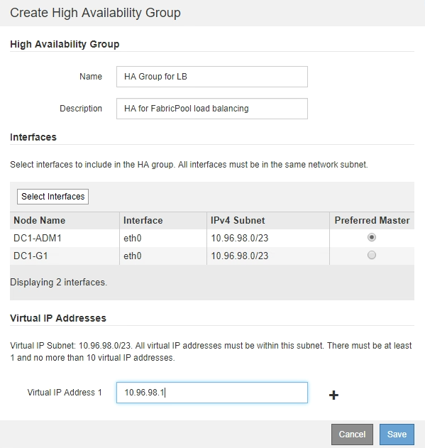

= Erstellen einer HA-Gruppe (High Availability, Hochverfügbarkeit) für FabricPool
:allow-uri-read: 
:icons: font
:imagesdir: ../media/

[role="lead"]
Wenn Sie StorageGRID für die Verwendung mit FabricPool konfigurieren, können Sie optional eine oder mehrere HA-Gruppen (High Availability, Hochverfügbarkeit) erstellen. Eine HA-Gruppe besteht aus mindestens einer Netzwerkschnittstellen auf Admin-Nodes, Gateway-Nodes oder beiden.

.Was Sie benötigen
* Sie müssen über einen unterstützten Browser beim Grid Manager angemeldet sein.
* Sie müssen über die Berechtigung Root Access verfügen.

.Über diese Aufgabe
Jede HA-Gruppe verwendet virtuelle IP-Adressen (VIPs), um hochverfügbaren Zugriff auf die Shared Services auf den zugehörigen Nodes zu ermöglichen.

Weitere Informationen zu dieser Aufgabe. Siehe link:../admin/managing-high-availability-groups.html["Verwalten von Hochverfügbarkeitsgruppen"].

.Schritte
. Wählen Sie *Konfiguration* > *Netzwerkeinstellungen* > *Hochverfügbarkeitsgruppen*.
. Wählen Sie eine oder mehrere der Netzwerkschnittstellen aus. Die Netzwerkschnittstellen müssen entweder im Grid Network (eth0) oder im Client Network (eth2) zum selben Subnetz gehören.
. Weisen Sie einen Knoten als bevorzugter Master zu.
+
Der bevorzugte Master ist die aktive Schnittstelle, wenn kein Fehler auftritt, der dazu führt, dass die VIP-Adressen einer Backup-Schnittstelle neu zugewiesen werden.

. Geben Sie bis zu zehn IPv4-Adressen für die HA-Gruppe ein.
+
Die Adressen müssen sich im IPv4-Subnetz befinden, das von allen Mitgliedschnittstellen gemeinsam genutzt wird.

+

