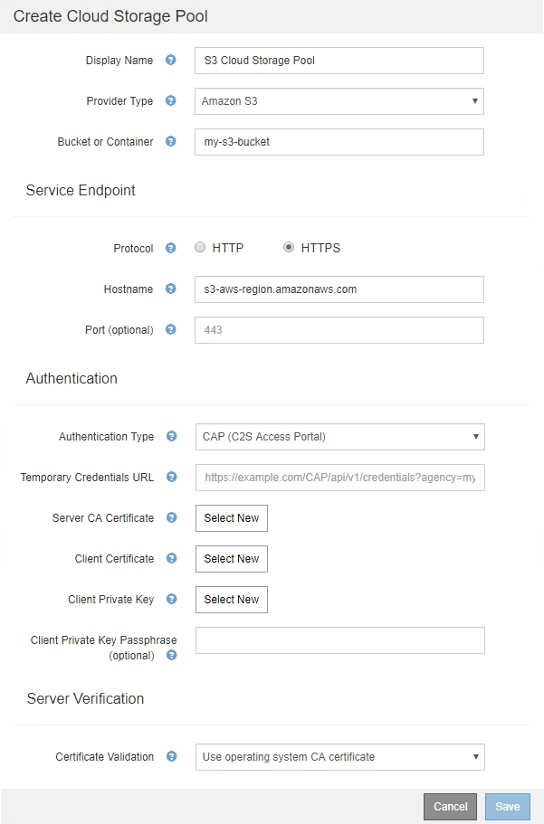

= C2S S3: Angeben von Authentifizierungsdetails für einen Cloud-Storage-Pool
:allow-uri-read: 
:icons: font
:imagesdir: ../media/

[role="lead"]
Wenn Sie den S3-Service (Commercial Cloud Services, C2S) als Cloud-Storage-Pool verwenden möchten, müssen Sie C2S Access Portal (CAP) als Authentifizierungstyp konfigurieren, damit StorageGRID temporäre Anmeldedaten für den Zugriff auf den S3-Bucket in Ihrem C2S-Konto anfordern kann.

.Was Sie benötigen
* Sie müssen die Basisinformationen für einen Amazon S3 Cloud-Storage-Pool, einschließlich des Service-Endpunkts, eingegeben haben.
* Sie müssen die vollständige URL kennen, die StorageGRID zum Abrufen temporärer Anmeldeinformationen vom CAP-Server verwendet, einschließlich aller erforderlichen und optionalen API-Parameter, die Ihrem C2S-Konto zugewiesen sind.
* Sie müssen über ein Server-CA-Zertifikat verfügen, das von einer entsprechenden Behörde ausgestellt wurde. StorageGRID verwendet dieses Zertifikat, um die Identität des CAP-Servers zu überprüfen. Das Server-CA-Zertifikat muss die PEM-Kodierung verwenden.
* Sie müssen über ein Clientzertifikat verfügen, das von einer entsprechenden Behörde ausgestellt wurde. StorageGRID verwendet dieses Zertifikat zur Identität des CAP-Servers. Das Clientzertifikat muss PEM-Kodierung verwenden und Zugriff auf Ihr C2S-Konto haben.
* Sie benötigen einen PEM-kodierten privaten Schlüssel für das Clientzertifikat.
* Wenn der private Schlüssel für das Clientzertifikat verschlüsselt ist, müssen Sie die Passphrase zum Entschlüsseln besitzen.

.Schritte
. Wählen Sie im Abschnitt *Authentifizierung* im Dropdown-Menü *Authentifizierungstyp* die Option *CAP (C2S Access Portal)* aus.
+
Die C2S-Authentifizierungsfelder werden angezeigt.

+

. Geben Sie die folgenden Informationen an:
+
.. Geben Sie unter *URL für temporäre Anmeldeinformationen* die vollständige URL ein, die StorageGRID zum Abrufen temporärer Anmeldeinformationen vom CAP-Server verwendet, einschließlich aller erforderlichen und optionalen API-Parameter, die Ihrem C2S-Konto zugewiesen sind.
.. Klicken Sie für *Server-CA-Zertifikat* auf *Neu auswählen* und laden Sie das PEM-codierte CA-Zertifikat hoch, das StorageGRID zur Überprüfung des CAP-Servers verwendet.
.. Klicken Sie für *Clientzertifikat* auf *Neu auswählen* und laden Sie das PEM-kodierte Zertifikat, das StorageGRID zur Identifizierung auf den CAP-Server verwendet.
.. Klicken Sie für *Client Private Key* auf *Select New* und laden Sie den PEM-kodierten privaten Schlüssel für das Clientzertifikat hoch.
+
Wenn der private Schlüssel verschlüsselt ist, muss das traditionelle Format verwendet werden. (Das verschlüsselte PKCS #8-Format wird nicht unterstützt.)

.. Wenn der private Clientschlüssel verschlüsselt ist, geben Sie die Passphrase zum Entschlüsseln des privaten Clientschlüssels ein. Andernfalls lassen Sie das Feld *Client Private Key Passphrase* leer.

. Geben Sie im Abschnitt Server-Überprüfung folgende Informationen an:
+
.. Wählen Sie für *Zertifikatvalidierung* * Benutzerdefiniertes CA-Zertifikat verwenden* aus.
.. Klicken Sie auf *Neu auswählen*, und laden Sie das PEM-codierte CA-Zertifikat hoch.

. Klicken Sie Auf *Speichern*.

Beim Speichern eines Cloud-Speicherpools führt StorageGRID Folgendes aus:

* Überprüft, ob der Bucket und der Service-Endpunkt vorhanden sind und ob sie mit den von Ihnen angegebenen Zugangsdaten erreicht werden können.
* Schreibt eine Markierungsdatei in den Bucket, um den Bucket als Cloud-Storage-Pool zu identifizieren. Entfernen Sie niemals diese Datei, die benannt ist `x-ntap-sgws-cloud-pool-uuid`.

Wenn die Validierung des Cloud-Storage-Pools fehlschlägt, erhalten Sie eine Fehlermeldung, die erklärt, warum die Validierung fehlgeschlagen ist. Möglicherweise wird ein Fehler gemeldet, wenn ein Zertifikatfehler vorliegt oder der angegebene Bucket nicht bereits vorhanden ist.

image::../media/cloud_storage_pool_create_error.gif[Fehler Beim Erstellen Des Cloud-Storage-Pools]

Lesen Sie die Anweisungen zur Fehlerbehebung bei Cloud-Speicherpools, beheben Sie das Problem und versuchen Sie dann, den Cloud-Speicherpool erneut zu speichern.

.Verwandte Informationen
link:troubleshooting-cloud-storage-pools.html["Fehlerbehebung Bei Cloud Storage Pools"]
