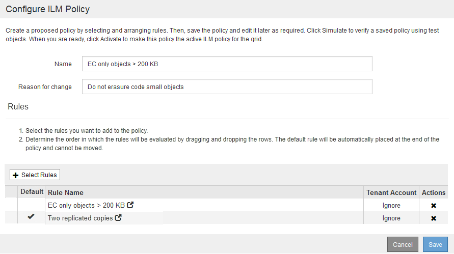

= Beispiel 2: ILM-Regeln und Richtlinie für EC-Objektgrößen-Filterung
:allow-uri-read: 
:icons: font
:imagesdir: ../media/

[role="lead"]
Die folgenden Beispielregeln und -Richtlinien dienen als Ausgangspunkt für die Definition einer ILM-Richtlinie, die nach Objektgröße gefiltert wird, um empfohlene EC-Anforderungen zu erfüllen.

CAUTION: Die folgenden ILM-Regeln und -Richtlinien sind nur Beispiele. Es gibt viele Möglichkeiten zur Konfiguration von ILM-Regeln. Vor der Aktivierung einer neuen Richtlinie sollte die vorgeschlagene Richtlinie simuliert werden, um zu bestätigen, dass sie wie vorgesehen funktioniert, um Inhalte vor Verlust zu schützen.

== ILM-Regel 1 beispielsweise 2: Verwenden Sie EC für alle Objekte, die größer als 200 KB sind

In diesem Beispiel werden alle Objekte, die größer als 200 KB sind (0.20 MB), mit einer ILM-Regel gelöscht.

[cols="1a,2a"]
|===
| Regeldefinition | Beispielwert 

 a| 
Regelname
 a| 
Nur EC-Objekte > 200 KB

 a| 
Referenzzeit
 a| 
Aufnahmezeit

 a| 
Erweiterte Filterung für Objektgröße
 a| 
Objektgröße (MB) größer als 0.20

 a| 
Platzierung Von Inhalten
 a| 
Erstellen Sie eine Kopie mit 2+1-Verfahren zur Fehlerkorrektur mit drei Standorten

|===
image:../media/policy_2_rule_1_ec_objects_adv_filtering.gif["ILM-Regel 1 beispielsweise 2: Verwenden Sie EC für alle Objekte, die größer als 200 KB sind"]

In den Anweisungen zur Platzierung wird angegeben, dass eine Kopie mit 2+1-Erasure-Coding-Verfahren unter Verwendung aller drei Standorte erstellt wird.

image::../media/policy_2_rule_1_ec_objects_placements.png[ILM-Regel 1 beispielsweise 2: Verwenden Sie EC für alle Objekte, die größer als 200 KB sind]

== ILM-Regel 2 beispielsweise 2: Zwei replizierte Kopien

Diese Beispiel-ILM-Regel erstellt zwei replizierte Kopien und filtert nicht nach Objektgröße. Diese Regel ist die zweite Regel in der Richtlinie. Da ILM-Regel 1 beispielsweise 2 alle Objekte gefiltert, die größer als 200 KB sind, gilt ILM-Regel 2 beispielsweise nur für Objekte mit einer Größe von 200 KB.

[cols="1a,2a"]
|===
| Regeldefinition | Beispielwert 

 a| 
Regelname
 a| 
Zwei Replizierte Kopien

 a| 
Referenzzeit
 a| 
Aufnahmezeit

 a| 
Erweiterte Filterung für Objektgröße
 a| 
Keine

 a| 
Platzierung Von Inhalten
 a| 
Erstellen Sie zwei replizierte Kopien, und speichern Sie sie in zwei Rechenzentren, DC1 und DC2

|===
image:../media/ilm_rule_2_example_2_two_replicated_copies.png["Beispiel ILM-Regel 2 beispielsweise 2 - zwei replizierte Kopien"]

== ILM-Richtlinie beispielsweise 2: Verwenden Sie EC für Objekte, die größer als 200 KB sind

In dieser Beispielrichtlinie werden Objekte mit einer Größe von mehr als 200 KB Erasure-Coding ausgeführt. Von allen anderen Objekten werden zwei replizierte Kopien erstellt.

Diese ILM-Richtlinie für das Beispiel umfasst die folgenden ILM-Regeln:

* Löschcode für alle Objekte, die größer als 200 KB sind.
* Wenn ein Objekt nicht mit der ersten ILM-Regel übereinstimmt, erstellen Sie zwei replizierte Kopien dieses Objekts mithilfe der Standard-ILM-Regel. Da Objekte mit einer Größe von mehr als 200 KB nach Regel 1 herausgefiltert wurden, gilt Regel 2 nur für Objekte, die 200 KB oder kleiner sind.
+

