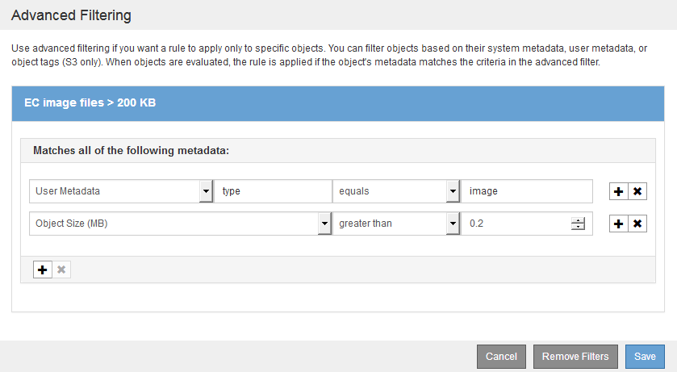
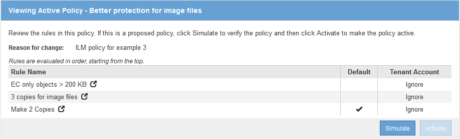

= Beispiel 3: ILM-Regeln und -Richtlinie für besseren Schutz von Image-Dateien
:allow-uri-read: 
:icons: font
:imagesdir: ../media/

[role="lead"]
Mithilfe der folgenden Beispielregeln und -Richtlinie können Sie sicherstellen, dass Bilder mit einer Größe von mehr als 200 KB gelöscht werden und drei Kopien von kleineren Images erstellt werden.

CAUTION: Die folgenden ILM-Regeln und -Richtlinien sind nur Beispiele. Es gibt viele Möglichkeiten zur Konfiguration von ILM-Regeln. Vor der Aktivierung einer neuen Richtlinie sollte die vorgeschlagene Richtlinie simuliert werden, um zu bestätigen, dass sie wie vorgesehen funktioniert, um Inhalte vor Verlust zu schützen.

== ILM-Regel 1 beispielsweise 3: Verwenden Sie EC für Bilddateien, die größer als 200 KB sind

Diese Beispiel ILM-Regel verwendet erweiterte Filterung zur Löschung von Code aller Bilddateien, die größer als 200 KB sind.

[cols="1a,2a"]
|===
| Regeldefinition | Beispielwert 

 a| 
Regelname
 a| 
EC-Bilddateien > 200 KB

 a| 
Referenzzeit
 a| 
Aufnahmezeit

 a| 
Erweiterte Filterung für Benutzermetadaten
 a| 
Der Metadatentyp des Benutzers entspricht den Bilddateien

 a| 
Erweiterte Filterung für Objektgröße
 a| 
Objektgröße (MB) größer als 0.2

 a| 
Platzierung Von Inhalten
 a| 
Erstellen Sie eine Kopie mit 2+1-Verfahren zur Fehlerkorrektur mit drei Standorten

|===

Da diese Regel als erste Regel in der Richtlinie konfiguriert ist, gilt die Anweisung zur Platzierung von Erasure Coding nur für Bilder, die größer als 200 KB sind.

image::../media/policy_2_rule_1_ec_objects_placements.png[ILM-Regel 1 beispielsweise 3: Verwenden Sie EC für Bilddateien, die größer als 200 KB sind]

== ILM-Regel 2 beispielsweise 3: Replizieren Sie 3 Kopien für alle übrigen Image-Dateien

Diese Beispiel-ILM-Regel verwendet erweiterte Filterung, um anzugeben, dass Bilddateien repliziert werden.

[cols="1a,2a"]
|===
| Regeldefinition | Beispielwert 

 a| 
Regelname
 a| 
3 Kopien für Bilddateien

 a| 
Referenzzeit
 a| 
Aufnahmezeit

 a| 
Erweiterte Filterung für Benutzermetadaten
 a| 
Der Metadatentyp des Benutzers entspricht den Bilddateien

 a| 
Platzierung Von Inhalten
 a| 
Erstellen Sie 3 replizierte Kopien in allen Storage-Nodes

|===
image:../media/policy_3_rule_2_copies_for_images_adv_filtering.gif["ILM-Regel 2 beispielsweise 3: Replizieren Sie 3 Kopien für alle übrigen Image-Dateien"]

Da die erste Regel in der Richtlinie bereits Bilddateien mit einer Größe von mehr als 200 KB übereinstimmt, gelten diese Platzierungsanweisungen nur für Bilddateien mit einer Größe von 200 KB.

image::../media/policy_3_rule_2_copies_for_images_placements.png[ILM-Regel 2 beispielsweise 3: Replizieren Sie 3 Kopien für alle übrigen Image-Dateien]

== ILM-Richtlinie beispielsweise 3: Besserer Schutz für Image-Dateien

In diesem Beispiel erstellt die ILM-Richtlinie drei ILM-Regeln, die eine Richtlinie erstellen, die beim Löschen von Image-Dateien, die größer als 200 KB (0.2 MB) sind, replizierte Kopien für Image-Dateien erstellt, die mindestens 200 KB groß sind, und zwei replizierte Kopien für alle Dateien erstellt, die nicht mit dem Image verknüpft sind.

In diesem Beispiel enthält die ILM-Richtlinie folgende Regeln:

* Löschen Code alle Bilddateien größer als 200 KB.
* Erstellen Sie drei Kopien aller verbleibenden Bilddateien (d. h. Bilder, die 200 KB oder kleiner sind).
* Wenden Sie die Standardregel auf alle übrigen Objekte an (d. h. alle nicht-Image-Dateien).

