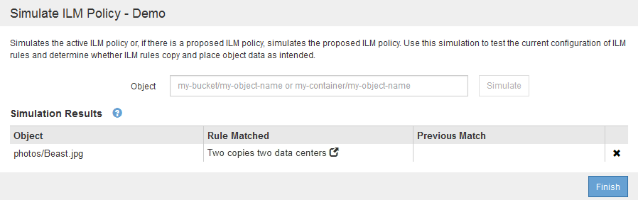

= Beispiele für die Simulation von ILM-Richtlinien
:allow-uri-read: 
:icons: font
:imagesdir: ../media/

[role="lead"]
Diese Beispiele zeigen, wie Sie ILM-Regeln durch Simulation der ILM-Richtlinie vor der Aktivierung überprüfen können.

== Beispiel 1: Überprüfung der Regeln bei der Simulation einer vorgeschlagenen ILM-Richtlinie

Dieses Beispiel zeigt, wie Regeln bei der Simulation einer vorgeschlagenen Richtlinie überprüft werden.

In diesem Beispiel wird die *Beispiel ILM-Richtlinie* für die aufgenommene Objekte in zwei Buckets simuliert. Die Richtlinie umfasst drei Regeln:

* Die erste Regel, *zwei Kopien, zwei Jahre für Eimer-A*, gilt nur für Objekte in Eimer-a.
* Die zweite Regel, menu:EC Objects[1 MB], gilt für alle Buckets, aber für Filter auf Objekten größer als 1 MB.
* Die dritte Regel ist die Standardregel und enthält keine Filter.

image::../media/saved_policy_for_simulation.png[Gespeicherte Richtlinie für Simulation]

.Schritte
. Klicken Sie nach dem Hinzufügen der Regeln und dem Speichern der Richtlinie auf *Simulieren*.
+
Das Dialogfeld ILM-Richtlinie simulieren wird angezeigt.

. Geben Sie im Feld *Object* den S3-Bucket/Object-Key oder den Swift-Container/Object-Name für ein Testobjekt ein und klicken Sie auf *Simulate*.
+
Die Simulationsergebnisse werden angezeigt und zeigen an, welche Regel in der Richtlinie zu jedem getesteten Objekt passt.

+
image::../media/simulate_policy_screen.png[Bildschirm Richtlinie Simulieren]

. Vergewissern Sie sich, dass jedes Objekt mit der richtigen Regel übereinstimmt.
+
In diesem Beispiel:

+
.. `bucket-a/bucket-a object.pdf` Die erste Regel, die nach Objekten in filtert, wurde richtig zugeordnet `bucket-a`.
.. `bucket-b/test object greater than 1 MB.pdf` Ist in `bucket-b`, So dass es nicht mit der ersten Regel. Stattdessen wurde sie durch die zweite Regel korrekt abgeglichen, die nach Objekten mit einer Größe von mehr als 1 MB filtert.
.. `bucket-b/test object less than 1 MB.pdf` Stimmt nicht mit den Filtern in den ersten beiden Regeln überein, so wird sie durch die Standardregel platziert, die keine Filter enthält.

== Beispiel 2: Neuanordnung von Regeln bei der Simulation einer vorgeschlagenen ILM-Richtlinie

Dieses Beispiel zeigt, wie Sie Regeln neu anordnen können, um die Ergebnisse bei der Simulation einer Richtlinie zu ändern.

In diesem Beispiel wird die *Demo*-Richtlinie simuliert. Diese Richtlinie, die zum Auffinden von Objekten mit Metadaten für Benutzer der Serie=x-men bestimmt ist, enthält drei Regeln:

* Die erste Regel, *PNGs*, filtert nach Schlüsselnamen, die enden `.png`.
* Die zweite Regel, *X-Men*, gilt nur für Objekte für Mieter A und Filter für `series=x-men` Benutzer-Metadaten:
* Die letzte Regel, *zwei Kopien zwei Rechenzentren*, ist die Standardregel, die alle Objekte, die nicht mit den ersten beiden Regeln übereinstimmen, übereinstimmt.

image::../media/simulate_reorder_rules_pngs_rule.png[Beispiel 2: Neuanordnung von Regeln bei der Simulation einer vorgeschlagenen ILM-Richtlinie]

.Schritte
. Klicken Sie nach dem Hinzufügen der Regeln und dem Speichern der Richtlinie auf *Simulieren*.
. Geben Sie im Feld *Object* den S3-Bucket/Object-Key oder den Swift-Container/Object-Name für ein Testobjekt ein und klicken Sie auf *Simulate*.
+
Die Simulationsergebnisse werden angezeigt, wobei das angezeigt wird `Havok.png` Das Objekt wurde durch die *PNGs*-Regel abgeglichen.

+
image::../media/simulate_reorder_rules_pngs_result.gif[Beispiel 2: Neuanordnung von Regeln bei der Simulation einer vorgeschlagenen ILM-Richtlinie]

+
Allerdings die Regel, dass die `Havok.png` Das Objekt war für den Test die *X-Men*-Regel gedacht.

. Um das Problem zu lösen, ordnen Sie die Regeln neu an.
+
.. Klicken Sie auf *Fertig stellen*, um die Seite ILM-Richtlinie simulieren zu schließen.
.. Klicken Sie auf *Bearbeiten*, um die Richtlinie zu bearbeiten.
.. Ziehen Sie die *X-Men*-Regel an den Anfang der Liste.
+
image::../media/simulate_reorder_rules_correct_rule.png[Simulieren - Regeln Neu Ordnen - Korrekte Regel]

.. Klicken Sie Auf *Speichern*.

. Klicken Sie Auf *Simulieren*.
+
Die zuvor getesteten Objekte werden anhand der aktualisierten Richtlinie neu bewertet und die neuen Simulationsergebnisse angezeigt. Im Beispiel wird in der Spalte Regel zugeordnet das angezeigt `Havok.png` Das Objekt entspricht jetzt wie erwartet der X-Men-Metadatenregel. Die Spalte Vorheriger Abgleich zeigt an, dass die PNGs-Regel mit dem Objekt in der vorherigen Simulation übereinstimmt.

+
image::../media/simulate_reorder_rules_correct_result.gif[Beispiel 2: Neuanordnung von Regeln bei der Simulation einer vorgeschlagenen ILM-Richtlinie]

+

NOTE: Wenn Sie auf der Seite Richtlinien konfigurieren bleiben, können Sie eine Richtlinie nach Änderungen erneut simulieren, ohne die Namen der Testobjekte erneut eingeben zu müssen.

== Beispiel 3: Korrektur einer Regel bei der Simulation einer vorgeschlagenen ILM-Richtlinie

Dieses Beispiel zeigt, wie eine Richtlinie simuliert, eine Regel in der Richtlinie korrigiert und die Simulation fortgesetzt wird.

In diesem Beispiel wird die *Demo*-Richtlinie simuliert. Diese Richtlinie dient zum Suchen von Objekten, die über solche verfügen `series=x-men` Benutzer-Metadaten: Bei der Simulation dieser Richtlinie gegen die traten jedoch unerwartete Ergebnisse auf `Beast.jpg` Objekt: Anstatt die X-Men-Metadatenregel zu entsprechen, kopiert das Objekt die Standardregel. Zwei Rechenzentren werden kopiert.

Wenn ein Testobjekt nicht mit der erwarteten Regel in der Richtlinie übereinstimmt, müssen Sie jede Regel in der Richtlinie überprüfen und eventuelle Fehler korrigieren.

.Schritte
. Zeigen Sie für jede Regel in der Richtlinie die Regeleinstellungen an, indem Sie auf den Regelnamen oder das Symbol Weitere Details klicken image:../media/icon_nms_more_details.gif["Weitere Details"] In jedem Dialogfeld, in dem die Regel angezeigt wird.
. Prüfen Sie das Mandantenkonto der Regel, die Referenzzeit und die Filterkriterien.
+
In diesem Beispiel enthält die Metadaten für die X-Men-Regel einen Fehler. Der Metadatenwert wurde als „`x-men1`“ anstelle von „`x-men.`“ eingegeben.

+
image::../media/simulate_rules_select_rule_popup_with_wrong_metadata.png[Beispiel 3: Korrektur einer Regel bei der Simulation einer vorgeschlagenen ILM-Richtlinie]

. Um den Fehler zu beheben, korrigieren Sie die Regel wie folgt:
+
** Wenn die Regel Teil der vorgeschlagenen Richtlinie ist, können Sie entweder die Regel klonen oder die Regel aus der Richtlinie entfernen und sie dann bearbeiten.
** Wenn die Regel Teil der aktiven Richtlinie ist, müssen Sie die Regel klonen. Sie können eine Regel nicht bearbeiten oder aus der aktiven Richtlinie entfernen.
+
[cols="1a,3a"]
|===
| Option | Beschreibung 

 a| 
Klonen der Regel
 a| 
... Wählen Sie *ILM* > *Regeln*.
... Wählen Sie die falsche Regel aus, und klicken Sie auf *Clone*.
... Ändern Sie die falschen Informationen, und klicken Sie auf *Speichern*.
... Wählen Sie *ILM* > *Richtlinien*.
... Wählen Sie die vorgeschlagene Richtlinie aus, und klicken Sie auf *Bearbeiten*.
... Klicken Sie Auf *Regeln Auswählen*.
... Aktivieren Sie das Kontrollkästchen für die neue Regel, deaktivieren Sie das Kontrollkästchen für die ursprüngliche Regel, und klicken Sie auf *Anwenden*.
... Klicken Sie Auf *Speichern*.

 a| 
Bearbeiten der Regel
 a| 
... Wählen Sie die vorgeschlagene Richtlinie aus, und klicken Sie auf *Bearbeiten*.
... Klicken Sie auf das Löschsymbol image:../media/icon_nms_delete_new.gif["Symbol Löschen"] Um die falsche Regel zu entfernen, und klicken Sie auf *Speichern*.
... Wählen Sie *ILM* > *Regeln*.
... Wählen Sie die falsche Regel aus, und klicken Sie auf *Bearbeiten*.
... Ändern Sie die falschen Informationen, und klicken Sie auf *Speichern*.
... Wählen Sie *ILM* > *Richtlinien*.
... Wählen Sie die vorgeschlagene Richtlinie aus, und klicken Sie auf *Bearbeiten*.
... Wählen Sie die korrigierte Regel aus, klicken Sie auf *Anwenden* und klicken Sie auf *Speichern*.

|===

. Führen Sie die Simulation erneut aus.
+

NOTE: Da Sie zur Bearbeitung der Regel nicht mehr auf der Seite ILM-Richtlinien navigiert haben, werden die zuvor für die Simulation eingegebenen Objekte nicht mehr angezeigt. Sie müssen die Namen der Objekte erneut eingeben.

+
In diesem Beispiel entspricht die korrigierte X-Men-Regel nun dem `Beast.jpg` Objekt auf Grundlage des `series=x-men` Benutzer-Metadaten, wie erwartet.

+
image::../media/simulate_results_for_object_corrected_metadata.gif[Beispiel 3: Korrektur einer Regel bei der Simulation einer vorgeschlagenen ILM-Richtlinie]

