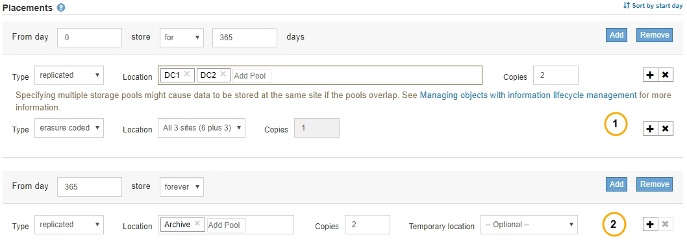

= Welche Anweisungen zur Platzierung der ILM-Regeln gibt es
:allow-uri-read: 
:icons: font
:imagesdir: ../media/

[role="lead"]
Eine Anleitung zur Platzierung bestimmt, wo, wann und wie Objektdaten gespeichert werden. Eine ILM-Regel kann eine oder mehrere Anweisungen zur Platzierung enthalten. Jede Einstufungsanweisung gilt für einen einzelnen Zeitraum.

Beim Erstellen einer Speicheranweisung geben Sie an, wann die Platzierung zutrifft (der Zeitraum), welche Art von Kopien erstellt werden sollen (repliziert oder Erasure Coding) und wo die Kopien gespeichert werden (ein oder mehrere Speicherorte). Innerhalb einer einzigen Regel können Sie mehrere Platzierungen für einen Zeitraum festlegen und Anweisungen zur Platzierung für mehr als einen Zeitraum:

* Klicken Sie auf das Pluszeichen-Symbol, um mehr als eine Objektplatzierung während eines einzelnen Zeitraums festzulegen image:../media/icon_plus_sign_black_on_white.gif["Plus Sign Icon Schwarz auf Weiß"] Hinzufügen von mehr als einer Zeile für diesen Zeitraum.
* Wenn Sie für mehr als einen Zeitraum Objektplatzierungen angeben möchten, klicken Sie auf die Schaltfläche *Hinzufügen*, um den nächsten Zeitraum hinzuzufügen. Geben Sie dann eine oder mehrere Zeilen innerhalb des Zeitraums an.

Das Beispiel zeigt die Seite Platzierungen definieren im Assistenten „ILM-Regel erstellen“.

[cols="1a,3a"]
|===

 a| 
image:../media/icon_number_1.png["Symbol Nummer 1"]
 a| 
Die erste Einstufungsanweisung hat zwei Linien für das erste Jahr:

. In der ersten Zeile werden zwei replizierte Objektkopien an zwei Datacenter-Standorten erstellt.
. Die zweite Zeile erstellt eine Kopie mit 6 und 3 zur Fehlerkorrektur codierten Kopien unter Verwendung von drei Datacenter-Standorten.

 a| 
image:../media/icon_number_2.png["Symbol 2"]
 a| 
Die zweite Anleitung zur Platzierung erstellt zwei archivierte Kopien nach einem Jahr und speichert diese Kopien für immer.

|===
Wenn Sie den Satz von Anweisungen zur Platzierung für eine Regel definieren, müssen Sie sicherstellen, dass mindestens eine Platzierungsanweisung an Tag 0 beginnt, dass zwischen den von Ihnen definierten Zeiträumen keine Lücken bestehen. Und dass die abschließende Anweisung zum Platzieren entweder für immer oder bis Sie keine Objektkopien mehr benötigen.

Da jeder Zeitraum in der Regel abläuft, werden die Anweisungen zur Inhaltsplatzierung für den nächsten Zeitraum angewendet. Neue Objektkopien werden erstellt und nicht benötigte Kopien werden gelöscht.
