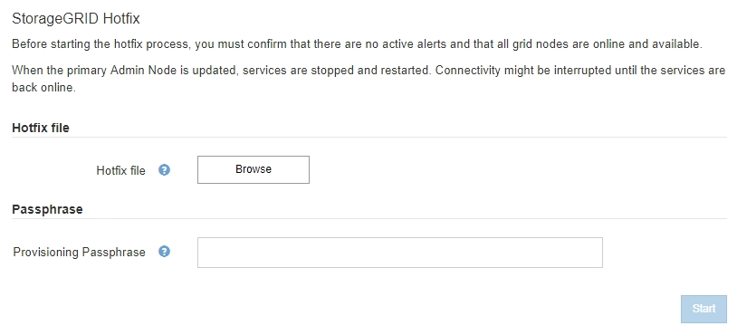
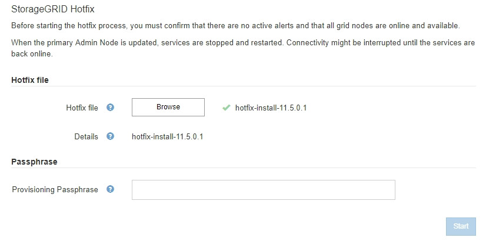
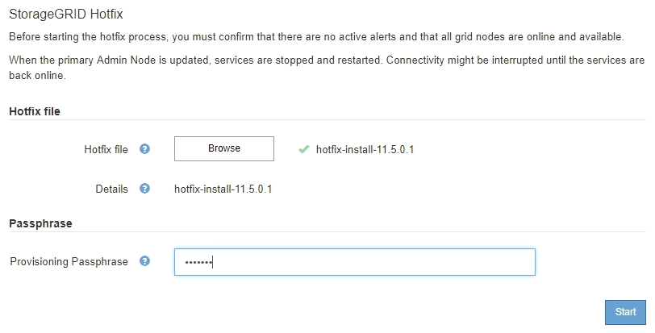
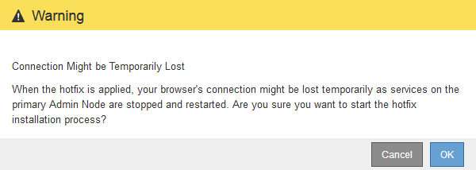
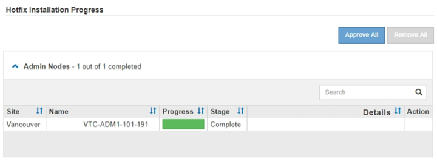

= Anwenden des Hotfix
:allow-uri-read: 
:icons: font
:imagesdir: ../media/

[role="lead"]
Der Hotfix wird zuerst automatisch auf den primären Admin-Knoten angewendet. Anschließend müssen Sie die Anwendung des Hotfix für andere Grid-Knoten genehmigen, bis alle Knoten dieselbe Softwareversion ausführen. Sie können die Genehmigungssequenz anpassen, indem Sie auswählen, ob einzelne Grid-Nodes, Gruppen von Grid-Nodes oder alle Grid-Nodes genehmigt werden sollen.

.Was Sie benötigen
* Sie haben alle Überlegungen geprüft und alle Schritte in "`Hotfix Planung und Vorbereitung.`" abgeschlossen.
* Sie müssen über eine Passphrase für die Bereitstellung verfügen.
* Sie müssen über Root Access oder die Wartungsberechtigung verfügen.
* Sie können die Anwendung eines Hotfix auf einen Knoten verzögern. Der Hotfix-Prozess ist jedoch erst abgeschlossen, wenn Sie den Hotfix auf alle Knoten anwenden.
* Sie können erst nach Abschluss des Hotfix-Vorgangs ein StorageGRID Software-Upgrade oder ein SANtricity OS-Upgrade durchführen.

.Schritte
. Melden Sie sich über einen unterstützten Browser beim Grid Manager an.
. Wählen Sie *Wartung* *System* *Software-Update*.
+
Die Seite Software-Aktualisierung wird angezeigt.

+
image::../media/software_update_landing.png[Landing Page Für Software-Updates]

. Wählen Sie *StorageGRID Hotfix*.
+
Die Seite StorageGRID Hotfix wird angezeigt.

+

. Wählen Sie die Hotfix-Datei aus, die Sie von der NetApp Support-Webseite heruntergeladen haben.
+
.. Wählen Sie *Durchsuchen*.
.. Suchen und wählen Sie die Datei aus.
+
`hotfix-install-_version_`

.. Wählen Sie *Offen*.
+
Die Datei wurde hochgeladen. Nach Abschluss des Uploads wird der Dateiname im Feld Details angezeigt.

+

NOTE: Ändern Sie den Dateinamen nicht, da er Teil des Verifizierungsvorgangs ist.

+

. Geben Sie die Provisionierungs-Passphrase in das Textfeld ein.
+
Die Schaltfläche *Start* wird aktiviert.

+

. Wählen Sie *Start*.
+
Eine Warnung wird angezeigt, dass die Verbindung Ihres Browsers vorübergehend unterbrochen wird, da Dienste auf dem primären Admin-Knoten neu gestartet werden.

+

. Wählen Sie *OK*, um mit der Anwendung des Hotfix auf den primären Admin-Knoten zu beginnen.
+
Wenn der Hotfix beginnt:

+
.. Die Hotfix-Validierungen werden ausgeführt.
+

NOTE: Wenn Fehler gemeldet werden, beheben Sie sie, laden Sie die Hotfix-Datei erneut hoch und wählen Sie erneut *Start* aus.

.. Die Tabelle mit dem Hotfix-Installationsfortschritt wird angezeigt. Diese Tabelle zeigt alle Knoten in Ihrem Raster und die aktuelle Phase der Hotfix-Installation für jeden Knoten. Die in der Tabelle aufgeführten Nodes sind nach Typ gruppiert:
+
*** Admin-Nodes
*** Gateway-Nodes
*** Storage-Nodes
*** Archiv-Nodes

+

NOTE: Der Fortschrittsbalken erreicht den Abschluss, und dann wird der primäre Admin-Node zuerst mit der Phase „`Complete`“ angezeigt.

+

. Sortieren Sie die Listen der Knoten in jeder Gruppierung in aufsteigender oder absteigender Reihenfolge nach *Site*, *Name*, *Progress*, *Stage* oder *Details*. Oder geben Sie einen Begriff in das Feld *Suche* ein, um nach bestimmten Knoten zu suchen.
. Genehmigen Sie die Grid-Knoten, die aktualisiert werden können. Genehmigte Nodes desselben Typs werden nacheinander aktualisiert.
+

IMPORTANT: Genehmigen Sie den Hotfix nicht für einen Knoten, es sei denn, Sie sind sicher, dass der Knoten bereit ist, aktualisiert zu werden.Wenn das Hotfix auf einen Grid-Knoten angewendet wird, werden einige Dienste auf diesem Knoten möglicherweise neu gestartet. Diese Vorgänge können zu Serviceunterbrechungen für Clients führen, die mit dem Node kommunizieren.

+
** Wählen Sie eine oder mehrere *Genehmigen*-Schaltflächen, um einen oder mehrere einzelne Knoten zur Hotfix-Warteschlange hinzuzufügen.
** Wählen Sie in jeder Gruppierung die Schaltfläche *Alle genehmigen* aus, um alle Knoten desselben Typs der Hotfix-Warteschlange hinzuzufügen. Wenn Sie Suchkriterien im Feld *Suche* eingegeben haben, gilt die Schaltfläche *Alle genehmigen* für alle durch die Suchkriterien ausgewählten Knoten.
+

NOTE: Die Schaltfläche *Alle genehmigen* oben auf der Seite genehmigt alle Knoten, die auf der Seite aufgeführt sind, während die Schaltfläche *Alle genehmigen* oben in einer Tabellengruppierung nur alle Knoten in dieser Gruppe genehmigt. Wenn die Reihenfolge, in der Knoten aktualisiert werden, wichtig ist, genehmigen Sie Knoten oder Gruppen von Knoten jeweils eins und warten Sie, bis das Upgrade auf jedem Knoten abgeschlossen ist, bevor Sie den nächsten Knoten genehmigen.

** Wählen Sie oben auf der Seite die Schaltfläche *Alle genehmigen* aus, um alle Knoten im Raster zur Hotfix-Warteschlange hinzuzufügen.
+

NOTE: Sie müssen den StorageGRID-Hotfix abschließen, bevor Sie ein anderes Softwareupdate starten können. Wenn Sie den Hotfix nicht abschließen können, wenden Sie sich an den technischen Support.

. Wenn Sie einen Knoten oder alle Knoten aus der Hotfix-Warteschlange entfernen müssen, wählen Sie *Entfernen* oder *Alle entfernen*.
+
Wie im Beispiel gezeigt, wird die Phase über „`Queued`“ hinaus ausgeblendet und Sie können den Knoten nicht mehr aus dem Hotfix-Prozess entfernen.

+
image::../media/approve_all_progresstable.png[Hotfix-Fortschritt mit Entnahme-Taste]

. Warten Sie, bis der Hotfix auf jeden genehmigten Grid-Knoten angewendet wird.
+
Wenn der Hotfix erfolgreich auf allen Knoten installiert wurde, wird die Fortschrittstabelle für die Hotfix-Installation geschlossen. Ein grünes Banner zeigt das Datum und die Uhrzeit an, zu der der Hotfix abgeschlossen wurde.

. Wenn der Hotfix nicht auf alle Knoten angewendet werden konnte, überprüfen Sie den Fehler für jeden Knoten, beheben Sie das Problem und wiederholen Sie diese Schritte.
+
Der Vorgang ist erst abgeschlossen, wenn der Hotfix auf alle Knoten angewendet wurde. Sie können den Hotfix-Prozess so oft wie nötig wiederholen, bis er abgeschlossen ist.

.Verwandte Informationen
link:hotfix-planning-and-preparation.html["Hotfix Planung und Vorbereitung"]

link:../admin/index.html["StorageGRID verwalten"]

link:../monitor/index.html["Monitor  Fehlerbehebung"]
