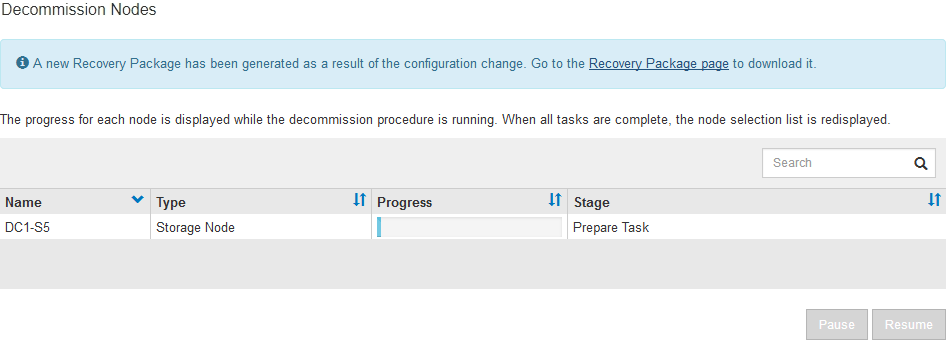

= Deaktivierung verbundener Grid-Nodes
:allow-uri-read: 
:icons: font
:imagesdir: ../media/

[role="lead"]
Sie können Nodes, die mit dem Grid verbunden sind, außer Betrieb nehmen und dauerhaft entfernen.

.Was Sie benötigen
* Sie kennen die Anforderungen und Überlegungen für die Deaktivierung von Grid-Nodes.
+
link:considerations-for-decommissioning-grid-nodes.html["Überlegungen für die Deaktivierung von Grid-Nodes"]

* Sie haben alle benötigten Materialien zusammengestellt.
* Sie haben sichergestellt, dass keine Datenreparaturjobs aktiv sind.
* Sie haben bestätigt, dass die Wiederherstellung von Storage-Nodes an keiner Stelle im Grid ausgeführt wird. In diesem Fall müssen Sie warten, bis alle Cassandra-Rebuilds im Rahmen der Recovery abgeschlossen sind. Anschließend können Sie mit der Stilllegung fortfahren.
* Sie haben sichergestellt, dass andere Wartungsvorgänge während der Deaktivierung des Nodes nicht ausgeführt werden, es sei denn, der Vorgang zur Deaktivierung des Nodes wurde angehalten.
* Sie haben die Provisionierungs-Passphrase.
* Die Grid-Nodes sind verbunden.
* Die Spalte *Decommission möglich* für den Knoten oder Knoten, die deaktiviert werden sollen, enthält ein grünes Häkchen.
* Alle Grid-Nodes weisen den normalen Zustand (grün) auf . Wenn eines dieser Symbole in der Spalte *Gesundheit* angezeigt wird, müssen Sie versuchen, das Problem zu lösen:
+
|===

| Symbol | Farbe | Schweregrad 

 a| 
image:../media/icon_alarm_yellow_notice.gif["Gelbes Quadrat-Symbol"]
 a| 
Gelb
 a| 
Hinweis

 a| 
image:../media/icon_alarm_light_orange_minor.gif["Hellorangefarbenes Diamantsymbol"]
 a| 
Hellorange
 a| 
Gering

 a| 
image:../media/icon_alarm_orange_major.gif["Dunkles orangefarbenes Diamantsymbol"]
 a| 
Dunkelorange
 a| 
Major

 a| 
image:../media/icon_alarm_red_critical.gif["Rotes X-Symbol"]
 a| 
Rot
 a| 
Kritisch

|===
* Wenn Sie zuvor einen getrennten Speicherknoten außer Betrieb genommen haben, wurden die Reparaturaufträge erfolgreich abgeschlossen. Informationen zum Überprüfen von Datenreparaturjobs finden Sie in den Anweisungen.

IMPORTANT: Entfernen Sie die virtuelle Maschine oder andere Ressourcen eines Grid-Node erst, wenn Sie dazu in diesem Verfahren aufgefordert werden.

.Schritte
. Aktivieren Sie auf der Seite Decommission Nodes das Kontrollkästchen für jeden Grid-Knoten, den Sie stilllegen möchten.
. Geben Sie die Provisionierungs-Passphrase ein.
+
Die Schaltfläche *Start Decommission* ist aktiviert.

. Klicken Sie Auf *Start Decommission*.
+
Ein Bestätigungsdialogfeld wird angezeigt.

+
image::../media/decommission_confirmation.gif[Screenshot des Dialogfelds zur Bestätigung der Deaktivierung]

. Überprüfen Sie die Liste der ausgewählten Knoten, und klicken Sie auf *OK*.
+
Daraufhin wird der Vorgang zum Stilllegen des Node gestartet, und der Fortschritt wird für jeden Node angezeigt. Während des Verfahrens wird ein neues Wiederherstellungspaket generiert, um die Änderung der Grid-Konfiguration anzuzeigen.

+

+

IMPORTANT: Nehmen Sie einen Storage Node nicht in den Offline-Modus, nachdem der Vorgang zur Deaktivierung gestartet wurde. Wenn Sie den Status ändern, werden einige Inhalte möglicherweise nicht an andere Orte kopiert.

. Sobald das neue Wiederherstellungspaket verfügbar ist, klicken Sie auf den Link oder wählen Sie *Wartung* *System* *Wiederherstellungspaket*, um die Seite Wiederherstellungspaket aufzurufen. Laden Sie anschließend die herunter `.zip` Datei:
+
Lesen Sie die Anweisungen zum Herunterladen des Wiederherstellungspakets.

+

NOTE: Laden Sie das Wiederherstellungspaket so schnell wie möglich herunter, um sicherzustellen, dass Sie Ihr Grid wiederherstellen können, wenn während des Stillfalls etwas schief geht.

. Überwachen Sie die Seite Decommission Nodes regelmäßig, um sicherzustellen, dass alle ausgewählten Knoten erfolgreich deaktiviert wurden.
+
Storage-Nodes können Tage oder Wochen ausmustern. Wenn alle Aufgaben abgeschlossen sind, wird die Liste der Knotenauswahl mit einer Erfolgsmeldung erneut angezeigt.

+
image::../media/decommission_nodes_procedure_complete.png[Screenshot zeigt, dass die Deaktivierung abgeschlossen ist]

. Befolgen Sie den entsprechenden Schritt für Ihre Plattform. Beispiel:
+
** *Linux*: Möglicherweise möchten Sie die Volumes trennen und die Knoten-Konfigurationsdateien löschen, die Sie während der Installation erstellt haben.
** *VMware*: Sie können die vCenter "`Delete from Disk`" Option verwenden, um die virtuelle Maschine zu löschen. Möglicherweise müssen Sie auch alle Datenfestplatten löschen, die unabhängig von der virtuellen Maschine sind.
** *StorageGRID-Appliance*: Der Appliance-Knoten wird automatisch in einen nicht bereitgestellten Zustand zurückgesetzt, in dem Sie auf das Installationsprogramm der StorageGRID-Appliance zugreifen können. Sie können das Gerät ausschalten oder es einem anderen StorageGRID-System hinzufügen.

Führen Sie die folgenden Schritte aus, nachdem Sie den Vorgang zur Deaktivierung des Node abgeschlossen haben:

* Stellen Sie sicher, dass die Laufwerke des ausgemusterten Grid-Node sauber gelöscht werden. Verwenden Sie ein handelsübliches Datenwischwerkzeug oder einen Dienst, um die Daten dauerhaft und sicher von den Laufwerken zu entfernen.
* Wenn Sie einen Appliance-Node deaktiviert haben und die Daten auf der Appliance mithilfe der Node-Verschlüsselung geschützt wurden, löschen Sie die Konfiguration des Verschlüsselungsmanagement-Servers (Clear KMS) mithilfe des StorageGRID Appliance Installer. Wenn Sie die Appliance in einem anderen Raster verwenden möchten, müssen Sie die KMS-Konfiguration löschen.
+
link:../sg100-1000/index.html["SG100  SG1000 Services-Appliances"]

+
link:../sg5600/index.html["SG5600 Storage Appliances"]

+
link:../sg5700/index.html["SG5700 Storage-Appliances"]

+
link:../sg6000/index.html["SG6000 Storage-Appliances"]

.Verwandte Informationen
link:checking-data-repair-jobs.html["Datenreparaturaufträge werden überprüft"]

link:downloading-recovery-package.html["Herunterladen des Wiederherstellungspakets"]

link:../rhel/index.html["Installieren Sie Red hat Enterprise Linux oder CentOS"]
