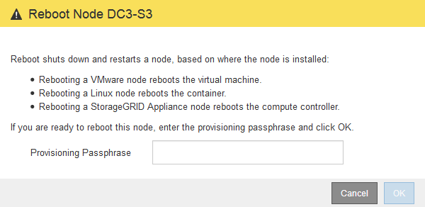

= Neubooten eines Grid-Node aus dem Grid Manager
:allow-uri-read: 
:icons: font
:imagesdir: ../media/

[role="lead"]
Beim Neubooten eines Grid-Node aus dem Grid Manager wird der Probleme auftreten `reboot` Befehl auf dem Ziel-Node.

.Was Sie benötigen
* Sie müssen über einen unterstützten Browser beim Grid Manager angemeldet sein.
* Sie müssen über die Berechtigung Wartung oder Stammzugriff verfügen.
* Sie müssen über eine Passphrase für die Bereitstellung verfügen.

.Schritte
. Wählen Sie *Knoten*.
. Wählen Sie den Grid-Node aus, den Sie neu booten möchten.
. Wählen Sie die Registerkarte *Aufgaben* aus.
+
image::../media/nodes_tasks_reboot.gif[Knoten > Aufgaben > Schaltfläche Neu booten]

. Klicken Sie Auf *Neustart*.
+
Ein Bestätigungsdialogfeld wird angezeigt.

+

+

NOTE: Wenn Sie den primären Admin-Knoten neu starten, wird im Bestätigungsdialogfeld darauf hingewiesen, dass die Verbindung Ihres Browsers zum Grid Manager vorübergehend verloren geht, wenn Dienste beendet werden.

. Geben Sie die Provisionierungs-Passphrase ein, und klicken Sie auf *OK*.
. Warten Sie, bis der Node neu gebootet wird.
+
Es kann einige Zeit dauern, bis Dienste heruntergefahren werden.

+
Wenn der Knoten neu gestartet wird, wird das graue Symbol (Administrativ Down) auf der linken Seite der Seite Knoten angezeigt. Wenn alle Dienste wieder gestartet wurden, ändert sich das Symbol wieder in seine ursprüngliche Farbe.

