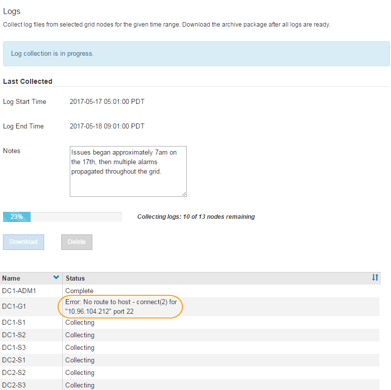

= Protokolldateien und Systemdaten werden erfasst
:allow-uri-read: 
:icons: font
:imagesdir: ../media/

[role="lead"]
Mit dem Grid Manager können Sie Protokolldateien und Systemdaten (einschließlich Konfigurationsdaten) für Ihr StorageGRID System abrufen.

.Was Sie benötigen
* Sie müssen über einen unterstützten Browser beim Grid Manager angemeldet sein.
* Sie müssen über spezifische Zugriffsberechtigungen verfügen.
* Sie müssen über eine Passphrase für die Bereitstellung verfügen.

.Über diesen Taak
Mit dem Grid Manager können Sie Protokolldateien, Systemdaten und Konfigurationsdaten für den von Ihnen ausgewählten Zeitraum von einem beliebigen Grid-Node aus erfassen. Die Daten werden in einer .tar.gz-Datei gesammelt und archiviert, die Sie dann auf Ihren lokalen Computer herunterladen können.

Da Anwendungsprotokolle sehr groß sein können, muss das Zielverzeichnis, in dem Sie die archivierten Protokolldateien herunterladen, mindestens 1 GB freien Speicherplatz haben.

.Schritte
. Wählen Sie *Support* > *Extras* > *Protokolle*.
+
image::../media/support_logs_select_nodes.gif[Screenshot der Log-Collection-UI]

. Wählen Sie die Grid-Knoten aus, für die Sie Protokolldateien sammeln möchten.
+
Je nach Bedarf können Sie Log-Dateien für das gesamte Grid oder einen gesamten Datacenter-Standort sammeln.

. Wählen Sie eine *Startzeit* und *Endzeit* aus, um den Zeitbereich der Daten festzulegen, die in die Protokolldateien aufgenommen werden sollen.
+
Wenn Sie einen sehr langen Zeitraum auswählen oder Protokolle von allen Knoten in einem großen Raster sammeln, könnte das Protokollarchiv zu groß werden, um auf einem Knoten gespeichert zu werden, oder zu groß, um zum Download an den primären Admin-Knoten gesammelt zu werden. In diesem Fall müssen Sie die Protokollerfassung mit einem kleineren Datensatz neu starten.

. Geben Sie optional Hinweise zu den Protokolldateien ein, die Sie im Textfeld *Hinweise* sammeln.
+
Mithilfe dieser Hinweise können Sie Informationen zum technischen Support über das Problem geben, das Sie zum Erfassen der Protokolldateien aufgefordert hat. Ihre Notizen werden einer Datei namens hinzugefügt `info.txt`, Zusammen mit anderen Informationen über die Log-Datei-Sammlung. Der `info.txt` Die Datei wird im Archivpaket der Protokolldatei gespeichert.

. Geben Sie die Provisionierungs-Passphrase für Ihr StorageGRID-System im Textfeld *Provisioning-Passphrase* ein.
. Klicken Sie Auf *Protokolle Sammeln*.
+
Wenn Sie eine neue Anforderung senden, wird die vorherige Sammlung von Protokolldateien gelöscht.

+

+
Auf der Seite „Protokolle“ können Sie den Fortschritt der Sammlung von Protokolldateien für jeden Grid-Knoten überwachen.

+
Wenn Sie eine Fehlermeldung über die Protokollgröße erhalten, versuchen Sie, Protokolle für einen kürzeren Zeitraum oder für weniger Nodes zu sammeln.

. Klicken Sie auf *Download*, wenn die Sammlung der Protokolldatei abgeschlossen ist.
+
Die Datei _.tar.gz_ enthält alle Protokolldateien aller Grid-Knoten, in denen die Protokollsammlung erfolgreich war. In der kombinierten _.tar.gz_-Datei gibt es für jeden Grid-Knoten ein Log-File-Archiv.

.Nachdem Sie fertig sind
Sie können das Archivpaket für die Protokolldatei später erneut herunterladen, wenn Sie es benötigen.

Optional können Sie auf *Löschen* klicken, um das Archiv-Paket der Protokolldatei zu entfernen und Speicherplatz freizugeben. Das aktuelle Archivpaket für die Protokolldatei wird beim nächsten Erfassen von Protokolldateien automatisch entfernt.

.Verwandte Informationen
link:../monitor/logs-files-reference.html["Referenz für Protokolldateien"]
