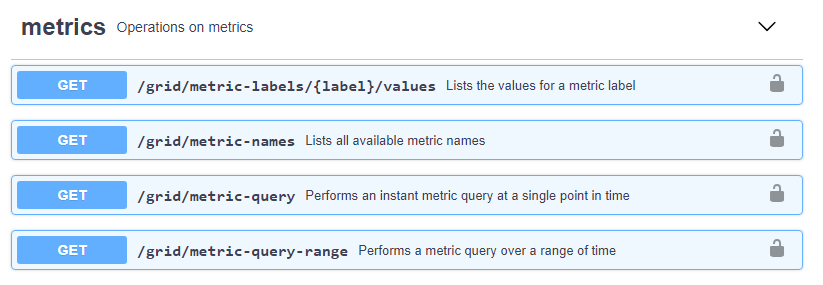

= Erstellen benutzerdefinierter Überwachungsanwendungen
:allow-uri-read: 
:icons: font
:imagesdir: ../media/

[role="lead"]
Mithilfe der StorageGRID-Kennzahlen der Grid-Management-API können Sie benutzerdefinierte Monitoring-Applikationen und Dashboards erstellen.

Wenn Sie Kennzahlen überwachen möchten, die nicht auf einer vorhandenen Seite des Grid Managers angezeigt werden, oder wenn Sie benutzerdefinierte Dashboards für StorageGRID erstellen möchten, können Sie mithilfe der Grid Management API die StorageGRID-Kennzahlen abfragen.

Über ein externes Monitoring-Tool wie Grafana können Sie auch direkt auf die Prometheus Metriken zugreifen. Zur Verwendung eines externen Tools müssen Sie ein Administrator-Clientzertifikat hochladen oder erstellen, damit StorageGRID das Tool für die Sicherheit authentifizieren kann. Lesen Sie die Anweisungen zum Verwalten von StorageGRID.

Um die Vorgänge der Kennzahlen-API einschließlich der vollständigen Liste der verfügbaren Metriken anzuzeigen, gehen Sie zum Grid Manager und wählen Sie *Hilfe* > *API-Dokumentation* > *Metriken*. 

Die Einzelheiten zur Implementierung einer benutzerdefinierten Überwachungsanwendung liegen über dem Umfang dieses Leitfadens hinaus.

.Verwandte Informationen
link:../admin/index.html["StorageGRID verwalten"]
