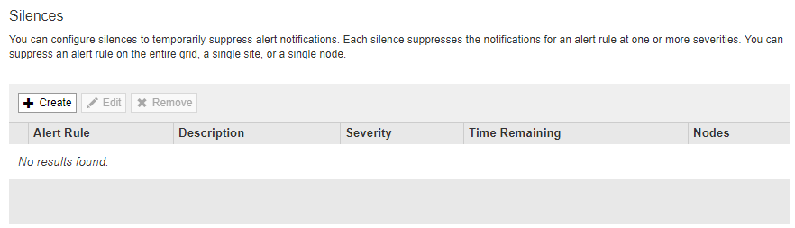

= Verwalten von Meldungen
:allow-uri-read: 
:icons: font
:imagesdir: ../media/

[role="lead"]
Mithilfe von Meldungen können Sie verschiedene Ereignisse und Bedingungen innerhalb des StorageGRID Systems überwachen. Sie können Benachrichtigungen verwalten, indem Sie benutzerdefinierte Warnmeldungen erstellen, Standardwarnungen bearbeiten oder deaktivieren, E-Mail-Benachrichtigungen für Warnungen einrichten und Benachrichtigungen deaktivieren.

.Verwandte Informationen
link:viewing-current-alerts.html["Anzeigen aktueller Meldungen"]

link:viewing-resolved-alerts.html["Anzeigen gelöster Warnmeldungen"]

link:viewing-specific-alert.html["Anzeigen einer bestimmten Meldung"]

link:alerts-reference.html["Alerts Referenz"]

== Um welche Warnmeldungen geht es

Das Warnsystem bietet eine benutzerfreundliche Oberfläche zum Erkennen, Bewerten und Beheben von Problemen, die während des StorageGRID-Betriebs auftreten können.

* Das Warnsystem konzentriert sich auf umsetzbare Probleme im System. Anders als bei einigen Alarmen im Legacy-System werden bei Ereignissen, die eine sofortige Aufmerksamkeit erfordern, Warnmeldungen ausgelöst und nicht bei Ereignissen, die sicher ignoriert werden können.
* Die Seite „Aktuelle Meldungen“ bietet eine benutzerfreundliche Oberfläche zum Anzeigen aktueller Probleme. Sie können die Liste nach einzelnen Warnungen und Alarmgruppen sortieren. Beispielsweise können Sie alle Meldungen nach Node/Standort sortieren, um zu sehen, welche Meldungen sich auf einen bestimmten Node auswirken. Oder Sie möchten die Meldungen in einer Gruppe nach der Zeit sortieren, die ausgelöst wird, um die letzte Instanz einer bestimmten Warnmeldung zu finden.
* Die Seite „gelöste Warnmeldungen“ enthält ähnliche Informationen wie auf der Seite „Aktuelle Meldungen“. Sie können jedoch einen Verlauf der behobenen Warnmeldungen suchen und anzeigen, einschließlich des Auslöseverlaufs und der Behebung des Alarms.
* Mehrere Warnmeldungen desselben Typs werden in einer E-Mail gruppiert, um die Anzahl der Benachrichtigungen zu reduzieren. Darüber hinaus werden auf der Seite „Meldungen“ mehrere Warnmeldungen desselben Typs als Gruppe angezeigt. Sie können Warnungsgruppen erweitern oder ausblenden, um die einzelnen Warnmeldungen ein- oder auszublenden. Wenn z. B. mehrere Knoten die Meldung *nicht in der Lage, mit Knoten* zu kommunizieren ungefähr zur gleichen Zeit melden, wird nur eine E-Mail gesendet und die Warnung wird als Gruppe auf der Seite Warnungen angezeigt.
* Warnmeldungen verwenden intuitive Namen und Beschreibungen, um das Problem schnell zu verstehen. Meldungsbenachrichtigungen umfassen Details zum betroffenen Node und Standort, den Schweregrad der Warnmeldung, den Zeitpunkt, zu dem die Meldungsregel ausgelöst wurde, und den aktuellen Wert der Metriken in Bezug auf die Meldung.
* Warnmeldungen per E-Mail und die auf den Seiten „Aktuelle Warnmeldungen und gelöste Warnmeldungen“ angezeigten Warnmeldungen enthalten empfohlene Aktionen zur Behebung von Warnmeldungen. Dazu gehören häufig direkte Links zum StorageGRID Dokumentationszentrum, damit detailliertere Fehlerbehebungsmaßnahmen leichter gefunden und zugänglich sind.
* Wenn Sie die Benachrichtigungen für eine Warnung vorübergehend auf einem oder mehreren Schweregraden unterdrücken müssen, können Sie ganz einfach eine bestimmte Alarmregel für eine bestimmte Dauer und für das gesamte Grid, eine einzelne Site oder einen einzelnen Node stummschalten. Sie können auch während einer geplanten Wartung, z. B. einer Software-Aktualisierung, alle Alarmregeln stummschalten.
* Sie können die standardmäßigen Alarmregeln nach Bedarf bearbeiten. Sie können eine Meldungsregel vollständig deaktivieren oder deren Triggerbedingungen und -Dauer ändern.
* Sie können benutzerdefinierte Alarmregeln erstellen, um auf die für Ihre Situation relevanten spezifischen Bedingungen abzielen und eigene Empfehlungen auszuarbeiten. Um die Bedingungen für eine benutzerdefinierte Warnung zu definieren, erstellen Sie Ausdrücke mithilfe der Prometheus-Metriken, die im Abschnitt Kennzahlen der Grid Management API verfügbar sind.

== Verwalten von Meldungsregeln

Alarmregeln definieren die Bedingungen, die bestimmte Warnmeldungen auslösen. StorageGRID enthält eine Reihe von Standardwarnregeln, die Sie unverändert verwenden oder ändern können, oder Sie können individuelle Alarmregeln erstellen.

=== Anzeigen von Meldungsregeln

Sie können die Liste aller Standard- und benutzerdefinierten Warnungsregeln anzeigen, um zu erfahren, welche Bedingungen die einzelnen Warnmeldungen auslösen und feststellen, ob Meldungen deaktiviert sind.

.Was Sie benötigen
* Sie müssen über einen unterstützten Browser beim Grid Manager angemeldet sein.
* Sie müssen über die Berechtigung zum Verwalten von Warnungen oder Stammzugriff verfügen.

.Schritte
. Wählen Sie *Alarme* > *Warnregeln*.
+
Die Seite Alarmregeln wird angezeigt.

+
image::../media/alert_rules_page.png[Seite „Alarmregeln“]

. Die Informationen in der Tabelle mit den Alarmregeln prüfen:
+
|===
| Spaltenüberschrift | Beschreibung 

 a| 
Name
 a| 
Der eindeutige Name und die Beschreibung der Warnungsregel. Benutzerdefinierte Alarmregeln werden zuerst aufgeführt, gefolgt von Standardwarnregeln. Der Name der Alarmregel ist Betreff für E-Mail-Benachrichtigungen.

 a| 
Bestimmten Bedingungen
 a| 
Die Prometheus Ausdrücke, die bestimmen, wann diese Warnung ausgelöst wird. Eine Meldung kann auf einem oder mehreren der folgenden Schweregrade ausgelöst werden, jedoch ist für jeden Schweregrad ein Zustand nicht erforderlich.

** * Kritisch* image:../media/icon_alert_red_critical.png["Symbol Warnung Rot Kritisch"]: Es besteht eine anormale Bedingung, die die normalen Vorgänge eines StorageGRID-Knotens oder -Dienstes gestoppt hat. Sie müssen das zugrunde liegende Problem sofort lösen. Wenn das Problem nicht behoben ist, kann es zu Serviceunterbrechungen und Datenverlusten kommen.
** *Major* image:../media/icon_alert_orange_major.png["Icon Alert Orange Major"]: Es besteht eine anormale Bedingung, die entweder die aktuellen Operationen beeinflusst oder sich dem Schwellenwert für eine kritische Warnung nähert. Sie sollten größere Warnmeldungen untersuchen und alle zugrunde liegenden Probleme beheben, um sicherzustellen, dass die anormale Bedingung den normalen Betrieb eines StorageGRID Node oder Service nicht beendet.
** *Klein* image:../media/icon_alert_yellow_miinor.png["Symbol Alarm Gelb Minor"]: Das System funktioniert normal, aber es besteht eine anormale Bedingung, die die Fähigkeit des Systems beeinträchtigen könnte, zu arbeiten, wenn es fortgesetzt wird. Sie sollten kleinere Warnmeldungen überwachen und beheben, die sich nicht selbst beheben lassen, um sicherzustellen, dass sie nicht zu einem schwerwiegenderen Problem führen.

 a| 
Typ
 a| 
Der Typ der Warnregel:

** *Standard*: Eine mit dem System bereitgestellte Warnregel. Sie können eine Standardwarnregel deaktivieren oder die Bedingungen und Dauer für eine Standardwarnregel bearbeiten. Sie können keine Standardwarnregel entfernen.
** *Standard**: Eine Standardwarnregel, die eine bearbeitete Bedingung oder Dauer enthält. Bei Bedarf können Sie eine geänderte Bedingung ganz einfach wieder auf die ursprüngliche Standardeinstellung zurücksetzen.
** *Benutzerdefiniert*: Eine Alarmregel, die Sie erstellt haben. Sie können benutzerdefinierte Alarmregeln deaktivieren, bearbeiten und entfernen.

 a| 
Status
 a| 
Gibt an, ob diese Warnungsregel derzeit aktiviert oder deaktiviert ist. Die Bedingungen für deaktivierte Warnregeln werden nicht ausgewertet, sodass keine Warnmeldungen ausgelöst werden.

|===

.Verwandte Informationen
link:alerts-reference.html["Alerts Referenz"]

=== Erstellen benutzerdefinierter Warnungsregeln

Sie können benutzerdefinierte Alarmregeln erstellen, um eigene Bedingungen für das Auslösen von Warnmeldungen zu definieren.

.Was Sie benötigen
* Sie müssen über einen unterstützten Browser beim Grid Manager angemeldet sein.
* Sie müssen über die Berechtigung zum Verwalten von Warnungen oder Stammzugriff verfügen.

.Über diese Aufgabe
StorageGRID validiert keine benutzerdefinierten Warnmeldungen. Wenn Sie sich für die Erstellung benutzerdefinierter Warnungsregeln entscheiden, befolgen Sie die folgenden allgemeinen Richtlinien:

* Informieren Sie sich über die Bedingungen für die Standardwarnregeln und verwenden Sie sie als Beispiele für Ihre benutzerdefinierten Warnungsregeln.
* Wenn Sie mehrere Bedingungen für eine Warnungsregel definieren, verwenden Sie denselben Ausdruck für alle Bedingungen. Ändern Sie dann den Schwellenwert für jede Bedingung.
* Prüfen Sie jede Bedingung sorgfältig auf Tippfehler und Logikfehler.
* Verwenden Sie nur die in der Grid Management API aufgeführten Metriken.
* Wenn Sie einen Ausdruck mit der Grid Management API testen, beachten Sie, dass eine „`successful`“-Antwort einfach nur ein leerer Antwortkörper sein kann (keine Warnung ausgelöst). Um zu überprüfen, ob die Meldung tatsächlich ausgelöst wird, können Sie vorübergehend einen Schwellenwert auf einen Wert festlegen, der Ihrer Meinung nach derzeit „true“ ist.
+
Zum Beispiel zum Testen des Ausdrucks `node_memory_MemTotal_bytes < 24000000000`, Erste Ausführung `node_memory_MemTotal_bytes >= 0` Und stellen Sie sicher, dass Sie die erwarteten Ergebnisse erhalten (alle Knoten geben einen Wert zurück). Ändern Sie dann den Operator und den Schwellenwert wieder auf die gewünschten Werte und führen Sie die Ausführung erneut aus. Keine Ergebnisse zeigen an, dass für diesen Ausdruck keine aktuellen Warnmeldungen vorhanden sind.

* Gehen Sie nicht davon aus, dass eine benutzerdefinierte Meldung funktioniert, es sei denn, Sie haben überprüft, dass die Meldung erwartungsgemäß ausgelöst wird.

.Schritte
. Wählen Sie *Alarme* > *Warnregeln*.
+
Die Seite Alarmregeln wird angezeigt.

. Wählen Sie *eigene Regel erstellen*.
+
Das Dialogfeld „Benutzerdefinierte Regel erstellen“ wird angezeigt.

+
image::../media/alerts_create_custom_rule.png[Alarme > Benutzerdefinierte Regel Erstellen]

. Aktivieren oder deaktivieren Sie das Kontrollkästchen *aktiviert*, um festzustellen, ob diese Alarmregel derzeit aktiviert ist.
+
Wenn eine Alarmregel deaktiviert ist, werden ihre Ausdrücke nicht ausgewertet und es werden keine Warnmeldungen ausgelöst.

. Geben Sie die folgenden Informationen ein:
+
|===
| Feld | Beschreibung 

 a| 
Eindeutiger Name
 a| 
Ein eindeutiger Name für diese Regel. Der Name der Alarmregel wird auf der Seite „Meldungen“ angezeigt und ist außerdem Betreff für E-Mail-Benachrichtigungen. Die Namen für Warnungsregeln können zwischen 1 und 64 Zeichen umfassen.

 a| 
Beschreibung
 a| 
Eine Beschreibung des Problems. Die Beschreibung ist die auf der Seite „Meldungen“ und in E-Mail-Benachrichtigungen angezeigte Warnmeldung. Die Beschreibungen für Warnungsregeln können zwischen 1 und 128 Zeichen umfassen.

 a| 
Empfohlene Maßnahmen
 a| 
Optional sind die zu ergriffenen Maßnahmen verfügbar, wenn diese Meldung ausgelöst wird. Geben Sie empfohlene Aktionen als Klartext ein (keine Formatierungscodes). Die empfohlenen Aktionen für Warnungsregeln können zwischen 0 und 1,024 Zeichen liegen.

|===
. Geben Sie im Abschnitt Bedingungen einen Prometheus-Ausdruck für eine oder mehrere der Schweregrade für Warnmeldungen ein.
+
Ein Grundausdruck ist in der Regel die Form:

+
[listing]
----
[metric] [operator] [value]
----
+
Ausdrücke können eine beliebige Länge haben, aber in einer einzigen Zeile in der Benutzeroberfläche angezeigt werden. Mindestens ein Ausdruck ist erforderlich.

+
Klicken Sie auf das Hilfesymbol, um verfügbare Metriken anzuzeigen und Prometheus-Ausdrücke zu testen image:../media/icon_nms_question.gif["Fragezeichen-Symbol"] Und folgen Sie dem Link zum Abschnitt Metriken der Grid Management API.

+
Informationen über die Verwendung der Grid-Management-API finden Sie in den Anweisungen für die Administration von StorageGRID. Einzelheiten zur Syntax der Prometheus-Abfragen finden Sie in der Dokumentation für Prometheus.

+
Dieser Ausdruck bewirkt, dass eine Warnung ausgelöst wird, wenn die Menge des installierten RAM für einen Knoten weniger als 24,000,000,000 Byte (24 GB) beträgt.

+
[listing]
----
node_memory_MemTotal_bytes < 24000000000
----
. Geben Sie im Feld *Dauer* den Zeitraum ein, den eine Bedingung kontinuierlich wirksam bleiben muss, bevor die Warnung ausgelöst wird, und wählen Sie eine Zeiteinheit aus.
+
Um sofort eine Warnung auszulösen, wenn eine Bedingung wahr wird, geben Sie *0* ein. Erhöhen Sie diesen Wert, um zu verhindern, dass temporäre Bedingungen Warnungen auslösen.

+
Der Standardwert ist 5 Minuten.

. Klicken Sie Auf *Speichern*.
+
Das Dialogfeld wird geschlossen, und die neue benutzerdefinierte Alarmregel wird in der Tabelle Alarmregeln angezeigt.

.Verwandte Informationen
link:../admin/index.html["StorageGRID verwalten"]

link:commonly-used-prometheus-metrics.html["Häufig verwendete Prometheus-Kennzahlen"]

https://prometheus.io/docs/querying/basics/["Prometheus: Grundlagen der Abfrage"]

=== Bearbeiten einer Meldungsregel

Sie können eine Meldungsregel bearbeiten, um die Triggerbedingungen zu ändern. Für eine benutzerdefinierte Warnungsregel können Sie auch den Regelnamen, die Beschreibung und die empfohlenen Aktionen aktualisieren.

.Was Sie benötigen
* Sie müssen über einen unterstützten Browser beim Grid Manager angemeldet sein.
* Sie müssen über die Berechtigung zum Verwalten von Warnungen oder Stammzugriff verfügen.

.Über diese Aufgabe
Wenn Sie eine standardmäßige Warnungsregel bearbeiten, können Sie die Bedingungen für kleinere, größere und kritische Warnmeldungen sowie die Dauer ändern. Wenn Sie eine benutzerdefinierte Alarmregel bearbeiten, können Sie auch den Namen, die Beschreibung und die empfohlenen Aktionen der Regel bearbeiten.

IMPORTANT: Seien Sie vorsichtig, wenn Sie sich entscheiden, eine Warnungsregel zu bearbeiten. Wenn Sie die Triggerwerte ändern, können Sie möglicherweise ein zugrunde liegendes Problem erst erkennen, wenn ein kritischer Vorgang nicht abgeschlossen werden kann.

.Schritte
. Wählen Sie *Alarme* > *Warnregeln*.
+
Die Seite Alarmregeln wird angezeigt.

. Wählen Sie das Optionsfeld für die Alarmregel, die Sie bearbeiten möchten.
. Wählen Sie *Regel bearbeiten*.
+
Das Dialogfeld Regel bearbeiten wird angezeigt. In diesem Beispiel wird eine Standardwarnregel angezeigt: Die Felder eindeutiger Name, Beschreibung und empfohlene Aktionen sind deaktiviert und können nicht bearbeitet werden.

+
image::../media/alert_rules_edit_rule.png[Alarme > Regel Bearbeiten]

. Aktivieren oder deaktivieren Sie das Kontrollkästchen *aktiviert*, um festzustellen, ob diese Alarmregel derzeit aktiviert ist.
+
Wenn eine Alarmregel deaktiviert ist, werden ihre Ausdrücke nicht ausgewertet und es werden keine Warnmeldungen ausgelöst.

+

NOTE: Wenn Sie die Meldungsregel für eine aktuelle Meldung deaktivieren, müssen Sie einige Minuten warten, bis die Meldung nicht mehr als aktive Meldung angezeigt wird.

+

IMPORTANT: Im Allgemeinen wird es nicht empfohlen, eine Standardwarnregel zu deaktivieren. Wenn eine Meldungsregel deaktiviert ist, kann ein zugrunde liegendes Problem möglicherweise erst erkannt werden, wenn ein kritischer Vorgang nicht abgeschlossen werden kann.

. Aktualisieren Sie für benutzerdefinierte Warnungsregeln die folgenden Informationen, falls erforderlich.
+

NOTE: Diese Informationen können nicht für Standardwarnregeln bearbeitet werden.

+
|===
| Feld | Beschreibung 

 a| 
Eindeutiger Name
 a| 
Ein eindeutiger Name für diese Regel. Der Name der Alarmregel wird auf der Seite „Meldungen“ angezeigt und ist außerdem Betreff für E-Mail-Benachrichtigungen. Die Namen für Warnungsregeln können zwischen 1 und 64 Zeichen umfassen.

 a| 
Beschreibung
 a| 
Eine Beschreibung des Problems. Die Beschreibung ist die auf der Seite „Meldungen“ und in E-Mail-Benachrichtigungen angezeigte Warnmeldung. Die Beschreibungen für Warnungsregeln können zwischen 1 und 128 Zeichen umfassen.

 a| 
Empfohlene Maßnahmen
 a| 
Optional sind die zu ergriffenen Maßnahmen verfügbar, wenn diese Meldung ausgelöst wird. Geben Sie empfohlene Aktionen als Klartext ein (keine Formatierungscodes). Die empfohlenen Aktionen für Warnungsregeln können zwischen 0 und 1,024 Zeichen liegen.

|===
. Geben Sie im Abschnitt Bedingungen den Prometheus-Ausdruck für eine oder mehrere Schweregrade für Warnmeldungen ein oder aktualisieren Sie diesen.
+

NOTE: Wenn Sie eine Bedingung für eine bearbeitete Standardwarnregel auf ihren ursprünglichen Wert zurücksetzen möchten, klicken Sie rechts neben der geänderten Bedingung auf die drei Punkte.

+
image::../media/alert_rules_edit_revert_to_default.png[Meldungsregeln: Zurücksetzen einer bearbeiteten Bedingung auf den Standardwert]

+

NOTE: Wenn Sie die Bedingungen für eine aktuelle Meldung aktualisieren, werden Ihre Änderungen möglicherweise erst implementiert, wenn der vorherige Zustand behoben ist. Wenn das nächste Mal eine der Bedingungen für die Regel erfüllt ist, zeigt die Warnmeldung die aktualisierten Werte an.

+
Ein Grundausdruck ist in der Regel die Form:

+
[listing]
----
[metric] [operator] [value]
----
+
Ausdrücke können eine beliebige Länge haben, aber in einer einzigen Zeile in der Benutzeroberfläche angezeigt werden. Mindestens ein Ausdruck ist erforderlich.

+
Klicken Sie auf das Hilfesymbol, um verfügbare Metriken anzuzeigen und Prometheus-Ausdrücke zu testen image:../media/icon_nms_question.gif["Fragezeichen-Symbol"] Und folgen Sie dem Link zum Abschnitt Metriken der Grid Management API.

+
Informationen über die Verwendung der Grid-Management-API finden Sie in den Anweisungen für die Administration von StorageGRID. Einzelheiten zur Syntax der Prometheus-Abfragen finden Sie in der Dokumentation für Prometheus.

+
Dieser Ausdruck bewirkt, dass eine Warnung ausgelöst wird, wenn die Menge des installierten RAM für einen Knoten weniger als 24,000,000,000 Byte (24 GB) beträgt.

+
[listing]
----
node_memory_MemTotal_bytes < 24000000000
----
. Geben Sie im Feld *Dauer* den Zeitraum ein, den eine Bedingung kontinuierlich wirksam bleiben muss, bevor die Warnmeldung ausgelöst wird, und wählen Sie die Zeiteinheit aus.
+
Um sofort eine Warnung auszulösen, wenn eine Bedingung wahr wird, geben Sie *0* ein. Erhöhen Sie diesen Wert, um zu verhindern, dass temporäre Bedingungen Warnungen auslösen.

+
Der Standardwert ist 5 Minuten.

. Klicken Sie Auf *Speichern*.
+
Wenn Sie eine Standardwarnregel bearbeitet haben, wird in der Spalte Typ *Standard** angezeigt. Wenn Sie eine Standard- oder benutzerdefinierte Alarmregel deaktiviert haben, wird in der Spalte *Status* *deaktiviertes* angezeigt.

.Verwandte Informationen
link:../admin/index.html["StorageGRID verwalten"]

link:commonly-used-prometheus-metrics.html["Häufig verwendete Prometheus-Kennzahlen"]

https://prometheus.io/docs/querying/basics/["Prometheus: Grundlagen der Abfrage"]

=== Deaktivieren einer Meldungsregel

Sie können den aktivierten/deaktivierten Status für eine Standard- oder eine benutzerdefinierte Warnungsregel ändern.

.Was Sie benötigen
* Sie müssen über einen unterstützten Browser beim Grid Manager angemeldet sein.
* Sie müssen über die Berechtigung zum Verwalten von Warnungen oder Stammzugriff verfügen.

.Über diese Aufgabe
Wenn eine Meldungsregel deaktiviert ist, werden seine Ausdrücke nicht ausgewertet und es werden keine Warnmeldungen ausgelöst.

IMPORTANT: Im Allgemeinen wird es nicht empfohlen, eine Standardwarnregel zu deaktivieren. Wenn eine Meldungsregel deaktiviert ist, kann ein zugrunde liegendes Problem möglicherweise erst erkannt werden, wenn ein kritischer Vorgang nicht abgeschlossen werden kann.

.Schritte
. Wählen Sie *Alarme* > *Warnregeln*.
+
Die Seite Alarmregeln wird angezeigt.

. Wählen Sie das Optionsfeld für die Warnungsregel, die deaktiviert oder aktiviert werden soll.
. Wählen Sie *Regel bearbeiten*.
+
Das Dialogfeld Regel bearbeiten wird angezeigt.

. Aktivieren oder deaktivieren Sie das Kontrollkästchen *aktiviert*, um festzustellen, ob diese Alarmregel derzeit aktiviert ist.
+
Wenn eine Alarmregel deaktiviert ist, werden ihre Ausdrücke nicht ausgewertet und es werden keine Warnmeldungen ausgelöst.

+

NOTE: Wenn Sie die Meldungsregel für eine aktuelle Meldung deaktivieren, müssen Sie einige Minuten warten, bis die Meldung nicht mehr als aktive Meldung angezeigt wird.

. Klicken Sie Auf *Speichern*.
+
*Deaktiviert* wird in der Spalte *Status* angezeigt.

=== Entfernen einer benutzerdefinierten Warnungsregel

Sie können eine benutzerdefinierte Alarmregel entfernen, wenn Sie sie nicht mehr verwenden möchten.

.Was Sie benötigen
* Sie müssen über einen unterstützten Browser beim Grid Manager angemeldet sein.
* Sie müssen über die Berechtigung zum Verwalten von Warnungen oder Stammzugriff verfügen.

.Schritte
. Wählen Sie *Alarme* > *Warnregeln*.
+
Die Seite Alarmregeln wird angezeigt.

. Wählen Sie das Optionsfeld für die benutzerdefinierte Alarmregel, die Sie entfernen möchten.
+
Sie können keine Standardwarnregel entfernen.

. Klicken Sie auf *Benutzerdefinierte Regel entfernen*.
+
Ein Bestätigungsdialogfeld wird angezeigt.

. Klicken Sie auf *OK*, um die Warnregel zu entfernen.
+
Alle aktiven Instanzen der Warnmeldung werden innerhalb von 10 Minuten behoben.

== Verwalten von Warnmeldungen

Wenn eine Warnmeldung ausgelöst wird, kann StorageGRID E-Mail-Benachrichtigungen und SNMP-Benachrichtigungen (Simple Network Management Protocol) senden.

=== Einrichten von SNMP-Benachrichtigungen für Alarme

Wenn StorageGRID SNMP-Benachrichtigungen senden soll, wenn Warnmeldungen auftreten, müssen Sie den StorageGRID SNMP-Agent aktivieren und ein oder mehrere Trap-Ziele konfigurieren.

.Über diese Aufgabe
Sie können im Grid Manager die Option *Konfiguration* > *Überwachung* > *SNMP-Agent* oder die SNMP-Endpunkte für die Grid-Management-API verwenden, um den StorageGRID-SNMP-Agent zu aktivieren und zu konfigurieren. Der SNMP-Agent unterstützt alle drei Versionen des SNMP-Protokolls.

Informationen zum Konfigurieren des SNMP-Agenten finden Sie im Abschnitt zur Verwendung der SNMP-Überwachung.

Nachdem Sie den StorageGRID SNMP-Agent konfiguriert haben, können zwei Arten von ereignisgesteuerten Benachrichtigungen gesendet werden:

* Traps sind Benachrichtigungen, die vom SNMP-Agent gesendet werden, die keine Bestätigung durch das Managementsystem benötigen. Traps dienen dazu, das Managementsystem über etwas innerhalb von StorageGRID zu informieren, wie z. B. eine Warnung, die ausgelöst wird. Traps werden in allen drei Versionen von SNMP unterstützt
* Informationen sind ähnlich wie Traps, aber sie erfordern eine Bestätigung durch das Management-System. Wenn der SNMP-Agent innerhalb einer bestimmten Zeit keine Bestätigung erhält, wird die Benachrichtigung erneut gesendet, bis eine Bestätigung empfangen wurde oder der maximale Wiederholungswert erreicht wurde. Die Informationsunterstützung wird in SNMPv2c und SNMPv3 unterstützt.

Trap- und Informieren-Benachrichtigungen werden gesendet, wenn eine Standard- oder benutzerdefinierte Warnung auf einem Schweregrad ausgelöst wird. Um SNMP-Benachrichtigungen für eine Warnung zu unterdrücken, müssen Sie eine Stille für die Warnung konfigurieren. Benachrichtigungen werden von jedem Admin-Node gesendet, der als bevorzugter Absender konfiguriert wurde. Standardmäßig ist der primäre Admin-Node ausgewählt. Weitere Informationen finden Sie in den Anweisungen zum Verwalten von StorageGRID.

NOTE: Trap- und Informieren-Benachrichtigungen werden auch dann gesendet, wenn bestimmte Alarme (Legacy-System) mit einem bestimmten Schweregrad oder höher ausgelöst werden. SNMP-Benachrichtigungen werden jedoch nicht für jeden Alarm oder jeden Schweregrad gesendet.

.Verwandte Informationen
link:using-snmp-monitoring.html["Verwendung von SNMP-Überwachung"]

link:managing-alerts.html["Stummschalten von Warnmeldungen"]

link:../admin/index.html["StorageGRID verwalten"]

link:alarms-that-generate-snmp-notifications.html["Warnmeldungen, die SNMP-Benachrichtigungen generieren (Legacy-System)"]

=== Einrichten von E-Mail-Benachrichtigungen für Meldungen

Wenn E-Mail-Benachrichtigungen gesendet werden sollen, wenn Warnmeldungen auftreten, müssen Sie Informationen über Ihren SMTP-Server angeben. Sie müssen auch E-Mail-Adressen für Empfänger von Benachrichtigungen eingeben.

.Was Sie benötigen
* Sie müssen über einen unterstützten Browser beim Grid Manager angemeldet sein.
* Sie müssen über die Berechtigung zum Verwalten von Warnungen oder Stammzugriff verfügen.

.Was Sie benötigen
Da es sich bei den Alarmen um unabhängige Systeme handelt, wird das E-Mail-Setup, das für Alarmbenachrichtigungen verwendet wird, nicht für Alarmbenachrichtigungen und AutoSupport-Meldungen verwendet. Sie können jedoch denselben E-Mail-Server für alle Benachrichtigungen verwenden.

Wenn Ihre StorageGRID-Bereitstellung mehrere Administratorknoten enthält, können Sie auswählen, welcher Admin-Knoten der bevorzugte Absender von Warnmeldungen sein soll. Der gleiche „`bevorzugte Absender`“ wird auch für Benachrichtigungen zu Alarmen und AutoSupport-Nachrichten verwendet. Standardmäßig ist der primäre Admin-Node ausgewählt. Weitere Informationen finden Sie in den Anweisungen zum Verwalten von StorageGRID.

.Schritte
. Wählen Sie *Alarme* > *E-Mail-Einrichtung*.
+
Die Seite E-Mail-Einrichtung wird angezeigt.

+
image::../media/alerts_email_setup_disabled.png[Alarm E-Mail-Einrichtung Deaktiviert]

. Aktivieren Sie das Kontrollkästchen *E-Mail-Benachrichtigungen aktivieren*, um anzugeben, dass Benachrichtigungen-E-Mails gesendet werden sollen, wenn Alarme konfigurierte Schwellenwerte erreichen.
+
Die Abschnitte „E-Mail-Server“ (SMTP), „Transport Layer Security“ (TLS), „E-Mail-Adressen“ und „Filter“ werden angezeigt.

. Geben Sie im Abschnitt E-Mail-Server (SMTP) die Informationen ein, die StorageGRID für den Zugriff auf Ihren SMTP-Server benötigt.
+
Wenn Ihr SMTP-Server eine Authentifizierung erfordert, müssen Sie sowohl einen Benutzernamen als auch ein Kennwort angeben. Außerdem müssen Sie TLS benötigen und ein CA-Zertifikat vorlegen.

+
|===
| Feld | Eingabe 

 a| 
Mailserver
 a| 
Der vollständig qualifizierte Domänenname (FQDN) oder die IP-Adresse des SMTP-Servers.

 a| 
Port
 a| 
Der Port, der für den Zugriff auf den SMTP-Server verwendet wird. Muss zwischen 1 und 65535 liegen.

 a| 
Benutzername (optional)
 a| 
Wenn Ihr SMTP-Server eine Authentifizierung erfordert, geben Sie den Benutzernamen ein, mit dem Sie sich authentifizieren möchten.

 a| 
Kennwort (optional)
 a| 
Wenn Ihr SMTP-Server eine Authentifizierung erfordert, geben Sie das Kennwort für die Authentifizierung ein.

|===
+
image:../media/alerts_email_smtp_server.png["Warnungen E-Mail-SMTP-Server"]

. Geben Sie im Abschnitt E-Mail-Adressen die E-Mail-Adressen für den Absender und für jeden Empfänger ein.
+
.. Geben Sie für die *Absender E-Mail-Adresse* eine gültige E-Mail-Adresse an, die als Absenderadresse für Benachrichtigungen verwendet werden soll.
+
Beispiel: `storagegrid-alerts@example.com`

.. Geben Sie im Abschnitt Empfänger eine E-Mail-Adresse für jede E-Mail-Liste oder Person ein, die beim Auftreten einer Warnmeldung eine E-Mail erhalten soll.
+
Klicken Sie auf das Plus-Symbol image:../media/icon_plus_sign_black_on_white.gif["Plus-Symbol"] Um Empfänger hinzuzufügen.

+
image::../media/alerts_email_recipients.png[E-Mail-Empfänger Für Warnungen]

. Aktivieren Sie im Abschnitt Transport Layer Security (TLS) das Kontrollkästchen *TLS erforderlich*, wenn für die Kommunikation mit dem SMTP-Server Transportschichtsicherheit (TLS) erforderlich ist.
+
.. Geben Sie im Feld *CA-Zertifikat* das CA-Zertifikat ein, das zur Überprüfung der Identifizierung des SMTP-Servers verwendet wird.
+
Sie können den Inhalt in dieses Feld kopieren und einfügen, oder klicken Sie auf *Durchsuchen* und wählen Sie die Datei aus.

+
Sie müssen eine einzelne Datei bereitstellen, die die Zertifikate jeder Zertifizierungsstelle (CA) enthält. Die Datei sollte alle PEM-kodierten CA-Zertifikatdateien enthalten, die in der Reihenfolge der Zertifikatskette verkettet sind.

.. Aktivieren Sie das Kontrollkästchen *Client-Zertifikat senden*, wenn Ihr SMTP-E-Mail-Server E-Mail-Absender benötigt, um Clientzertifikate zur Authentifizierung bereitzustellen.
.. Geben Sie im Feld *Client Certificate* das PEM-codierte Clientzertifikat an, das an den SMTP-Server gesendet werden kann.
+
Sie können den Inhalt in dieses Feld kopieren und einfügen, oder klicken Sie auf *Durchsuchen* und wählen Sie die Datei aus.

.. Geben Sie im Feld *Private Key* den privaten Schlüssel für das Clientzertifikat in unverschlüsselter PEM-Codierung ein.
+
Sie können den Inhalt in dieses Feld kopieren und einfügen, oder klicken Sie auf *Durchsuchen* und wählen Sie die Datei aus.

+

NOTE: Wenn Sie das E-Mail-Setup bearbeiten müssen, klicken Sie auf das Stift-Symbol, um dieses Feld zu aktualisieren.

+
image::../media/alerts_email_tls.png[Warnungen E-Mail TLS]

. Wählen Sie im Abschnitt Filter aus, welche Alarmschweregrade zu E-Mail-Benachrichtigungen führen soll, es sei denn, die Regel für eine bestimmte Warnung wurde stummgeschaltet.
+
|===
| Schweregrad | Beschreibung 

 a| 
Klein, groß, kritisch
 a| 
Eine E-Mail-Benachrichtigung wird gesendet, wenn die kleine, größere oder kritische Bedingung für eine Alarmregel erfüllt wird.

 a| 
Kritisch
 a| 
Wenn die Hauptbedingung für eine Warnmeldung erfüllt ist, wird eine E-Mail-Benachrichtigung gesendet. Es werden keine Benachrichtigungen für kleinere Warnmeldungen gesendet.

 a| 
Nur kritisch
 a| 
Eine E-Mail-Benachrichtigung wird nur gesendet, wenn die kritische Bedingung für eine Alarmregel erfüllt ist. Es werden keine Benachrichtigungen für kleinere oder größere Warnmeldungen gesendet.

|===
+
image:../media/alerts_email_filters.png["E-Mail-Filter Für Alarme"]

. Wenn Sie bereit sind, Ihre E-Mail-Einstellungen zu testen, führen Sie die folgenden Schritte aus:
+
.. Klicken Sie Auf *Test-E-Mail Senden*.
+
Es wird eine Bestätigungsmeldung angezeigt, die angibt, dass eine Test-E-Mail gesendet wurde.

.. Aktivieren Sie die Kontrollkästchen aller E-Mail-Empfänger, und bestätigen Sie, dass eine Test-E-Mail empfangen wurde.
+

NOTE: Wenn die E-Mail nicht innerhalb weniger Minuten empfangen wird oder wenn die Meldung *E-Mail-Benachrichtigung Fehler* ausgelöst wird, überprüfen Sie Ihre Einstellungen und versuchen Sie es erneut.

.. Melden Sie sich bei anderen Admin-Knoten an und senden Sie eine Test-E-Mail, um die Verbindung von allen Standorten zu überprüfen.
+

NOTE: Wenn Sie die Warnbenachrichtigungen testen, müssen Sie sich bei jedem Admin-Knoten anmelden, um die Verbindung zu überprüfen. Dies steht im Gegensatz zum Testen von Alarmbenachrichtigungen und AutoSupport-Meldungen, bei denen alle Admin-Knoten die Test-E-Mail senden.

. Klicken Sie Auf *Speichern*.
+
Beim Senden einer Test-E-Mail werden Ihre Einstellungen nicht gespeichert. Klicken Sie auf *Speichern*.

+
Die E-Mail-Einstellungen werden gespeichert.

.Verwandte Informationen
link:managing-alerts.html["Fehlerbehebung bei Warnmeldungen per E-Mail"]

link:../maintain/index.html["Verwalten Sie  erholen"]

=== Informationen, die in E-Mail-Benachrichtigungen für Warnmeldungen enthalten sind

Nachdem Sie den SMTP-E-Mail-Server konfiguriert haben, werden beim Auslösen einer Warnung E-Mail-Benachrichtigungen an die angegebenen Empfänger gesendet, es sei denn, die Alarmregel wird durch Stille unterdrückt.

E-Mail-Benachrichtigungen enthalten die folgenden Informationen:

image::../media/alerts_email_notification.png[Benachrichtigung Per E-Mail]

[cols="1a,5a"]
|===
|  | Beschreibung 

 a| 
1
 a| 
Der Name der Warnmeldung, gefolgt von der Anzahl der aktiven Instanzen dieser Warnmeldung.

 a| 
2
 a| 
Die Beschreibung der Warnmeldung.

 a| 
3
 a| 
Alle empfohlenen Aktionen für die Warnmeldung

 a| 
4
 a| 
Details zu jeder aktiven Instanz der Warnmeldung, einschließlich des betroffenen Node und Standorts, des Meldungsschweregrads, der UTC-Zeit, zu der die Meldungsregel ausgelöst wurde, und des Namens des betroffenen Jobs und Service.

 a| 
5
 a| 
Der Hostname des Admin-Knotens, der die Benachrichtigung gesendet hat.

|===
.Verwandte Informationen
link:managing-alerts.html["Stummschalten von Warnmeldungen"]

=== Wie StorageGRID Alarme in E-Mail-Benachrichtigungen gruppiert

Um zu verhindern, dass bei der Auslösung von Warnmeldungen eine übermäßige Anzahl von E-Mail-Benachrichtigungen gesendet wird, versucht StorageGRID, mehrere Warnmeldungen in derselben Benachrichtigung zu gruppieren.

In der folgenden Tabelle finden Sie Beispiele, wie StorageGRID mehrere Warnmeldungen in E-Mail-Benachrichtigungen gruppiert.

|===
| Verhalten | Beispiel 

 a| 
Jede Warnbenachrichtigung gilt nur für Warnungen, die denselben Namen haben. Wenn zwei Benachrichtigungen mit verschiedenen Namen gleichzeitig ausgelöst werden, werden zwei E-Mail-Benachrichtigungen gesendet.
 a| 
* Bei zwei Nodes wird gleichzeitig ein Alarm A ausgelöst. Es wird nur eine Benachrichtigung gesendet.
* Bei Knoten 1 wird die Warnmeldung A ausgelöst, und gleichzeitig wird auf Knoten 2 die Warnmeldung B ausgelöst. Für jede Warnung werden zwei Benachrichtigungen gesendet.

 a| 
Wenn für eine bestimmte Warnmeldung auf einem bestimmten Node die Schwellenwerte für mehr als einen Schweregrad erreicht werden, wird eine Benachrichtigung nur für die schwerste Warnmeldung gesendet.
 a| 
* Die Warnmeldung A wird ausgelöst und die kleineren, größeren und kritischen Alarmschwellenwerte werden erreicht. Eine Benachrichtigung wird für die kritische Warnmeldung gesendet.

 a| 
Bei der ersten Alarmauslösung wartet StorageGRID zwei Minuten, bevor eine Benachrichtigung gesendet wird. Wenn während dieser Zeit andere Warnmeldungen mit demselben Namen ausgelöst werden, gruppiert StorageGRID alle Meldungen in der ersten Benachrichtigung.​
 a| 
. An Knoten 1 um 08:00 wird eine Warnmeldung A ausgelöst. Es wird keine Benachrichtigung gesendet.
. An Knoten 2 um 08:01 wird eine Warnmeldung A ausgelöst. Es wird keine Benachrichtigung gesendet.
. Um 08:02 Uhr wird eine Benachrichtigung gesendet, um beide Instanzen der Warnmeldung zu melden.

 a| 
Falls eine weitere Benachrichtigung mit demselben Namen ausgelöst wird, wartet StorageGRID 10 Minuten, bevor eine neue Benachrichtigung gesendet wird. Die neue Benachrichtigung meldet alle aktiven Warnungen (aktuelle Warnungen, die nicht stummgeschaltet wurden), selbst wenn sie zuvor gemeldet wurden.
 a| 
. An Knoten 1 um 08:00 wird eine Warnmeldung A ausgelöst. Eine Benachrichtigung wird um 08:02 Uhr gesendet.
. An Knoten 2 um 08:05 wird eine Warnmeldung A ausgelöst. Eine zweite Benachrichtigung wird um 08:15 Uhr (10 Minuten später) versendet. Beide Nodes werden gemeldet.

 a| 
Wenn mehrere aktuelle Warnmeldungen mit demselben Namen vorliegen und eine dieser Meldungen gelöst wird, wird eine neue Benachrichtigung nicht gesendet, wenn die Meldung auf dem Node, für den die Meldung behoben wurde, erneut auftritt.
 a| 
. Für Knoten 1 wird eine Warnmeldung A ausgelöst. Eine Benachrichtigung wird gesendet.
. Für Knoten 2 wird eine Warnmeldung A ausgelöst. Eine zweite Benachrichtigung wird gesendet.
. Die Warnung A wird für Knoten 2 behoben, bleibt jedoch für Knoten 1 aktiv.
. Für Node 2 wird erneut eine Warnmeldung A ausgelöst. Es wird keine neue Benachrichtigung gesendet, da die Meldung für Node 1 noch aktiv ist.

 a| 
StorageGRID sendet weiterhin alle 7 Tage E-Mail-Benachrichtigungen, bis alle Instanzen der Warnmeldung gelöst oder die Alarmregel stummgeschaltet wurde.
 a| 
. Am 8. März wird Alarm A für Knoten 1 ausgelöst. Eine Benachrichtigung wird gesendet.
. Warnung A ist nicht gelöst oder stummgeschaltet. Weitere Benachrichtigungen erhalten Sie am 15. März, 22. März 29 usw.

|===

=== Fehlerbehebung bei Warnmeldungen per E-Mail

Wenn die Meldung *E-Mail-Benachrichtigung Fehler* ausgelöst wird oder Sie die Test-Benachrichtigung nicht erhalten können, führen Sie die folgenden Schritte aus, um das Problem zu beheben.

.Was Sie benötigen
* Sie müssen über einen unterstützten Browser beim Grid Manager angemeldet sein.
* Sie müssen über die Berechtigung zum Verwalten von Warnungen oder Stammzugriff verfügen.

.Schritte
. Überprüfen Sie Ihre Einstellungen.
+
.. Wählen Sie *Alarme* > *E-Mail-Einrichtung*.
.. Überprüfen Sie, ob die Einstellungen des SMTP-Servers (E-Mail) korrekt sind.
.. Stellen Sie sicher, dass Sie gültige E-Mail-Adressen für die Empfänger angegeben haben.

. Überprüfen Sie Ihren Spam-Filter, und stellen Sie sicher, dass die E-Mail nicht an einen Junk-Ordner gesendet wurde.
. Bitten Sie Ihren E-Mail-Administrator, zu bestätigen, dass E-Mails von der Absenderadresse nicht blockiert werden.
. Erstellen Sie eine Protokolldatei für den Admin-Knoten, und wenden Sie sich dann an den technischen Support.
+
Der technische Support kann anhand der in den Protokollen enthaltenen Informationen ermitteln, was schief gelaufen ist. Beispielsweise kann die Datei prometheus.log einen Fehler anzeigen, wenn Sie eine Verbindung zu dem von Ihnen angegebenen Server herstellen.

.Verwandte Informationen
link:collecting-log-files-and-system-data.html["Protokolldateien und Systemdaten werden erfasst"]

== Stummschalten von Warnmeldungen

Optional können Sie Stille konfigurieren, um Benachrichtigungen vorübergehend zu unterdrücken.

.Was Sie benötigen
* Sie müssen über einen unterstützten Browser beim Grid Manager angemeldet sein.
* Sie müssen über die Berechtigung zum Verwalten von Warnungen oder Stammzugriff verfügen.

.Über diese Aufgabe
Sie können Alarmregeln für das gesamte Grid, eine einzelne Site oder einen einzelnen Knoten und für einen oder mehrere Schweregrade stummschalten. Bei jeder Silence werden alle Benachrichtigungen für eine einzelne Warnungsregel oder für alle Warnungsregeln unterdrückt.

Wenn Sie den SNMP-Agent aktiviert haben, unterdrücken Stille auch SNMP-Traps und informieren.

IMPORTANT: Seien Sie vorsichtig, wenn Sie sich entscheiden, eine Alarmregel zu stummzuschalten. Wenn Sie eine Warnmeldung stummschalten, können Sie ein zugrunde liegendes Problem möglicherweise erst erkennen, wenn ein kritischer Vorgang nicht abgeschlossen werden kann.

NOTE: Da es sich bei Alarmmeldungen und Warnmeldungen um unabhängige Systeme handelt, können Sie diese Funktion nicht verwenden, um Alarmbenachrichtigungen zu unterdrücken.

.Schritte
. Wählen Sie *Alarme* > *Stille*.
+
Die Seite „Stille“ wird angezeigt.

+

. Wählen Sie *Erstellen*.
+
Das Dialogfeld Stille erstellen wird angezeigt.

+
image::../media/alerts_create_silence.png[Alarme > Quittieren Erzeugen]

. Wählen Sie die folgenden Informationen aus, oder geben Sie sie ein:
+
[cols="1a,3a"]
|===
| Feld | Beschreibung 

 a| 
Meldungsregel
 a| 
Der Name der Alarmregel, die Sie stumm schalten möchten. Sie können eine beliebige Standard- oder benutzerdefinierte Warnungsregel auswählen, auch wenn die Alarmregel deaktiviert ist.

*Hinweis:* Wählen Sie *Alle Regeln* aus, wenn Sie alle Alarmregeln mit den in diesem Dialogfeld angegebenen Kriterien stummschalten möchten.

 a| 
Beschreibung
 a| 
Optional eine Beschreibung der Stille. Beschreiben Sie zum Beispiel den Zweck dieser Stille.

 a| 
Dauer
 a| 
Wie lange Sie möchten, dass diese Stille in Minuten, Stunden oder Tagen wirksam bleibt. Eine Stille kann von 5 Minuten bis 1,825 Tage (5 Jahre) in Kraft sein.

*Hinweis:* eine Alarmregel sollte nicht für längere Zeit stummgemacht werden. Wenn eine Alarmregel stumm geschaltet ist, können Sie ein zugrunde liegendes Problem möglicherweise erst erkennen, wenn ein kritischer Vorgang abgeschlossen wird. Möglicherweise müssen Sie jedoch eine erweiterte Stille verwenden, wenn eine Warnung durch eine bestimmte, vorsätzliche Konfiguration ausgelöst wird, wie z. B. bei den *Services Appliance Link Down*-Alarmen und den *Storage Appliance Link down*-Alarmen.

 a| 
Schweregrad
 a| 
Welche Alarmschweregrade oder -Schweregrade stummgeschaltet werden sollten. Wenn die Warnung bei einem der ausgewählten Schweregrade ausgelöst wird, werden keine Benachrichtigungen gesendet.

 a| 
Knoten
 a| 
Auf welchen Knoten oder Knoten Sie diese Stille anwenden möchten. Sie können eine Meldungsregel oder alle Regeln im gesamten Grid, einer einzelnen Site oder einem einzelnen Node unterdrücken. Wenn Sie das gesamte Raster auswählen, gilt die Stille für alle Standorte und alle Knoten. Wenn Sie einen Standort auswählen, gilt die Stille nur für die Knoten an diesem Standort.

*Hinweis:* für jede Stille können Sie nicht mehr als einen oder mehrere Knoten auswählen. Sie müssen zusätzliche Stille erstellen, wenn Sie dieselbe Warnungsregel auf mehr als einem Node oder mehreren Standorten gleichzeitig unterdrücken möchten.

|===
. Klicken Sie Auf *Speichern*.
. Wenn Sie eine Stille ändern oder beenden möchten, bevor sie abläuft, können Sie sie bearbeiten oder entfernen.
+
[cols="1a,3a"]
|===
| Option | Beschreibung 

 a| 
Stille bearbeiten
 a| 
.. Wählen Sie *Alarme* > *Stille*.
.. Wählen Sie in der Tabelle das Optionsfeld für die Stille, die Sie bearbeiten möchten.
.. Klicken Sie Auf *Bearbeiten*.
.. Ändern Sie die Beschreibung, die verbleibende Zeit, die ausgewählten Schweregrade oder den betroffenen Knoten.
.. Klicken Sie Auf *Speichern*.

 a| 
Entfernen Sie eine Stille
 a| 
.. Wählen Sie *Alarme* > *Stille*.
.. Wählen Sie in der Tabelle das Optionsfeld für die Stille, die Sie entfernen möchten.
.. Klicken Sie Auf *Entfernen*.
.. Klicken Sie auf *OK*, um zu bestätigen, dass Sie diese Stille entfernen möchten.
+
*Hinweis*: Benachrichtigungen werden jetzt gesendet, wenn diese Warnung ausgelöst wird (es sei denn, sie werden durch eine andere Stille unterdrückt). Wenn diese Warnmeldung derzeit ausgelöst wird, kann es einige Minuten dauern, bis E-Mail- oder SNMP-Benachrichtigungen gesendet werden und die Seite „Meldungen“ aktualisiert wird.

|===

.Verwandte Informationen
link:configuring-snmp-agent.html["Konfigurieren des SNMP-Agenten"]
