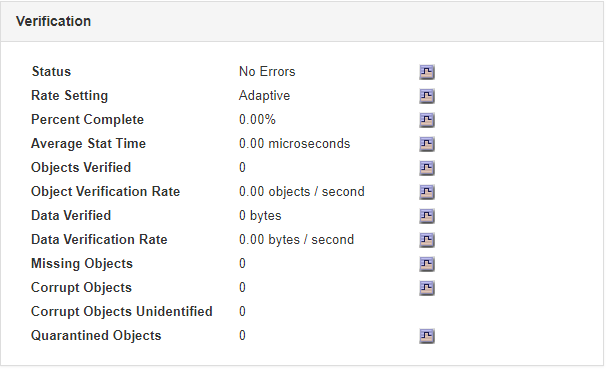
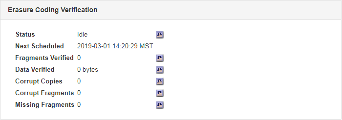

= Monitoring von Objektverifizierungsvorgängen
:allow-uri-read: 
:icons: font
:imagesdir: ../media/

[role="lead"]
Das StorageGRID System kann die Integrität von Objektdaten auf Storage-Nodes überprüfen und sowohl beschädigte als auch fehlende Objekte prüfen.

.Was Sie benötigen
Sie müssen über einen unterstützten Browser beim Grid Manager angemeldet sein.

.Über diese Aufgabe
Es gibt zwei Überprüfungsprozesse, die zusammenarbeiten, um die Datenintegrität zu gewährleisten:

* *Hintergrundüberprüfung* läuft automatisch und überprüft kontinuierlich die Richtigkeit der Objektdaten.
+
Hintergrund-Verifizierung überprüft automatisch und kontinuierlich alle Storage-Nodes, um festzustellen, ob es beschädigte Kopien von replizierten und mit Erasure Coding verschlüsselten Objektdaten gibt. Falls Probleme gefunden werden, versucht das StorageGRID System automatisch, die beschädigten Objektdaten durch Kopien zu ersetzen, die an anderer Stelle im System gespeichert sind. Die Hintergrundüberprüfung wird nicht auf Archiv-Nodes oder auf Objekten in einem Cloud-Speicherpool ausgeführt.

+

NOTE: Die Warnung *nicht identifiziertes korruptes Objekt erkannt* wird ausgelöst, wenn das System ein korruptes Objekt erkennt, das nicht automatisch korrigiert werden kann.

* *Vordergrundverifizierung* kann von einem Nutzer ausgelöst werden, um die Existenz (obwohl nicht die Richtigkeit) von Objektdaten schneller zu überprüfen.
+
Bei der Vordergrundüberprüfung können Sie die Existenz replizierter und Erasure-codierter Objektdaten auf einem bestimmten Storage-Node überprüfen und überprüfen, ob alle Objekte vorhanden sein sollen. Sie können die Vordergrundüberprüfung auf allen oder einigen Objektspeichern eines Storage Node ausführen, um festzustellen, ob es bei einem Speichergerät Integritätsprobleme gibt. Eine große Anzahl von fehlenden Objekten kann darauf hindeuten, dass es ein Problem mit der Speicherung gibt.

Um Ergebnisse aus Hintergrund- und Vordergrundverifizierungen, wie z. B. beschädigte oder fehlende Objekte, zu prüfen, können Sie auf der Seite Knoten einen Speicherknoten sehen. Sie sollten alle Instanzen von beschädigten oder fehlenden Objektdaten sofort untersuchen, um die Ursache zu ermitteln.

.Schritte
. Wählen Sie *Knoten*.
. Wählen Sie *_Speicherknoten_* > *Objekte* Aus.
. So prüfen Sie die Überprüfungsergebnisse:
+
** Um die Verifizierung replizierter Objektdaten zu prüfen, sehen Sie sich die Attribute im Abschnitt Überprüfung an.
+

+

NOTE: Klicken Sie in der Tabelle auf den Namen eines Attributs, um den Hilfetext anzuzeigen.

** Um die Überprüfung von Fragment mit Löschungscode zu überprüfen, wählen Sie *_Storage Node_* > *ILM* aus, und sehen Sie sich die Attribute in der Tabelle „Erasure Coding Verification“ an.
+

+

NOTE: Klicken Sie in der Tabelle auf den Namen eines Attributs, um den Hilfetext anzuzeigen.

.Verwandte Informationen
link:../troubleshoot/troubleshooting-storagegrid-system.html["Überprüfen der Objektintegrität"]
