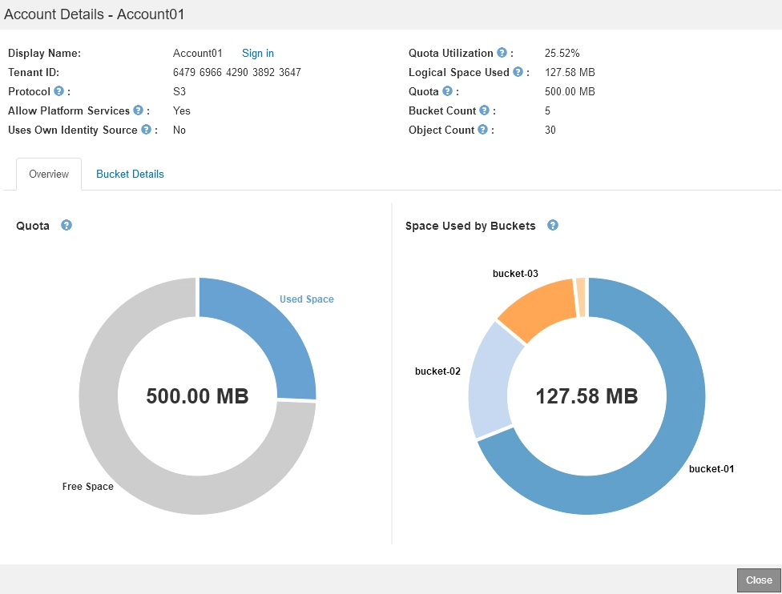

= Monitoring der Mandantenaktivitäten
:allow-uri-read: 
:icons: font
:imagesdir: ../media/

[role="lead"]
Alle Client-Aktivitäten sind mit einem Mandantenkonto verknüpft. Mit dem Grid Manager lässt sich die Storage-Nutzung oder der Netzwerk-Traffic eines Mandanten überwachen. Alternativ können mit dem Audit-Protokoll oder Grafana Dashboards ausführlichere Informationen zur Verwendung von StorageGRID durch Mandanten erstellt werden.

.Was Sie benötigen
* Sie müssen über einen unterstützten Browser beim Grid Manager angemeldet sein.
* Sie müssen über Root Access oder Administrator-Berechtigung verfügen.

.Über diese Aufgabe

IMPORTANT: Die Werte für den genutzten Speicherplatz sind Schätzungen. Diese Schätzungen sind vom Zeitpunkt der Aufnahme, der Netzwerkverbindung und des Node-Status betroffen.

.Schritte
. Wählen Sie *Mieter* aus, um den von allen Mietern genutzten Speicherplatz zu überprüfen.
+
Für jeden Mandanten werden der genutzte Speicherplatz, die Kontingentnutzung, die Kontingente und die Objektanzahl aufgelistet. Wenn kein Kontingent für einen Mandanten festgelegt ist, enthält das Feld Quotenauslastung einen Strich (-) und das Quota-Feld gibt „`Unlimited`“ an.

+
image::../media/tenant_accounts_page.png[Seite „Mandantenkonten“]

+
Wenn Ihr System mehr als 20 Elemente enthält, können Sie festlegen, wie viele Zeilen auf jeder Seite gleichzeitig angezeigt werden. Verwenden Sie das Suchfeld, um nach einem Mandantenkonto zu suchen, indem Sie den Namen oder die Mandanten-ID anzeigen.

+
Sie können sich bei einem Mandantenkonto anmelden, indem Sie den Link in der Spalte *Anmelden* der Tabelle auswählen.

. Wählen Sie optional *in CSV exportieren* aus, um eine .csv-Datei anzuzeigen und zu exportieren, die die Nutzungswerte für alle Mandanten enthält.
+
Sie werden aufgefordert, das zu öffnen oder zu speichern `.csv` Datei:

+
Der Inhalt einer .csv-Datei sieht wie das folgende Beispiel aus:

+
image::../media/tenant_accounts_example_csv.png[Mandantenkonten, Beispiel .csv]

+
Sie können die .csv-Datei in einer Tabellenkalkulationsanwendung öffnen oder sie automatisiert verwenden.

. Um Details für einen bestimmten Mieter einschließlich der Nutzungsdiagramme anzuzeigen, wählen Sie auf der Seite Mandantenkonten das Mandantenkonto aus und wählen dann *Details anzeigen*.
+
Die Seite Kontodetails wird angezeigt und enthält zusammenfassende Informationen, ein Diagramm, das die Anzahl der verwendeten und verbleibenden Kontingente darstellt, sowie ein Diagramm, das die Menge der Objektdaten in Buckets (S3) oder Containern (Swift) darstellt.

+

+
** *Quote*
+
Wenn für diesen Mieter eine Quote festgelegt wurde, zeigt das Diagramm *quota* an, wie viel von dieser Quote dieser Mieter verwendet hat und wie viel noch verfügbar ist. Wenn kein Kontingent festgelegt wurde, hat der Mieter eine unbegrenzte Quote und eine Informationsmeldung wird angezeigt. Wenn der Mieter das Speicherkontingent um mehr als 1 % und mindestens 1 GB überschritten hat, zeigt das Diagramm das Gesamtkontingent und den Überschuss an.

+
Sie können den Cursor über das Segment „verwendeter Speicherplatz“ platzieren, um die Anzahl der gespeicherten Objekte und die insgesamt verwendeten Bytes anzuzeigen. Sie können den Cursor über das Segment Freier Speicherplatz platzieren, um zu sehen, wie viele Bytes Speicherplatz verfügbar sind.

+

IMPORTANT: Die Kontingentnutzung basiert auf internen Schätzungen und kann in einigen Fällen sogar überschritten werden. StorageGRID überprüft beispielsweise das Kontingent, wenn ein Mandant beginnt, Objekte hochzuladen und neue Einlässe zurückweist, wenn der Mieter die Quote überschritten hat. StorageGRID berücksichtigt jedoch bei der Bestimmung, ob das Kontingent überschritten wurde, nicht die Größe des aktuellen Uploads. Wenn Objekte gelöscht werden, kann es vorübergehend verhindert werden, dass ein Mandant neue Objekte hochgeladen wird, bis die Kontingentnutzung neu berechnet wird. Berechnungen zur Kontingentnutzung können 10 Minuten oder länger dauern.

+

NOTE: Die Kontingentnutzung eines Mandanten gibt die Gesamtanzahl der Objektdaten an, die der Mandant auf StorageGRID (logische Größe) hochgeladen hat. Die Kontingentnutzung stellt nicht den Speicherplatz dar, der zur Speicherung von Kopien dieser Objekte und ihrer Metadaten verwendet wird (physische Größe).

+

NOTE: Sie können die Warnung * Tenant Quotenverbrauch hoch* aktivieren, um festzustellen, ob Mieter ihre Quoten verbrauchen. Wenn diese Meldung aktiviert ist, wird diese Meldung ausgelöst, wenn ein Mandant 90 % seines Kontingents verwendet hat. Weitere Informationen finden Sie in der Referenz zu Warnmeldungen.

** *Verwendeter Platz*
+
Das Diagramm *Space used by Buckets* (S3) or *Space used by Containers* (Swift) zeigt die größten Eimer für den Mieter. Der verwendete Speicherplatz ist die Gesamtgröße der Objektdaten im Bucket. Dieser Wert stellt nicht den Storage-Platzbedarf für ILM-Kopien und Objekt-Metadaten dar.

+
Wenn der Mandant mehr als neun Buckets oder Container enthält, werden sie in einem Segment zusammengefasst, das als „Sonstige“ bezeichnet wird. Einige Diagrammsegmente sind möglicherweise zu klein, um ein Etikett aufzunehmen. Sie können den Cursor auf ein beliebiges Segment setzen, um die Beschriftung zu sehen und weitere Informationen zu erhalten, darunter die Anzahl der gespeicherten Objekte und die Gesamtzahl der Bytes für jeden Bucket oder Container.

+
image::../media/tenant_dashboard_storage_usage_segment_other.png[Segment Für Storage-Nutzung – Sonstiges]

. Wählen Sie *Bucket Details* (S3) oder *Container Details* (Swift) aus, um eine Liste der verwendeten Abstände und die Anzahl der Objekte für die einzelnen Buckets oder Container des Mandanten anzuzeigen.
+
image::../media/tenant_bucket_details.png[Mandanten-Bucket-Details]

. Wählen Sie optional *in CSV exportieren* aus, um eine .csv-Datei anzuzeigen und zu exportieren, die die Nutzungswerte für jeden Bucket oder Container enthält.
+
Sie werden aufgefordert, die .csv-Datei zu öffnen oder zu speichern.

+
Der Inhalt der .csv-Datei eines einzelnen S3-Mandanten sieht wie folgt aus:

+
image::../media/tenant_bucket_details_csv.png[Beispiel für die Bucket-Details des Mandanten (CSV]

+
Sie können die .csv-Datei in einer Tabellenkalkulationsanwendung öffnen oder sie automatisiert verwenden.

. Wenn Richtlinien zur Traffic-Klassifizierung für einen Mandanten vorhanden sind, überprüfen Sie den Netzwerkverkehr für diesen Mandanten.
+
.. Wählen Sie *Konfiguration* > *Netzwerkeinstellungen* > *Verkehrsklassifizierung*.
+
Die Seite Richtlinien zur Klassifizierung von Verkehrsdaten wird angezeigt, und die vorhandenen Richtlinien sind in der Tabelle aufgeführt.

+
image::../media/traffic_classification_policies_main_screen_w_examples.png[Beispiel für eine Verkehrsrichtlinie für Grafik]

.. Anhand der Liste der Richtlinien können Sie diejenigen ermitteln, die für einen bestimmten Mandanten gelten.
.. Um Metriken anzuzeigen, die mit einer Richtlinie verknüpft sind, wählen Sie das Optionsfeld links neben der Richtlinie aus, und klicken Sie dann auf *Metriken*.
.. Analysieren Sie die Diagramme, um zu ermitteln, wie oft die Richtlinie den Datenverkehr einschränkt und ob Sie die Richtlinie anpassen müssen.
+
Informationen zum Erstellen, Bearbeiten oder Löschen von Richtlinien für die Verkehrsklassifizierung finden Sie in den Anweisungen für die Verwaltung von StorageGRID.

. Optional können Sie das Audit-Protokoll verwenden, um eine granularere Überwachung der Aktivitäten eines Mandanten zu ermöglichen.
+
Sie können beispielsweise folgende Informationstypen überwachen:

+
** Bestimmte Client-Vorgänge, z. B. PUT, GET oder DELETE
** Objektgrößen
** Die ILM-Regel wurde auf Objekte angewendet
** Die Quell-IP von Client-Anforderungen

+
Audit-Protokolle werden in Textdateien geschrieben, die Sie mit einem Tool Ihrer Wahl analysieren können. Dadurch können Sie Kundenaktivitäten besser verstehen oder ausgereifte Chargeback- und Abrechnungsmodelle implementieren. Weitere Informationen finden Sie in den Anweisungen zum Verständnis von Überwachungsmeldungen.

. Optional können Sie mit den Prometheus Kennzahlen die Mandantenaktivität erfassen:
+
** Wählen Sie im Grid Manager die Option *Support* > *Tools* > *Metriken* aus. Kunden können vorhandene Dashboards wie S3 Overview zur Überprüfung von Client-Aktivitäten nutzen.
+

IMPORTANT: Die auf der Seite Metriken verfügbaren Tools sind in erster Linie für den technischen Support bestimmt. Einige Funktionen und Menüelemente in diesen Tools sind absichtlich nicht funktionsfähig.

** Wählen Sie *Hilfe* > *API-Dokumentation*. Sie können die Kennzahlen im Abschnitt „Kennzahlen“ der Grid Management API verwenden, um benutzerdefinierte Alarmregeln und Dashboards für Mandantenaktivitäten zu erstellen.

.Verwandte Informationen
link:alerts-reference.html["Alerts Referenz"]

link:../audit/index.html["Prüfung von Audit-Protokollen"]

link:../admin/index.html["StorageGRID verwalten"]

link:reviewing-support-metrics.html["Überprüfen von Support-Metriken"]
