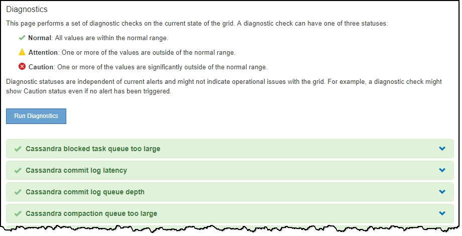

= Diagnose wird ausgeführt
:allow-uri-read: 
:icons: font
:imagesdir: ../media/

[role="lead"]
Bei der Fehlerbehebung eines Problems können Sie gemeinsam mit dem technischen Support eine Diagnose auf Ihrem StorageGRID-System durchführen und die Ergebnisse überprüfen.

.Was Sie benötigen
* Sie müssen über einen unterstützten Browser beim Grid Manager angemeldet sein.
* Sie müssen über spezifische Zugriffsberechtigungen verfügen.

.Über diese Aufgabe
Die Seite Diagnose führt eine Reihe von diagnostischen Prüfungen zum aktuellen Status des Rasters durch. Jede diagnostische Prüfung kann einen von drei Zuständen haben:

* image:../media/icon_alert_green_checkmark.png["Häkchen Für Symbolwarnung Grün"]*Normal*: Alle Werte liegen im Normalbereich.
* *Achtung*: Ein oder mehrere Werte liegen außerhalb des normalen Bereichs.
* image:../media/icon_alert_red_critical.png["Symbol Warnung Rot Kritisch"]*Achtung*: Ein oder mehrere der Werte liegen deutlich außerhalb des normalen Bereichs.

Diagnosestatus sind unabhängig von aktuellen Warnungen und zeigen möglicherweise keine betrieblichen Probleme mit dem Raster an. Beispielsweise wird bei einer Diagnose-Prüfung möglicherweise der Status „Achtung“ angezeigt, auch wenn keine Meldung ausgelöst wurde.

.Schritte
. Wählen Sie *Support* > *Tools* > *Diagnose*.
+
Die Seite Diagnose wird angezeigt und zeigt die Ergebnisse für jede Diagnosetest an. Im Beispiel haben alle Diagnosen einen normalen Status.

+

. Wenn Sie mehr über eine bestimmte Diagnose erfahren möchten, klicken Sie auf eine beliebige Stelle in der Zeile.
+
Details zur Diagnose und ihren aktuellen Ergebnissen werden angezeigt. Folgende Details sind aufgelistet:

+
** *Status*: Der aktuelle Status dieser Diagnose: Normal, Achtung oder Achtung.
** *Prometheus query*: Bei Verwendung für die Diagnose, der Prometheus Ausdruck, der verwendet wurde, um die Statuswerte zu generieren. (Ein Prometheus-Ausdruck wird nicht für alle Diagnosen verwendet.)
** *Schwellenwerte*: Wenn für die Diagnose verfügbar, die systemdefinierten Schwellenwerte für jeden anormalen Diagnosestatus. (Schwellwerte werden nicht für alle Diagnosen verwendet.)
+

NOTE: Sie können diese Schwellenwerte nicht ändern.

** *Statuswerte*: Eine Tabelle, die den Status und den Wert der Diagnose im gesamten StorageGRID-System anzeigt. In diesem Beispiel wird die aktuelle CPU-Auslastung für jeden Node in einem StorageGRID System angezeigt. Alle Node-Werte liegen unter den Warn- und Warnschwellenwerten, sodass der Gesamtstatus der Diagnose normal ist.

+
image::../media/support_diagnostics_cpu_utilization.png[Support Diagnostics CPU-Auslastung]

. *Optional*: Um Grafana-Diagramme zu dieser Diagnose anzuzeigen, klicken Sie auf den Link *Grafana Dashboard*.
+
Dieser Link wird nicht für alle Diagnosen angezeigt.

+
Das zugehörige Grafana Dashboard wird angezeigt. In diesem Beispiel wird auf dem Node-Dashboard die CPU-Auslastung für diesen Node und andere Grafana-Diagramme für den Node angezeigt.

+

NOTE: Sie können auch über den Abschnitt „Grafana“ auf der Seite * Support* > *Tools* > *Metriken* auf die vorkonfigurierten Dashboards von Grafana zugreifen.

+
image::../media/grafana_dashboard_nodes.png[Grafana Dashboard-Knoten]

. *Optional*: Um ein Diagramm des Prometheus-Ausdrucks über die Zeit zu sehen, klicken Sie auf *Anzeigen in Prometheus*.
+
Es wird ein Prometheus-Diagramm des in der Diagnose verwendeten Ausdrucks angezeigt.

+
image::../media/support_diagnostics_prometheus_png.png[Support Diagnostics Prometheus Seite]

.Verwandte Informationen
link:reviewing-support-metrics.html["Überprüfen von Support-Metriken"]

link:commonly-used-prometheus-metrics.html["Häufig verwendete Prometheus-Kennzahlen"]
