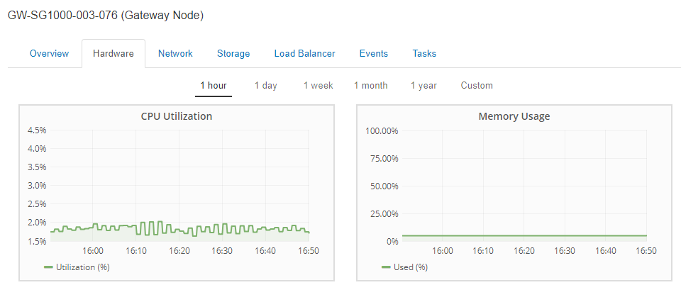
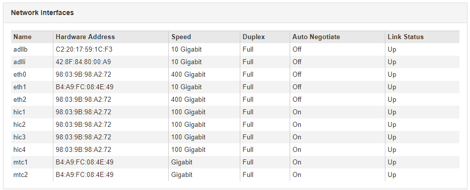

= Anzeigen von Informationen zu Appliance Admin Nodes und Gateway Nodes
:allow-uri-read: 
:icons: font
:imagesdir: ../media/

[role="lead"]
Auf der Seite Nodes werden Informationen zum Serviczustand sowie alle Computing-, Festplatten- und Netzwerkressourcen für jede Service-Appliance, die für einen Admin-Node oder einen Gateway-Node verwendet wird, aufgeführt. Außerdem können Sie Arbeitsspeicher, Storage-Hardware, Netzwerkressourcen, Netzwerkschnittstellen, Netzwerkadressen, Daten empfangen und übertragen.

.Schritte
. Wählen Sie auf der Seite Knoten einen Appliance Admin Node oder einen Appliance Gateway Node aus.
. Wählen Sie *Übersicht*.
+
In der Tabelle Node Information auf der Registerkarte Übersicht werden die ID und der Name des Node, der Node-Typ, die installierte Softwareversion und die dem Node zugeordneten IP-Adressen angezeigt. Die Spalte Interface enthält den Namen der Schnittstelle wie folgt:

+
** *Adlb* und *adlli*: Wird angezeigt, wenn Active/Backup Bonding für die Admin Network Interface verwendet wird
** *eth*: Das Grid-Netzwerk, das Admin-Netzwerk oder das Client-Netzwerk.
** *Hic*: Einer der physischen 10-, 25- oder 100-GbE-Ports auf dem Gerät. Diese Ports können miteinander verbunden und mit dem StorageGRID-Grid-Netzwerk (eth0) und dem Client-Netzwerk (eth2) verbunden werden.
** *mtc*: Einer der physischen 1-GbE-Ports auf der Appliance, die mit dem StorageGRID Admin Network (eth1) verbunden oder kalibriert und verbunden werden können.image:../media/nodes_page_overview_tab_services_appliance.png["Registerkarte Knoten – Überblick für Service-Appliance"]

. Wählen Sie *Hardware*, um weitere Informationen über das Gerät anzuzeigen.
+
.. Sehen Sie sich die CPU-Auslastung und die Speicherdiagramme an, um den Prozentsatz der CPU- und Arbeitsspeicherauslastung im Laufe der Zeit zu ermitteln. Um ein anderes Zeitintervall anzuzeigen, wählen Sie eines der Steuerelemente oberhalb des Diagramms oder Diagramms aus. Sie können die verfügbaren Informationen für Intervalle von 1 Stunde, 1 Tag, 1 Woche oder 1 Monat anzeigen. Sie können auch ein benutzerdefiniertes Intervall festlegen, mit dem Sie Datum und Zeitbereiche festlegen können.
+

.. Blättern Sie nach unten, um die Komponententabelle für das Gerät anzuzeigen. Diese Tabelle enthält Informationen, z. B. den Modellnamen, die Seriennummer, die Controller-Firmware-Version und den Status jeder Komponente.
+
image::../media/nodes_page_hardware_tab_services_appliance_do_not_use.png[Registerkarte Knoten Hardware für Service Appliance]

+
|===
| Feld in der Appliance-Tabelle | Beschreibung 

 a| 
Appliance-Modell
 a| 
Die Modellnummer für diese StorageGRID Appliance.

 a| 
Anzahl Ausgefallener Speicher-Controller-Laufwerke
 a| 
Anzahl an Laufwerken, die nicht optimal sind.

 a| 
Typ Des Storage-Datenlaufwerks
 a| 
Die Art der Laufwerke in der Appliance, z. B. HDD (Festplatte) oder SSD (Solid State Drive).

 a| 
Größe Der Speicherdatenlaufwerke
 a| 
Gesamtkapazität einschließlich aller Datenlaufwerke in der Appliance.

 a| 
Storage RAID-Modus
 a| 
Der RAID-Modus für die Appliance.

 a| 
Gesamtnetzteil
 a| 
Der Status aller Netzteile im Gerät.

 a| 
BMC IP für Computing Controller
 a| 
Die IP-Adresse des Ports für das Baseboard Management Controller (BMC) im Computing-Controller. Mit dieser IP können Sie eine Verbindung zur BMC-Schnittstelle herstellen, um die Appliance-Hardware zu überwachen und zu diagnostizieren.

Dieses Feld wird nicht für Appliance-Modelle angezeigt, die keinen BMC enthalten.

 a| 
Seriennummer Des Computing-Controllers
 a| 
Die Seriennummer des Compute-Controllers.

 a| 
Computing-Hardware
 a| 
Der Status der Compute-Controller-Hardware

 a| 
CPU-Temperatur für Compute Controller
 a| 
Der Temperaturstatus der CPU des Compute-Controllers.

 a| 
Temperatur Im Computing-Controller-Chassis
 a| 
Der Temperaturstatus des Compute-Controllers.

|===
.. Bestätigen Sie, dass alle Status „`Nominal`“ sind.
+
Wenn der Status nicht „`Nominal`“ lautet, überprüfen Sie alle aktuellen Warnmeldungen.

. Wählen Sie *Netzwerk*, um Informationen für jedes Netzwerk anzuzeigen.
+
Das Diagramm „Netzwerkverkehr“ bietet eine Zusammenfassung des gesamten Netzwerkverkehr.

+
image::../media/nodes_page_network_traffic_graph.gif[Knoten Seite Netzwerk Verkehr Diagramm]

+
.. Lesen Sie den Abschnitt Netzwerkschnittstellen.
+

+
Verwenden Sie die folgende Tabelle mit den Werten in der Spalte *Geschwindigkeit* in der Tabelle Netzwerkschnittstellen, um festzustellen, ob die vier 40/100-GbE-Netzwerkanschlüsse auf der Appliance für den aktiven/Backup-Modus oder den LACP-Modus konfiguriert wurden.

+

NOTE: Die in der Tabelle aufgeführten Werte gehen davon aus, dass alle vier Links verwendet werden.

+
|===
| Verbindungsmodus | Bond-Modus | Einzelne HIC-Verbindungsgeschwindigkeit (Schluck1, 2, Schluck3, Schluck4) | Erwartete Grid-/Client-Netzwerkgeschwindigkeit (eth0, eth2) 

 a| 
Aggregat
 a| 
LACP
 a| 
100
 a| 
400

 a| 
Fest
 a| 
LACP
 a| 
100
 a| 
200

 a| 
Fest
 a| 
Aktiv/Backup
 a| 
100
 a| 
100

 a| 
Aggregat
 a| 
LACP
 a| 
40
 a| 
160

 a| 
Fest
 a| 
LACP
 a| 
40
 a| 
80

 a| 
Fest
 a| 
Aktiv/Backup
 a| 
40
 a| 
40

|===
.. Lesen Sie den Abschnitt Netzwerkkommunikation.
+
Die Tabellen „Empfangen und Senden“ zeigen, wie viele Bytes und Pakete über jedes Netzwerk empfangen und gesendet wurden, sowie andere Empfangs- und Übertragungstabellen.

+
image::../media/nodes_page_network_communication.gif[Knoten Seite Netzwerk Komm]

. Wählen Sie *Storage* aus, um Informationen zu den Festplattengeräten und Volumes auf der Services Appliance anzuzeigen.
+
image::../media/nodes_page_storage_tab_services_appliance.png[Knoten Seite Speicher Registerkarte Dienste Appliance]

.Verwandte Informationen
link:../sg100-1000/index.html["SG100  SG1000 Services-Appliances"]
