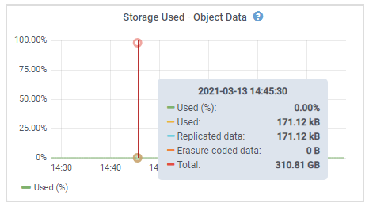

= Anzeigen von Informationen zu Appliance-Speicherknoten
:allow-uri-read: 
:icons: font
:imagesdir: ../media/

[role="lead"]
Auf der Seite Nodes werden Informationen zum Serviczustand sowie alle Computing-, Festplattengeräte- und Netzwerkressourcen für jeden Appliance Storage Node aufgeführt. Außerdem können Sie den Arbeitsspeicher, die Storage-Hardware, die Controller-Firmware-Version, Netzwerkressourcen, Netzwerkschnittstellen, Netzwerkadressen und empfangen und übertragen Daten.

.Schritte
. Wählen Sie auf der Seite Knoten einen Appliance-Speicherknoten aus.
. Wählen Sie *Übersicht*.
+
In der Tabelle Node Information auf der Registerkarte Übersicht werden die ID und der Name des Node, der Node-Typ, die installierte Softwareversion und die dem Node zugeordneten IP-Adressen angezeigt. Die Spalte Interface enthält den Namen der Schnittstelle wie folgt:

+
** *eth*: Das Grid-Netzwerk, das Admin-Netzwerk oder das Client-Netzwerk.
** *Hic*: Einer der physischen 10-, 25- oder 100-GbE-Ports auf dem Gerät. Diese Ports können miteinander verbunden und mit dem StorageGRID-Grid-Netzwerk (eth0) und dem Client-Netzwerk (eth2) verbunden werden.
** *mtc*: Einer der physischen 1-GbE-Ports auf der Appliance, die mit dem StorageGRID Admin Network (eth1) verbunden oder kalibriert und verbunden werden können.image:../media/nodes_page_overview_tab_extended.png["Knotenübersicht Erweitert"]

. Wählen Sie *Hardware*, um weitere Informationen über das Gerät anzuzeigen.
+
.. Sehen Sie sich die CPU-Auslastung und die Speicherdiagramme an, um den Prozentsatz der CPU- und Arbeitsspeicherauslastung im Laufe der Zeit zu ermitteln. Um ein anderes Zeitintervall anzuzeigen, wählen Sie eines der Steuerelemente oberhalb des Diagramms oder Diagramms aus. Sie können die verfügbaren Informationen für Intervalle von 1 Stunde, 1 Tag, 1 Woche oder 1 Monat anzeigen. Sie können auch ein benutzerdefiniertes Intervall festlegen, mit dem Sie Datum und Zeitbereiche festlegen können.
+
image::../media/nodes_page_hardware_tab_graphs.png[Hardware-Grafiken]

.. Blättern Sie nach unten, um die Komponententabelle für das Gerät anzuzeigen. Diese Tabelle enthält Informationen, z. B. den Modellnamen der Appliance, Controller-Namen, Seriennummern und IP-Adressen und den Status der einzelnen Komponenten.
+

NOTE: Einige Felder, wie BMC IP und Compute Hardware, werden nur für Geräte mit dieser Funktion angezeigt.

+
Komponenten für Storage-Shelfs und Erweiterungs-Shelfs, wenn sie Teil der Installation sind, werden in einer separaten Tabelle unter der Appliance-Tabelle aufgeführt.

+
image::../media/nodes_page_hardware_tab_for_appliance.png[Registerkarte Knoten Hardware für Appliance]

+
|===
| Feld in der Appliance-Tabelle | Beschreibung 

 a| 
Appliance-Modell
 a| 
Die Modellnummer dieser StorageGRID Appliance, dargestellt in der SANtricity Software.

 a| 
Storage Controller-Name
 a| 
Der Name dieser in der SANtricity Software angezeigten StorageGRID Appliance.

 a| 
Storage Controller A Management-IP
 a| 
IP-Adresse für Management Port 1 auf Storage Controller A Sie verwenden diese IP für den Zugriff auf die SANtricity Software zur Fehlerbehebung bei Speicherproblemen.

 a| 
Storage Controller B Management-IP
 a| 
IP-Adresse für Management Port 1 auf Storage Controller B Sie verwenden diese IP für den Zugriff auf die SANtricity Software zur Fehlerbehebung bei Speicherproblemen.

Einige Gerätemodelle verfügen nicht über einen Speicher-Controller B

 a| 
WWID des Storage Controller
 a| 
Die weltweite Kennung des Storage-Controllers in der SANtricity Software.

 a| 
Seriennummer Des Storage Appliance Chassis
 a| 
Die Seriennummer des Gehäuses des Geräts.

 a| 
Firmware-Version Des Speicher-Controllers
 a| 
Die Version der Firmware auf dem Storage Controller für dieses Gerät.

 a| 
Storage-Hardware
 a| 
Der Gesamtstatus der Hardware des Storage Controllers. Wenn SANtricity System Manager einen Status als Warnung für die Storage-Hardware meldet, meldet das StorageGRID System diesen Wert ebenfalls.

Wenn der Status „`Anforderungen einer Warnung erfüllt,`“ zunächst den Storage Controller mithilfe der SANtricity Software prüfen. Stellen Sie dann sicher, dass keine weiteren Alarme vorhanden sind, die für den Rechencontroller gelten.

 a| 
Anzahl Ausgefallener Speicher-Controller-Laufwerke
 a| 
Anzahl an Laufwerken, die nicht optimal sind.

 a| 
Storage Controller A
 a| 
Der Status von Speicher-Controller A.

 a| 
Storage Controller B
 a| 
Der Status von Storage Controller B. Einige Gerätemodelle verfügen nicht über einen Speicher-Controller B

 a| 
Netzteil A für Speichercontroller
 a| 
Der Status von Netzteil A für den Storage Controller.

 a| 
Speicher-Controller-Netzteil B
 a| 
Der Status von Netzteil B für den Speicher-Controller.

 a| 
Typ Des Storage-Datenlaufwerks
 a| 
Die Art der Laufwerke in der Appliance, z. B. HDD (Festplatte) oder SSD (Solid State Drive).

 a| 
Größe Der Speicherdatenlaufwerke
 a| 
Gesamtkapazität einschließlich aller Datenlaufwerke in der Appliance.

 a| 
Storage RAID-Modus
 a| 
Der für die Appliance konfigurierte RAID-Modus.

 a| 
Storage-Konnektivität
 a| 
Der Status der Storage-Konnektivität.

 a| 
Gesamtnetzteil
 a| 
Der Status aller Netzteile für das Gerät.

 a| 
BMC IP für Computing Controller
 a| 
Die IP-Adresse des Ports für das Baseboard Management Controller (BMC) im Computing-Controller. Mit dieser IP können Sie eine Verbindung zur BMC-Schnittstelle herstellen, um die Appliance-Hardware zu überwachen und zu diagnostizieren.

Dieses Feld wird nicht für Appliance-Modelle angezeigt, die keinen BMC enthalten.

 a| 
Seriennummer Des Computing-Controllers
 a| 
Die Seriennummer des Compute-Controllers.

 a| 
Computing-Hardware
 a| 
Der Status der Compute-Controller-Hardware Dieses Feld wird nicht für Appliance-Modelle angezeigt, die keine separate Computing-Hardware und Speicherhardware besitzen.

 a| 
CPU-Temperatur für Compute Controller
 a| 
Der Temperaturstatus der CPU des Compute-Controllers.

 a| 
Temperatur Im Computing-Controller-Chassis
 a| 
Der Temperaturstatus des Compute-Controllers.

|===
+
|===
| Spalte in der Tabelle „Storage Shelfs“ | Beschreibung 

 a| 
Seriennummer Des Shelf-Chassis
 a| 
Die Seriennummer für das Storage Shelf-Chassis.

 a| 
Shelf-ID
 a| 
Die numerische Kennung für das Storage-Shelf.

*** 99: Storage Controller Shelf
*** 0: Erstes Erweiterungs-Shelf
*** 1: Zweites Erweiterungs-Shelf

*Hinweis:* Erweiterungseinschübe gelten nur für das SG6060.

 a| 
Shelf-Status
 a| 
Der Gesamtstatus des Storage Shelf.

 a| 
IOM-Status
 a| 
Der Status der ein-/Ausgangsmodule (IOMs) in beliebigen Erweiterungs-Shelfs. K. A., wenn es sich nicht um ein Erweiterungs-Shelf handelt

 a| 
Netzteilstatus
 a| 
Der Gesamtstatus der Netzteile für das Storage Shelf.

 a| 
Status Der Schublade
 a| 
Der Zustand der Schubladen im Lagerregal. N/A, wenn das Regal keine Schubladen enthält.

 a| 
Lüfterstatus
 a| 
Der Gesamtstatus der Lüfter im Storage Shelf.

 a| 
Laufwerksteckplätze
 a| 
Die Gesamtzahl der Laufwerksschächte im Storage-Shelf.

 a| 
Datenlaufwerke
 a| 
Die Anzahl der Laufwerke im Storage Shelf, die für den Datenspeicher verwendet werden.

 a| 
Größe Des Datenlaufwerks
 a| 
Die effektive Größe eines Datenlaufwerks im Storage Shelf.

 a| 
Cache-Laufwerke
 a| 
Die Anzahl der Laufwerke im Storage Shelf, die als Cache verwendet werden.

 a| 
Größe Des Cache-Laufwerks
 a| 
Die Größe des kleinsten Cache-Laufwerks im Storage-Shelf. Normalerweise haben Cache-Laufwerke dieselbe Größe.

 a| 
Konfigurationsstatus
 a| 
Der Konfigurationsstatus des Storage Shelf.

|===

. Bestätigen Sie, dass alle Status „`Nominal`“ sind.
+
Wenn der Status nicht „`Nominal`“ lautet, überprüfen Sie alle aktuellen Warnmeldungen. Weitere Informationen zu einigen dieser Hardware-Werte finden Sie auch mit SANtricity System Manager. Informationen zur Installation und Wartung des Geräts finden Sie in den Anweisungen.

. Wählen Sie *Netzwerk*, um Informationen für jedes Netzwerk anzuzeigen.
+
Das Diagramm „Netzwerkverkehr“ bietet eine Zusammenfassung des gesamten Netzwerkverkehr.

+
image::../media/nodes_page_network_traffic_graph.gif[Knoten Seite Netzwerk Verkehr Diagramm]

+
.. Lesen Sie den Abschnitt Netzwerkschnittstellen.
+
image::../media/nodes_page_network_interfaces.gif[Knoten Seite Netzwerkschnittstellen]

+
Verwenden Sie die folgende Tabelle mit den Werten in der Spalte *Geschwindigkeit* in der Tabelle Netzwerkschnittstellen, um festzustellen, ob die 10/25-GbE-Netzwerkanschlüsse auf dem Gerät für den aktiven/Backup-Modus oder den LACP-Modus konfiguriert wurden.

+

NOTE: Die in der Tabelle aufgeführten Werte gehen davon aus, dass alle vier Links verwendet werden.

+
|===
| Verbindungsmodus | Bond-Modus | Einzelne HIC-Verbindungsgeschwindigkeit (Schluck1, 2, Schluck3, Schluck4) | Erwartete Grid-/Client-Netzwerkgeschwindigkeit (eth0,eth2) 

 a| 
Aggregat
 a| 
LACP
 a| 
25
 a| 
100

 a| 
Fest
 a| 
LACP
 a| 
25
 a| 
50

 a| 
Fest
 a| 
Aktiv/Backup
 a| 
25
 a| 
25

 a| 
Aggregat
 a| 
LACP
 a| 
10
 a| 
40

 a| 
Fest
 a| 
LACP
 a| 
10
 a| 
20

 a| 
Fest
 a| 
Aktiv/Backup
 a| 
10
 a| 
10

|===
+
Weitere Informationen zur Konfiguration der 10/25-GbE-Ports finden Sie in der Installations- und Wartungsanleitung für Ihr Gerät.

.. Lesen Sie den Abschnitt Netzwerkkommunikation.
+
Die Tabellen „Empfangen und Senden“ zeigen, wie viele Bytes und Pakete über jedes Netzwerk empfangen und gesendet wurden, sowie andere Empfangs- und Übertragungs-Metriken.

+
image::../media/nodes_page_network_communication.gif[Knoten Seite Netzwerk Komm]

. Wählen Sie *Storage* aus, um Diagramme anzuzeigen, die den Prozentsatz des im Zeitverlauf für Objektdaten und Objektmetadaten verwendeten Speichers sowie Informationen zu Festplattengeräten, Volumes und Objektspeichern anzeigen.
+

+
image::../media/storage_used_object_metadata.png[Verwendeter Storage: Objekt-Metadaten]

+
.. Blättern Sie nach unten, um die verfügbaren Speichermengen für jedes Volume und jeden Objektspeicher anzuzeigen.
+
Der weltweite Name jeder Festplatte entspricht der World-Wide Identifier (WWID) des Volumes, die angezeigt wird, wenn Sie die standardmäßigen Volume-Eigenschaften in der SANtricity Software anzeigen (die Management-Software, die mit dem Storage Controller der Appliance verbunden ist).

+
Um Ihnen bei der Auswertung von Datenträger-Lese- und Schreibstatistiken zu Volume-Mount-Punkten zu helfen, entspricht der erste Teil des Namens, der in der Spalte *Name* der Tabelle Disk Devices (d. h. _sdc_, _sdd_, _sde_ usw.) in der Spalte *Gerät* der Tabelle Volumes angezeigt wird.

+
image::../media/nodes_page_storage_tables.png[Knoten Seitentabellen]

.Verwandte Informationen
link:../sg6000/index.html["SG6000 Storage-Appliances"]

link:../sg5700/index.html["SG5700 Storage-Appliances"]

link:../sg5600/index.html["SG5600 Storage Appliances"]
