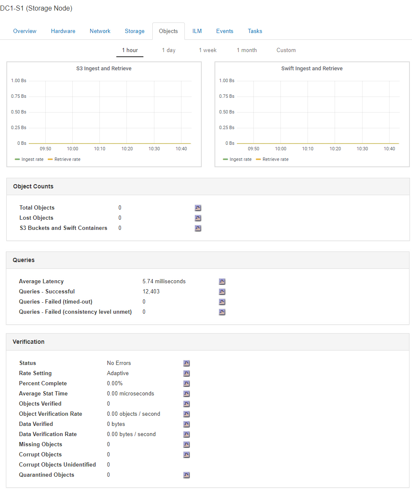

= Anzeigen der Registerkarte Objekte
:allow-uri-read: 
:icons: font
:imagesdir: ../media/

[role="lead"]
Die Registerkarte „Objekte“ bietet Informationen zur Aufnahme- und Abrufrate von S3 und Swift.

Für jeden Storage-Node, jeden Standort und das gesamte Raster wird die Registerkarte Objekte angezeigt. Für Storage-Nodes bietet die Registerkarte Objekte außerdem die Anzahl der Objekte und Informationen zu Metadatenabfragen und zur Hintergrundüberprüfung.

.Verwandte Informationen
link:../s3/index.html["S3 verwenden"]

link:../swift/index.html["Verwenden Sie Swift"]
