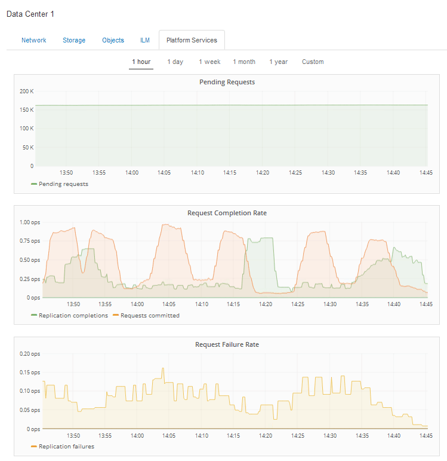

= Registerkarte Plattformdienste anzeigen
:allow-uri-read: 
:icons: font
:imagesdir: ../media/

[role="lead"]
Die Registerkarte Platform Services enthält Informationen zu allen S3-Plattform-Servicevorgängen an einem Standort.

Die Registerkarte Platform Services wird für jede Site angezeigt. Diese Registerkarte enthält Informationen zu S3-Plattformdiensten wie CloudMirror-Replizierung und den Suchintegrationsdienst. In Diagrammen auf dieser Registerkarte werden Metriken angezeigt, z. B. die Anzahl der ausstehenden Anfragen, die Abschlussrate der Anfrage und die Rate bei Ausfällen von Anfragen.

Weitere Informationen zu S3-Plattformservices, einschließlich Details zur Fehlerbehebung, finden Sie in den Anweisungen für die Administration von StorageGRID.

.Verwandte Informationen
link:../admin/index.html["StorageGRID verwalten"]
