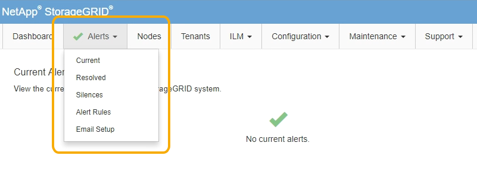

= Wie Grid Manager zu sehen ist
:allow-uri-read: 
:icons: font
:imagesdir: ../media/

[role="lead"]
Der Grid Manager ist eine browserbasierte grafische Schnittstelle, mit der Sie Ihr StorageGRID System konfigurieren, managen und überwachen können.

Wenn Sie sich beim Grid Manager anmelden, stellen Sie eine Verbindung zu einem Admin-Node her. Jedes StorageGRID System umfasst einen primären Admin-Node und eine beliebige Anzahl nicht primärer Admin-Nodes. Sie können eine Verbindung zu einem beliebigen Admin-Knoten herstellen, und jeder Admin-Knoten zeigt eine ähnliche Ansicht des StorageGRID-Systems an.

Sie können über einen unterstützten Webbrowser auf den Grid Manager zugreifen.

== Anforderungen an einen Webbrowser

Sie müssen einen unterstützten Webbrowser verwenden.

[cols="1a,1a"]
|===
| Webbrowser | Unterstützte Mindestversion 

 a| 
Google Chrome
 a| 
87

 a| 
Microsoft Edge
 a| 
87

 a| 
Mozilla Firefox
 a| 
84

|===
Sie sollten das Browserfenster auf eine empfohlene Breite einstellen.

[cols="1a,1a"]
|===
| Browserbreite | Pixel 

 a| 
Minimum
 a| 
1024

 a| 
Optimal
 a| 
1280

|===

== Grid Manager Dashboard

Wenn Sie sich zum ersten Mal beim Grid Manager anmelden, können Sie über das Dashboard Systemaktivitäten auf einen Blick überwachen.

Das Dashboard bietet zusammenfassende Informationen zum Systemzustand, zur Storage-Verwendung, ILM-Prozesse sowie S3 und Swift Operationen.

image::../media/grid_manager_dashboard.png[Dashboard im Grid Manager]

Um die Informationen in den einzelnen Bedienfelds zu erläutern, klicken Sie auf das Hilfesymbol  Für dieses Panel.

.Verwandte Informationen
link:../monitor/index.html["Monitor  Fehlerbehebung"]

== Menü „Meldungen“

Das Menü „Meldungen“ bietet eine benutzerfreundliche Oberfläche zum Erkennen, Bewerten und Beheben von Problemen, die während des StorageGRID-Betriebs auftreten können.

Im Menü „Meldungen“ können Sie Folgendes tun:

* Überprüfen Sie aktuelle Warnmeldungen
* Überprüfen Sie behobene Warnmeldungen
* Konfigurieren Sie Stille, um Benachrichtigungen zu unterdrücken
* Konfigurieren Sie den E-Mail-Server für Warnmeldungen
* Definieren Sie Alarmregeln für Bedingungen, die Warnmeldungen auslösen

.Verwandte Informationen
link:monitoring-and-managing-alerts.html["Monitoring und Management von Warnmeldungen"]

link:../monitor/index.html["Monitor  Fehlerbehebung"]

== Knoten Seite

Auf der Seite Knoten werden Informationen zum gesamten Raster, zu jedem Standort im Raster und zu jedem Node an einem Standort angezeigt.

Auf der Startseite Nodes werden die kombinierten Metriken für das gesamte Raster angezeigt. Um Informationen zu einem bestimmten Standort oder Knoten anzuzeigen, klicken Sie links auf den entsprechenden Link.

image::../media/nodes_menu.png[Knoten Hauptseite]

.Verwandte Informationen
link:viewing-nodes-page.html["Anzeigen der Seite Knoten"]

link:../monitor/index.html["Monitor  Fehlerbehebung"]

== Seite „Mandantenkonten“

Auf der Seite „Mandantenkonten“ können Sie Storage-Mandantenkonten für Ihr StorageGRID System erstellen und überwachen. Sie müssen mindestens ein Mandantenkonto erstellen, um anzugeben, wer Objekte speichern und abrufen kann und welche Funktionen ihnen zur Verfügung stehen.

Die Seite „Mandantenkonten“ bietet außerdem Einzelheiten zur Nutzung für jeden Mandanten, einschließlich der Anzahl der verwendeten Storage und der Anzahl der Objekte. Wenn Sie beim Erstellen des Mandanten eine Quote festlegen, sehen Sie, wie viel von dieser Quote verwendet wurde.

image::../media/tenants_menu_and_page.png[Mandantenmenü und Seite]

.Verwandte Informationen
link:managing-tenants-and-client-connections.html["Management von Mandanten und Client-Verbindungen"]

link:../admin/index.html["StorageGRID verwalten"]

link:../tenant/index.html["Verwenden Sie ein Mandantenkonto"]

== ILM-Menü

Über das ILM-Menü können Sie Regeln und Richtlinien für das Information Lifecycle Management (ILM) konfigurieren, die die Langlebigkeit und Verfügbarkeit von Daten regeln. Sie können auch eine Objekt-ID eingeben, um die Metadaten für das Objekt anzuzeigen.

image::../media/ilm_menu_and_page.png[ILM-Menü und -Seite]

.Verwandte Informationen
link:using-information-lifecycle-management.html["Mit Information Lifecycle Management"]

link:../ilm/index.html["Objektmanagement mit ILM"]

== Konfigurationsmenü

Über das Konfigurationsmenü können Sie Netzwerkeinstellungen, Systemeinstellungen, Überwachungsoptionen und Optionen für die Zugriffssteuerung festlegen.

image::../media/configuration_menu.png[Konfigurationsmenü]

.Verwandte Informationen
link:configuring-network-settings.html["Netzwerkeinstellungen werden konfiguriert"]

link:managing-tenants-and-client-connections.html["Management von Mandanten und Client-Verbindungen"]

link:reviewing-audit-messages.html["Überprüfen von Audit-Meldungen"]

link:controlling-storagegrid-access.html["Kontrolle des StorageGRID-Zugriffs"]

link:../admin/index.html["StorageGRID verwalten"]

link:../monitor/index.html["Monitor  Fehlerbehebung"]

link:../audit/index.html["Prüfung von Audit-Protokollen"]

== Menü Wartung

Im Menü Wartung können Sie Wartungsarbeiten, Netzwerkaufgaben und Systemaufgaben durchführen.

image::../media/maintenance_menu_and_page.png[Menü „Wartung“ und „Seite“]

=== Wartungsaufgaben

Zu den Wartungsarbeiten gehören:

* Deaktivierung von Vorgängen zur Entfernung nicht verwendeter Grid Nodes und Standorte
* Erweiterungsvorgänge ermöglichen das Hinzufügen neuer Grid-Nodes und -Standorte.
* Recovery-Vorgänge zum Austausch eines ausgefallenen Nodes und zur Wiederherstellung von Daten.

=== Netzwerk

Im Menü Wartung können Sie folgende Netzwerkaufgaben ausführen:

* Bearbeiten von Informationen zu DNS-Servern
* Konfigurieren der Subnetze, die im Grid-Netzwerk verwendet werden.
* Bearbeiten von Informationen zu NTP-Servern

=== System

Im Menü Wartung können Sie folgende Systemaufgaben ausführen:

* Überprüfen der Details für die aktuelle StorageGRID-Lizenz oder Hochladen einer neuen Lizenz.
* Erstellen eines Wiederherstellungspakets.
* Durchführung von StorageGRID Software-Updates, einschließlich Software-Upgrades, Hotfixes und Updates für die SANtricity OS Software auf ausgewählten Appliances.

.Verwandte Informationen
link:performing-maintenance-procedures.html["Durchführung von Wartungsverfahren"]

link:downloading-recovery-package.html["Herunterladen des Wiederherstellungspakets"]

link:../expand/index.html["Erweitern Sie Ihr Raster"]

link:../upgrade/index.html["Software-Upgrade"]

link:../maintain/index.html["Verwalten Sie  erholen"]

link:../sg6000/index.html["SG6000 Storage-Appliances"]

link:../sg5700/index.html["SG5700 Storage-Appliances"]

link:../sg5600/index.html["SG5600 Storage Appliances"]

== Menü „Support“

Das Menü Support enthält Optionen, die dem technischen Support bei der Analyse und Fehlerbehebung Ihres Systems helfen. Das Menü „Support“ enthält zwei Teile: Werkzeuge und Alarme (alt).

image::../media/support_menu.png[Menü „Support“]

=== Tools

Im Abschnitt Tools des Menüs Support können Sie folgende Aufgaben ausführen:

* Aktivieren Sie AutoSupport.
* Führen Sie eine Reihe von diagnostischen Prüfungen zum aktuellen Status des Rasters durch.
* Greifen Sie auf die Struktur der Grid Topology zu, um detaillierte Informationen zu Grid-Nodes, Services und Attributen anzuzeigen.
* Abrufen von Protokolldateien und Systemdaten
* Detaillierte Metriken und Diagramme prüfen
+

IMPORTANT: Die Tools, die über die Option *Metrics* zur Verfügung stehen, sind für den technischen Support bestimmt. Einige Funktionen und Menüelemente in diesen Tools sind absichtlich nicht funktionsfähig.

=== Alarme (alt)

Im Bereich „Alarme (alt)“ des Menüs „Support“ können Sie aktuelle, historische und globale Alarme überprüfen und E-Mail-Benachrichtigungen für ältere Alarme und AutoSupport einrichten.

.Verwandte Informationen
link:storagegrid-architecture-and-network-topology.html["StorageGRID Architektur und Netzwerktopologie"]

link:storagegrid-attributes.html["StorageGRID Attribute"]

link:using-storagegrid-support-options.html["Verwenden von StorageGRID Support-Optionen"]

link:../admin/index.html["StorageGRID verwalten"]

link:../monitor/index.html["Monitor  Fehlerbehebung"]

== Hilfe-Menü

Die Hilfsoption bietet Zugriff auf das StorageGRID Documentation Center für die aktuelle Version und die API-Dokumentation. Sie bestimmen auch, welche Version von StorageGRID derzeit installiert ist.

image::../media/help_menu.png[Hilfe-Menü]

.Verwandte Informationen
link:../admin/index.html["StorageGRID verwalten"]
