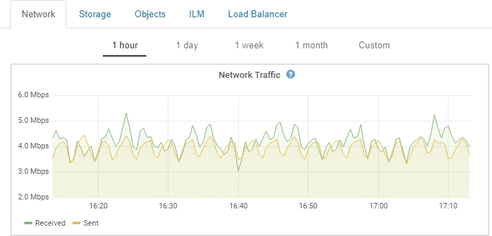

= Kennzahlen von Prometheus
:allow-uri-read: 
:icons: font
:imagesdir: ../media/

[role="lead"]
Der Prometheus-Service auf Admin-Knoten sammelt Zeitreihungskennzahlen aus den Diensten auf allen Knoten.

Die von Prometheus erfassten Kennzahlen werden an verschiedenen Stellen im Grid Manager verwendet:

* *Knoten Seite*: Die Grafiken und Diagramme auf den Registerkarten, die auf der Seite Knoten verfügbar sind, zeigen mit dem Grafana Visualization Tool die von Prometheus erfassten Zeitreihenmetriken an. Grafana zeigt Zeitserien-Daten im Diagramm- und Diagrammformat an, Prometheus dient als Back-End-Datenquelle.
+

* *Alerts*: Warnmeldungen werden auf bestimmten Schweregraden ausgelöst, wenn Alarmregelbedingungen, die Prometheus-Metriken verwenden, als wahr bewerten.
* *Grid Management API*: Sie können Prometheus-Kennzahlen in benutzerdefinierten Alarmregeln oder mit externen Automatisierungstools verwenden, um Ihr StorageGRID-System zu überwachen. Eine vollständige Liste der Prometheus-Kennzahlen finden Sie über die Grid Management API (*Hilfe* *API-Dokumentation* *Metrics*). Während mehr als tausend Kennzahlen zur Verfügung stehen, ist nur eine relativ kleine Zahl zur Überwachung der kritischsten StorageGRID Vorgänge erforderlich.
+

NOTE: Metriken, die _privat_ in ihren Namen enthalten, sind nur zur internen Verwendung vorgesehen und können ohne Ankündigung zwischen StorageGRID Versionen geändert werden.

* Die Seite *Support* *Tools* *Diagnose* und die *Support* *Tools* *Metriken* Seite: Diese Seiten, die hauptsächlich für den technischen Support bestimmt sind, bieten eine Reihe von Werkzeugen und Diagrammen, die die Werte der Prometheus-Kennzahlen nutzen.
+

NOTE: Einige Funktionen und Menüelemente auf der Seite Metriken sind absichtlich nicht funktionsfähig und können sich ändern.

.Verwandte Informationen
link:monitoring-and-managing-alerts.html["Monitoring und Management von Warnmeldungen"]

link:using-storagegrid-support-options.html["Verwenden von StorageGRID Support-Optionen"]

link:../monitor/index.html["Monitor  Fehlerbehebung"]
