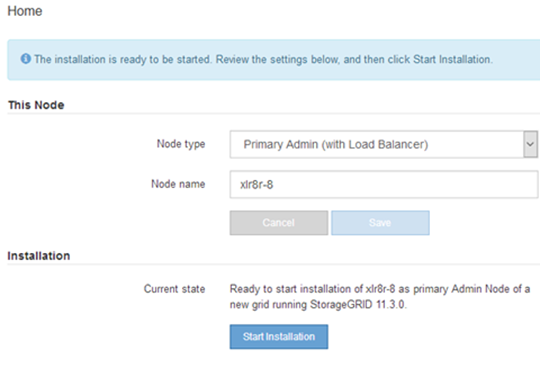

= Bereitstellen einer Services Appliance als primärer Admin-Node
:allow-uri-read: 
:icons: font
:imagesdir: ../media/

[role="lead"]
Wenn Sie eine Services-Appliance als primären Administratorknoten bereitstellen, verwenden Sie das auf der Appliance enthaltene StorageGRID-Appliance-Installationsprogramm, um die StorageGRID-Software zu installieren, oder Sie laden die gewünschte Softwareversion hoch. Sie müssen den primären Admin-Node installieren und konfigurieren, bevor Sie andere Node-Typen installieren. Ein primärer Admin-Node kann eine Verbindung mit dem Grid-Netzwerk und dem optionalen Admin-Netzwerk und dem Client-Netzwerk herstellen, wenn ein oder beide konfiguriert sind.

.Was Sie benötigen
* Das Gerät wurde in einem Rack oder Schrank installiert, mit Ihren Netzwerken verbunden und eingeschaltet.
* Mithilfe des Installationsprogramms der StorageGRID Appliance wurden Netzwerkverbindungen, IP-Adressen und (falls erforderlich) die Port-Neuzuordnung für die Appliance konfiguriert.
+

IMPORTANT: Wenn Sie Ports neu zugeordnet haben, können Sie nicht dieselben Ports zum Konfigurieren von Load Balancer-Endpunkten verwenden. Sie können Endpunkte mit neu zugeordneten Ports erstellen, aber diese Endpunkte werden nicht dem Load Balancer-Service, sondern den ursprünglichen CLB-Ports und -Service neu zugeordnet. Befolgen Sie die Schritte in der Recovery- und Wartungsanleitung zum Entfernen von Port-Remaps.

+

NOTE: Der CLB-Service ist veraltet.

* Sie verfügen über einen Service-Laptop mit einem unterstützten Webbrowser.
* Sie kennen eine der IP-Adressen, die der Appliance zugewiesen sind. Sie können die IP-Adresse für jedes angeschlossene StorageGRID-Netzwerk verwenden.

.Über diese Aufgabe
So installieren Sie StorageGRID auf einem primären Administrator-Node einer Appliance:

* Sie verwenden das Installationsprogramm für StorageGRID-Appliances, um die StorageGRID-Software zu installieren. Wenn Sie eine andere Version der Software installieren möchten, laden Sie sie zuerst mithilfe des StorageGRID-Appliance-Installationsprogramms hoch.
* Sie warten, bis die Software installiert ist.
* Nach der Installation der Software wird die Appliance automatisch neu gestartet.

.Schritte
. Öffnen Sie einen Browser, und geben Sie die IP-Adresse für das Gerät ein. +
`*https://_services_appliance_IP_:8443*`
+
Die Startseite des StorageGRID-Appliance-Installationsprogramms wird angezeigt.

. Wählen Sie im Abschnitt *dieser Knoten* die Option *Hauptadministrator* aus.
. Geben Sie im Feld *Knotenname* den Namen ein, den Sie für diesen Appliance-Knoten verwenden möchten, und klicken Sie auf *Speichern*.
+
Der Node-Name wird diesem Appliance-Node im StorageGRID-System zugewiesen. Sie wird auf der Seite Grid Nodes im Grid Manager angezeigt.

. Führen Sie optional folgende Schritte aus, um eine andere Version der StorageGRID-Software zu installieren:
+
.. Laden Sie das Installationsarchiv von der NetApp Downloads Seite zu StorageGRID herunter.
+
https://["NetApp Downloads: StorageGRID"^]

.. Extrahieren Sie das Archiv.
.. Wählen Sie im Installationsprogramm der StorageGRID-Appliance die Option *Erweitert* > *StorageGRID-Software hochladen*.
.. Klicken Sie auf *Entfernen*, um das aktuelle Softwarepaket zu entfernen.
+
image::../media/appliance_installer_rmv_current_software.png[Appliance Installer - Aktuelle Software Entfernen]

.. Klicken Sie auf *Durchsuchen* für das Softwarepaket, das Sie heruntergeladen und extrahiert haben, und klicken Sie dann auf *Durchsuchen* für die Prüfsummendatei.
+
image::../media/appliance_installer_upload_sg_software.png[Appliance Installer – SG-Software hochladen]

.. Wählen Sie *Home*, um zur Startseite zurückzukehren.

. Vergewissern Sie sich, dass der aktuelle Status „`bereit ist, die Installation des primären Admin Node-Namens mit der Softwareversion x.y` zu starten und dass die Schaltfläche *Installation starten* aktiviert ist.
+

NOTE: Wenn Sie die Admin-Node-Appliance als Ziel für das Klonen eines Node implementieren, beenden Sie den Implementierungsprozess hier und setzen Sie das Klonverfahren für den Node bei Recovery und Wartung fort.

+
link:../maintain/index.html["Verwalten Sie  erholen"]

. Klicken Sie auf der Startseite des StorageGRID-Appliance-Installationsprogramms auf *Installation starten*.
+

+
Der aktuelle Status ändert sich in „`Installation is in progress,`“ und die Seite Monitor Installation wird angezeigt.

+

NOTE: Wenn Sie manuell auf die Seite Monitor-Installation zugreifen müssen, klicken Sie in der Menüleiste auf *Monitor-Installation*.

.Verwandte Informationen
link:deploying-services-appliance-as-gateway-or-non-primary-admin-node.html["Services-Appliance wird als Gateway- oder nicht-primärer Admin-Node implementiert"]
