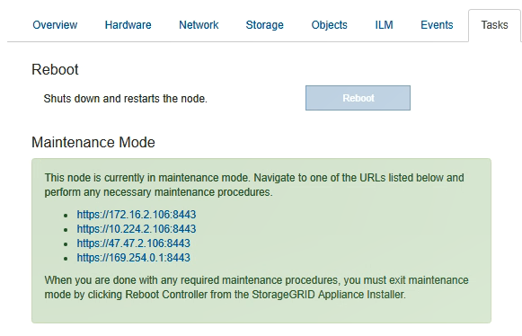

= Versetzen einer Appliance in den Wartungsmodus
:allow-uri-read: 
:icons: font
:imagesdir: ../media/

[role="lead"]
Sie müssen das Gerät in den Wartungsmodus versetzen, bevor Sie bestimmte Wartungsarbeiten durchführen.

.Was Sie benötigen
* Sie müssen über einen unterstützten Browser beim Grid Manager angemeldet sein.
* Sie müssen über die Berechtigung Wartung oder Stammzugriff verfügen. Weitere Informationen finden Sie in den Anweisungen zum Verwalten von StorageGRID.

.Über diese Aufgabe
Wenn Sie eine StorageGRID Appliance in den Wartungsmodus versetzen, ist das Gerät möglicherweise für den Remote-Zugriff nicht verfügbar.

NOTE: Das Passwort und der Hostschlüssel für eine StorageGRID-Appliance im Wartungsmodus bleiben identisch mit dem, als das Gerät in Betrieb war.

.Schritte
. Wählen Sie im Grid Manager die Option *Nodes* aus.
. Wählen Sie in der Strukturansicht der Seite Knoten den Appliance Storage Node aus.
. Wählen Sie *Aufgaben*.
+
image::../media/maintenance_mode.png[Taste Wartungsmodus für das Gerät]

. Wählen Sie *Wartungsmodus*.
+
Ein Bestätigungsdialogfeld wird angezeigt.

+
image::../media/maintenance_mode_confirmation.gif[Bestätigungsdialogfeld für den Wartungsmodus]

. Geben Sie die Provisionierungs-Passphrase ein, und wählen Sie *OK*.
+
Eine Fortschrittsleiste und eine Reihe von Meldungen, darunter „Anfrage gesendet“, „StorageGRID stoppen“ und „neu booten“, geben an, dass die Appliance die Schritte zum Eintritt in den Wartungsmodus abschließt.

+
image::../media/maintenance_mode_progress_bar.png[Statusleiste Für Den Wartungsmodus]

+
Wenn sich die Appliance im Wartungsmodus befindet, wird in einer Bestätigungsmeldung die URLs aufgeführt, mit denen Sie auf das Installationsprogramm der StorageGRID-Appliance zugreifen können.

+

. Um auf das Installationsprogramm der StorageGRID-Appliance zuzugreifen, navigieren Sie zu einer beliebigen der angezeigten URLs.
+
Verwenden Sie nach Möglichkeit die URL, die die IP-Adresse des Admin Network-Ports der Appliance enthält.

+

NOTE: Zugriff Auf `+https://169.254.0.1:8443+` Erfordert eine direkte Verbindung zum lokalen Management-Port.

. Vergewissern Sie sich beim Installationsprogramm der StorageGRID Appliance, dass sich die Appliance im Wartungsmodus befindet.
+
image::../media/maintenance_mode_notification_bar.png[Meldung des Wartungsmodus]

. Führen Sie alle erforderlichen Wartungsaufgaben durch.
. Beenden Sie nach Abschluss der Wartungsaufgaben den Wartungsmodus und fahren Sie den normalen Node-Betrieb fort. Wählen Sie im Installationsprogramm der StorageGRID-Appliance die Option *Erweitert* > *Controller neu starten* aus, und wählen Sie dann *Neustart in StorageGRID* aus.
+
image::../media/reboot_controller_from_maintenance_mode.png[Booten Sie den Controller im Wartungsmodus neu]

+
Die Appliance kann bis zu 20 Minuten dauern, bis sie neu gestartet und wieder in das Grid eingesetzt wird. Um zu überprüfen, ob das Neubooten abgeschlossen ist und dass der Node wieder dem Grid beigetreten ist, gehen Sie zurück zum Grid Manager. Auf der Registerkarte *Nodes* sollte ein normaler Status angezeigt werden image:../media/icon_alert_green_checkmark.png["Grünes Häkchen für Symbolwarnung"] Für den Appliance-Node gibt an, dass keine Meldungen aktiv sind und der Node mit dem Grid verbunden ist.

+
image::../media/node_rejoin_grid_confirmation.png[Das Raster des Appliance-Node wurde neu verbunden]

