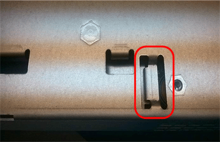

= Austausch des E2800 Controllers
:allow-uri-read: 
:icons: font
:imagesdir: ../media/

[role="lead"]
Möglicherweise müssen Sie den E2800 Controller austauschen, wenn er nicht optimal funktioniert oder ausgefallen ist.

.Über diese Aufgabe
* Sie verfügen über einen Ersatzcontroller mit derselben Teilenummer wie der zu ersetzenden Controller.
* Sie haben die Anweisungen für den Austausch der Simplexkonfiguration eines ausgefallenen E2800 Controller-Kanisters heruntergeladen.
+

IMPORTANT: Beachten Sie nur bei der Anleitung zur E-Series oder wenn Sie weitere Details für einen bestimmten Schritt benötigen. Verlassen Sie sich beim Austausch eines Controllers in der StorageGRID Appliance nicht auf die Anweisungen der E-Series, da sich die Verfahren nicht unterscheiden.

* Sie verfügen über Etiketten, um jedes Kabel, das mit dem Controller verbunden ist, zu identifizieren.
* Wenn alle Laufwerke gesichert sind, haben Sie die Schritte im Simplex-Verfahren zum Austausch des E2800 Controllers überprüft. Dazu gehören der Download und die Installation des E-Series SANtricity Storage Managers von der NetApp Support Site. Anschließend können Sie die gesicherten Laufwerke über das Enterprise Management Window (EMW) entsperren, nachdem Sie den Controller ersetzt haben.
+

IMPORTANT: Sie können das Gerät erst dann verwenden, wenn Sie die Laufwerke mit dem gespeicherten Schlüssel entsperren.

* Sie müssen über spezifische Zugriffsberechtigungen verfügen.
* Sie müssen über einen unterstützten Browser beim Grid Manager angemeldet sein.

.Über diese Aufgabe
Sie können auf zwei Arten feststellen, ob ein ausgefallener Controller-Behälter besteht:

* Der Recovery Guru im SANtricity System Manager führt Sie dazu, den Controller zu ersetzen.
* Die gelbe Warn-LED am Controller leuchtet und gibt an, dass der Controller einen Fehler aufweist.

Auf den Appliance-Speicherknoten kann nicht zugegriffen werden, wenn Sie den Controller austauschen. Wenn der E2800 Controller ausreichend funktioniert, können Sie den E5700SG Controller in den Wartungsmodus versetzen.

link:placing-appliance-into-maintenance-mode.html["Versetzen einer Appliance in den Wartungsmodus"]

Wenn Sie einen Controller austauschen, müssen Sie den Akku aus dem ursprünglichen Controller entfernen und in den Ersatzcontroller einsetzen.

NOTE: Der E2800 Controller in der Appliance enthält keine Host-Schnittstellenkarte (HIC).

.Schritte
. Befolgen Sie die Anweisungen beim Austausch des E2800 Controllers, um das Entfernen des Controllers vorzubereiten.
+
Sie führen die folgenden Schritte mit SANtricity System Manager aus.

+
.. Notieren Sie sich, welche Version der SANtricity OS Software derzeit auf dem Controller installiert ist.
.. Notieren Sie sich, welche NVSRAM-Version derzeit installiert ist.
.. Wenn die Laufwerksicherheit aktiviert ist, stellen Sie sicher, dass ein gespeicherter Schlüssel existiert und dass Sie den Passphrase kennen, der für die Installation erforderlich ist.
+

IMPORTANT: *Möglicher Verlust des Datenzugriffs --* Wenn alle Laufwerke im Gerät sicher sind, kann der neue Controller erst dann auf das Gerät zugreifen, wenn Sie die gesicherten Laufwerke mit dem Unternehmensverwaltungsfenster im SANtricity Storage Manager entsperren.

.. Sichern Sie die Konfigurationsdatenbank.
+
Wenn beim Entfernen eines Controllers ein Problem auftritt, können Sie die gespeicherte Datei verwenden, um Ihre Konfiguration wiederherzustellen.

.. Sammeln von Support-Daten für die Appliance
+

NOTE: Das Erfassen von Supportdaten vor und nach dem Ersetzen einer Komponente stellt sicher, dass Sie einen vollständigen Satz von Protokollen an den technischen Support senden können, falls das Problem durch den Austausch nicht behoben wird.

. Wenn die StorageGRID Appliance in einem StorageGRID System ausgeführt wird, versetzen Sie den E5700SG Controller in den Wartungsmodus.
+
link:placing-appliance-into-maintenance-mode.html["Versetzen einer Appliance in den Wartungsmodus"]

. Wenn der E2800 Controller ausreichend funktioniert, um ein kontrolliertes Herunterfahren zu ermöglichen, bestätigen Sie, dass alle Operationen abgeschlossen wurden.
+
.. Wählen Sie auf der Startseite des SANtricity System Managers die Option *Vorgänge in Bearbeitung anzeigen*.
.. Vergewissern Sie sich, dass alle Vorgänge abgeschlossen sind.

. Entfernen Sie den Controller aus dem Gerät:
+
.. Setzen Sie ein ESD-Armband an oder ergreifen Sie andere antistatische Vorsichtsmaßnahmen.
.. Beschriften Sie die Kabel, und trennen Sie dann die Kabel und SFPs.
+

IMPORTANT: Um eine verminderte Leistung zu vermeiden, dürfen die Kabel nicht verdreht, gefaltet, gequetscht oder treten.

.. Lösen Sie die Steuerung vom Gerät, indem Sie die Verriegelung am Nockengriff so lange drücken, bis sie sich löst, und öffnen Sie dann den Nockengriff nach rechts.
.. Schieben Sie den Regler mit zwei Händen und dem Nockengriff aus dem Gerät.
+

IMPORTANT: Verwenden Sie immer zwei Hände, um das Gewicht der Steuerung zu unterstützen.

.. Stellen Sie den Controller auf eine flache, statische Oberfläche, wobei die abnehmbare Abdeckung nach oben zeigt.
.. Entfernen Sie die Abdeckung, indem Sie die Taste nach unten drücken und die Abdeckung abnehmen.

. Entfernen Sie den Akku aus dem ausgefallenen Controller, und setzen Sie ihn in den Ersatzcontroller ein:
+
.. Vergewissern Sie sich, dass die grüne LED im Controller (zwischen Akku und DIMMs) aus ist.
+
Wenn diese grüne LED leuchtet, wird der Controller weiterhin mit Strom versorgt. Sie müssen warten, bis diese LED erlischt, bevor Sie Komponenten entfernen.

+
image::../media/e2800_internal_cache_active_led.gif[Grüne LED auf E2800]

+
|===
| Element | Beschreibung 

 a| 
image:../media/icon_legend_01.gif["Symbol Nummer 1"]
 a| 
Interne LED für aktiven Cache

 a| 
image:../media/icon_legend_02.gif["Symbol Nummer 2"]
 a| 
Batterie

|===
.. Suchen Sie den blauen Freigabehebel für die Batterie.
.. Entriegeln Sie den Akku, indem Sie den Entriegelungshebel nach unten und aus dem Controller entfernen.
+
image::../media/e2800_remove_battery.gif[Batterieverriegelung]

+
|===
| Element | Beschreibung 

 a| 
image:../media/icon_legend_01.gif["Symbol Nummer 1"]
 a| 
Akkufreigaberiegel

 a| 
image:../media/icon_legend_02.gif["Symbol Nummer 2"]
 a| 
Batterie

|===
.. Heben Sie den Akku an, und schieben Sie ihn aus dem Controller.
.. Entfernen Sie die Abdeckung vom Ersatzcontroller.
.. Richten Sie den Ersatz-Controller so aus, dass der Steckplatz für die Batterie zu Ihnen zeigt.
.. Setzen Sie den Akku in einem leichten Abwärtswinkel in den Controller ein.
+
Sie müssen den Metallflansch an der Vorderseite der Batterie in den Schlitz an der Unterseite des Controllers einsetzen und die Oberseite der Batterie unter den kleinen Ausrichtstift auf der linken Seite des Controllers schieben.

.. Schieben Sie die Akkuverriegelung nach oben, um die Batterie zu sichern.
+
Wenn die Verriegelung einrastet, Haken unten an der Verriegelung in einen Metallschlitz am Gehäuse.

.. Drehen Sie den Controller um, um zu bestätigen, dass der Akku korrekt installiert ist.
+

IMPORTANT: *Mögliche Hardware-Schäden* -- der Metallflansch an der Vorderseite der Batterie muss vollständig in den Schlitz am Controller eingesetzt werden (wie in der ersten Abbildung dargestellt). Wenn die Batterie nicht richtig eingesetzt ist (wie in der zweiten Abbildung dargestellt), kann der Metallflansch die Controllerplatine kontaktieren, was zu Schäden führt.

+
*** *Korrekt -- der Metallflansch der Batterie ist komplett in den Schlitz am Controller eingelegt:*
+
image::../media/e2800_battery_flange_ok.gif[Batterieflansch Korrekt]

*** *Falsch -- der Metallflansch der Batterie ist nicht in den Steckplatz an der Steuerung eingefügt:*
+

.. Bringen Sie die Controllerabdeckung wieder an.

. Setzen Sie den Ersatzcontroller in das Gerät ein.
+
.. Drehen Sie den Controller um, so dass die abnehmbare Abdeckung nach unten zeigt.
.. Schieben Sie den Steuerknebel in die geöffnete Stellung, und schieben Sie ihn bis zum Gerät.
.. Bewegen Sie den Nockengriff nach links, um die Steuerung zu verriegeln.
.. Ersetzen Sie die Kabel und SFPs.
.. Warten Sie, bis der E2800 Controller neu gestartet wurde. Vergewissern Sie sich, dass auf der 7-Segment-Anzeige ein Status von angezeigt wird `99`.
.. Legen Sie fest, wie Sie dem Ersatz-Controller eine IP-Adresse zuweisen.
+

NOTE: Die Schritte zum Zuweisen einer IP-Adresse zum Ersatz-Controller hängen davon ab, ob Sie Management-Port 1 mit einem Netzwerk mit einem DHCP-Server verbunden haben und ob alle Laufwerke gesichert sind.

+
*** Wenn Management-Port 1 mit einem Netzwerk über einen DHCP-Server verbunden ist, erhält der neue Controller seine IP-Adresse vom DHCP-Server. Dieser Wert kann sich von der IP-Adresse des ursprünglichen Controllers unterscheiden.
*** Wenn alle Laufwerke gesichert sind, müssen Sie das Enterprise Management-Fenster (EMW) im SANtricity Storage Manager verwenden, um die gesicherten Laufwerke zu entsperren. Sie können erst dann auf den neuen Controller zugreifen, wenn Sie die Laufwerke mit dem gespeicherten Schlüssel entsperren. In der Anleitung zur E-Series ist der Austausch eines E2800 Simplex-Controllers beschrieben.

. Wenn die Appliance gesicherte Laufwerke verwendet, befolgen Sie die Anweisungen beim Austausch des E2800 Controllers, um den Sicherheitsschlüssel des Laufwerks zu importieren.
. Stellen Sie den normalen Betriebsmodus des Geräts wieder ein. Wählen Sie im Installationsprogramm der StorageGRID-Appliance die Option *Erweitert* > *Controller neu starten* aus, und wählen Sie dann *Neustart in StorageGRID* aus.
+
image::../media/reboot_controller_from_maintenance_mode.png[Booten Sie den Controller im Wartungsmodus neu]

+
Während des Neustarts wird der folgende Bildschirm angezeigt:

+
image::../media/reboot_controller_in_progress.png[Neustart wird ausgeführt]

+
Das Gerät wird neu gestartet und wieder in das Raster integriert. Dieser Vorgang kann bis zu 20 Minuten dauern.

. Vergewissern Sie sich, dass das Neubooten abgeschlossen ist und dass der Node wieder dem Raster beigetreten ist. Überprüfen Sie im Grid Manager, ob auf der Registerkarte *Nodes* ein normaler Status angezeigt wird image:../media/icon_alert_green_checkmark.png["Grünes Häkchen für Symbolwarnung"] Für den Appliance-Node gibt an, dass keine Meldungen aktiv sind und der Node mit dem Grid verbunden ist.
+
image::../media/node_rejoin_grid_confirmation.png[Das Raster des Appliance-Node wurde neu verbunden]

. Vom SANtricity System Manager sollte sichergestellt werden, dass der neue Controller optimal ist, und er sammelt Support-Daten.

.Verwandte Informationen
http://mysupport.netapp.com/info/web/ECMP1658252.html["NetApp E-Series Systems Documentation Site"^]
