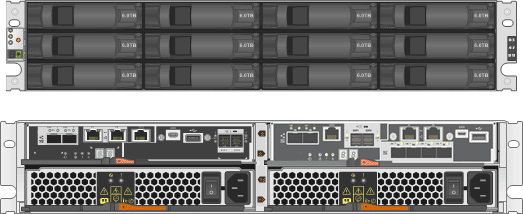

= Übersicht über die StorageGRID Appliance
:allow-uri-read: 
:icons: font
:imagesdir: ../media/

[role="lead"]
Die SG5700 StorageGRID Appliance ist eine integrierte Storage- und Computing-Plattform, die als Storage-Node in einem StorageGRID Grid ausgeführt wird. Die Appliance kann in einer hybriden Grid-Umgebung verwendet werden, die Appliance Storage Nodes und virtuelle (softwarebasierte) Storage-Nodes kombiniert.

Die StorageGRID SG5700 Appliance bietet folgende Funktionen:

* Integriert die Storage- und Computing-Elemente für einen StorageGRID Storage Node.
* Umfasst das Installationsprogramm von StorageGRID Appliance zur Vereinfachung der Bereitstellung und Konfiguration von Storage-Nodes.
* Umfasst E-Series SANtricity System Manager für Hardware-Management und Monitoring.
* Unterstützt bis zu vier 10-GbE- oder 25-GbE-Verbindungen mit dem StorageGRID-Grid-Netzwerk und dem Client-Netzwerk.
* Unterstützt vollständige Festplattenverschlüsselung (Full Disk Encryption, FDE) oder FIPS-Laufwerke (Federal Information Processing Standard). Wenn diese Laufwerke mit der Laufwerksicherheitsfunktion in SANtricity System Manager verwendet werden, wird ein nicht autorisierter Zugriff auf die Daten verhindert.

Das SG5700-Appliance ist in zwei Modellen erhältlich: Der SG5712 und der SG5760. Beide Modelle enthalten die folgenden Komponenten:

|===
| Komponente | SG5712 | SG5760 

 a| 
Computing-Controller
 a| 
E5700SG Controller
 a| 
E5700SG Controller

 a| 
Storage Controller
 a| 
E-Series E2800 Controller
 a| 
E-Series E2800 Controller

 a| 
Chassis
 a| 
E-Series DE212C-Gehäuse, ein 2-HE-Gehäuse (Rack-Unit)
 a| 
E-Series DE460C Gehäuse, ein 4-HE-Gehäuse (Rack-Unit

 a| 
Laufwerke
 a| 
12 NL-SAS-Laufwerke (3.5 Zoll)
 a| 
60 NL-SAS-Laufwerke (3.5 Zoll)

 a| 
Redundante Netzteile und Lüfter
 a| 
Zwei Power-Fan-Kanister
 a| 
Zwei Leistungskanister und zwei Lüfterkanister

|===
Der maximale Rohkapazität, der in der StorageGRID-Appliance verfügbar ist, richtet sich nach der Anzahl der Laufwerke in jedem Gehäuse. Der verfügbare Storage kann nicht erweitert werden, indem ein Shelf mit zusätzlichen Laufwerken hinzugefügt wird.

== Modell SG5712

Diese Abbildung zeigt die Vorder- und Rückseite des SG5712-Modells, ein 2-HE-Gehäuse für 12 Laufwerke.

Die SG5712 umfasst zwei Controller und zwei Power-Fan-Kanister.

image::../media/sg5712_with_callouts.gif[Controller und Power-Fan-Behälter im SG5712-Gerät]

[cols="1a,5a"]
|===
|  | Beschreibung 

 a| 
1
 a| 
E2800-Controller (Storage-Controller)

 a| 
2
 a| 
E5700SG Controller (Compute-Controller)

 a| 
3
 a| 
Power-Fan-Behälter

|===

== Modell SG5760

Diese Abbildung zeigt die Vorder- und Rückseite des SG5760-Modells, ein 4-HE-Gehäuse für 60 Laufwerke in 5 Laufwerksfächer.

image::../media/sg5760_front_and_back_views.gif[Vorder- und Rückseite des SG5760-Geräts]

Die SG5760 verfügt über zwei Controller, zwei Lüfterbehälter und zwei Strombehälter.

image::../media/sg5760_with_callouts.gif[Controller,fan canisters,and power canisters in SG5760 appliance]

[cols="1a,5a"]
|===
|  | Beschreibung 

 a| 
1
 a| 
E2800-Controller (Storage-Controller)

 a| 
2
 a| 
E5700SG Controller (Compute-Controller)

 a| 
3
 a| 
Gebläsebehälter (1 von 2)

 a| 
4
 a| 
Leistungsbehälter (1 von 2)

|===
.Verwandte Informationen
http://["NetApp E-Series Systems Documentation Site"^]
