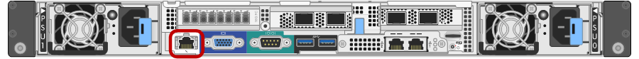

= Zugriff auf die BMC-Schnittstelle
:allow-uri-read: 
:icons: font
:imagesdir: ../media/

[role="lead"]
Sie können über die DHCP- oder statische IP-Adresse für den BMC-Management-Port auf die BMC-Schnittstelle des SG6000-CN-Controllers zugreifen.

.Was Sie benötigen
* Der BMC-Management-Port des SG6000-CN Controllers ist mit dem Managementnetzwerk verbunden, das Sie verwenden möchten.
+

* Der Management-Client verwendet einen unterstützten Webbrowser.

.Schritte
. Geben Sie die URL für die BMC-Schnittstelle ein: +
`*https://_BMC_Port_IP_*`
+
Für `_BMC_Port_IP_`, Verwenden Sie die DHCP- oder statische IP-Adresse für den BMC-Management-Port.

+
Die BMC-Anmeldeseite wird angezeigt.

. Geben Sie den Root-Benutzernamen und das Kennwort ein. Verwenden Sie dazu das Passwort, das Sie beim Ändern des Standard-Root-Passworts festgelegt haben: +
`*root*` +
`*_password_*`
+
image::../media/bmc_signin_page.gif[BMC-Anmelde-Seite]

. Wählen Sie *Sign me in* aus.
+
Das BMC-Dashboard wird angezeigt.

+
image::../media/bmc_dashboard.gif[BMC Dashboard]

. Erstellen Sie optional weitere Benutzer, indem Sie *Einstellungen* > *Benutzerverwaltung* wählen und auf einen beliebigen Benutzer "`disabled`" klicken.
+

NOTE: Wenn sich Benutzer zum ersten Mal anmelden, werden sie möglicherweise aufgefordert, ihr Passwort zu ändern, um die Sicherheit zu erhöhen.

.Verwandte Informationen
link:changing-root-password-for-bmc-interface-sg6000.html["Ändern des Root-Passworts für die BMC-Schnittstelle"]
