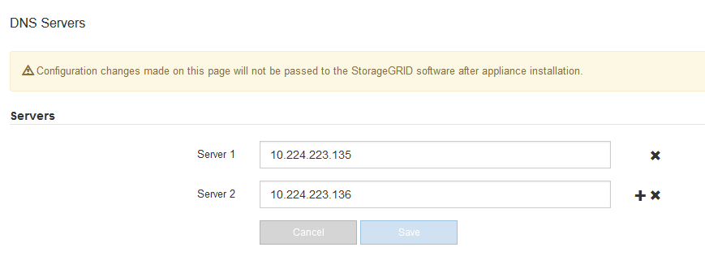

= Überprüfen der DNS-Serverkonfiguration
:allow-uri-read: 
:icons: font
:imagesdir: ../media/

[role="lead"]
Sie können die DNS-Server (Domain Name System), die derzeit von diesem Appliance-Node verwendet werden, überprüfen und vorübergehend ändern.

.Was Sie benötigen
Das Gerät wurde in den Wartungsmodus versetzt.

link:placing-appliance-into-maintenance-mode.html["Versetzen einer Appliance in den Wartungsmodus"]

.Über diese Aufgabe
Möglicherweise müssen Sie die DNS-Servereinstellungen ändern, wenn eine verschlüsselte Appliance sich nicht mit dem Verschlüsselungsmanagement-Server (KMS) oder dem KMS-Cluster verbinden kann, da der Hostname des KMS als Domänenname anstelle einer IP-Adresse angegeben wurde. Alle Änderungen, die Sie an den DNS-Einstellungen für die Appliance vornehmen, sind temporär und gehen verloren, wenn Sie den Wartungsmodus verlassen. Um diese Änderungen dauerhaft durchzuführen, geben Sie die DNS-Server im Grid Manager an (*Wartung* > *Netzwerk* > *DNS-Server*).

* Temporäre Änderungen an der DNS-Konfiguration sind nur für Node-verschlüsselte Appliances erforderlich, bei denen der KMS-Server mithilfe eines vollständig qualifizierten Domänennamens anstelle einer IP-Adresse für den Hostnamen definiert wird.
* Wenn eine Node-verschlüsselte Appliance über einen Domänennamen eine Verbindung zu einem KMS herstellt, muss sie eine Verbindung zu einem der für das Grid definierten DNS-Server herstellen. Einer dieser DNS-Server übersetzt dann den Domain-Namen in eine IP-Adresse.
* Wenn der Node keinen DNS-Server für das Grid erreichen kann oder wenn die DNS-Einstellungen für das gesamte Grid geändert wurden, wenn ein Node-verschlüsselter Appliance-Node offline war, kann der Node keine Verbindung mit dem KMS herstellen. Verschlüsselte Daten auf der Appliance können erst entschlüsselt werden, wenn das DNS-Problem behoben ist.

Um ein DNS-Problem zu beheben, das die KMS-Verbindung verhindert, geben Sie die IP-Adresse eines oder mehrerer DNS-Server im Installationsprogramm der StorageGRID Appliance an. Diese temporären DNS-Einstellungen ermöglichen es der Appliance, eine Verbindung zum KMS herzustellen und Daten auf dem Knoten zu entschlüsseln.

Wenn sich beispielsweise der DNS-Server für das Grid ändert, während ein verschlüsselter Node offline war, kann der Node nach seinem Wechsel wieder online den KMS nicht erreichen, da er weiterhin die vorherigen DNS-Werte verwendet. Durch Eingabe der neuen IP-Adresse des DNS-Servers im StorageGRID-Appliance-Installationsprogramm kann eine temporäre KMS-Verbindung die Knotendaten entschlüsseln.

.Schritte
. Wählen Sie im Installationsprogramm der StorageGRID-Appliance die Option *Netzwerke konfigurieren* > *DNS-Konfiguration* aus.
. Vergewissern Sie sich, dass die angegebenen DNS-Server richtig sind.
+

. Ändern Sie bei Bedarf die DNS-Server.
+

IMPORTANT: Änderungen an den DNS-Einstellungen erfolgen temporär und gehen verloren, wenn Sie den Wartungsmodus beenden.

. Wenn Sie mit den temporären DNS-Einstellungen zufrieden sind, wählen Sie *Speichern*.
+
Der Knoten verwendet die auf dieser Seite angegebenen DNS-Servereinstellungen, um eine Verbindung mit dem KMS herzustellen, sodass die Daten auf dem Knoten entschlüsselt werden können.

. Nachdem die Node-Daten entschlüsselt wurden, booten Sie den Node neu. Wählen Sie im Installationsprogramm der StorageGRID-Appliance die Option *Erweitert* > *Controller neu starten* aus, und wählen Sie dann eine der folgenden Optionen aus:
+
** Wählen Sie *Neustart in StorageGRID* aus, um den Controller neu zu starten, wobei der Knoten wieder in das Raster integriert wird. Wählen Sie diese Option, wenn Sie im Wartungsmodus ausgeführt werden und den Node in den normalen Betrieb zurückkehren möchten.
** Wählen Sie *Neustart im Wartungsmodus* aus, um den Controller neu zu starten, wobei der Knoten noch im Wartungsmodus bleibt. Wählen Sie diese Option aus, wenn weitere Wartungsmaßnahmen erforderlich sind, die Sie auf dem Node durchführen müssen, bevor Sie das Raster neu beitreten.image:../media/reboot_controller_from_maintenance_mode.png["Booten Sie den Controller im Wartungsmodus neu"]
+

NOTE: Wenn der Node neu gebootet und neu in das Grid wechselt, werden die im Grid Manager aufgeführten systemweiten DNS-Server verwendet. Nach dem erneuten Beitritt zum Grid verwendet die Appliance nicht mehr die im StorageGRID Appliance Installer angegebenen temporären DNS-Server, während sich die Appliance im Wartungsmodus befand.

+
Die Appliance kann bis zu 20 Minuten dauern, bis sie neu gestartet und wieder in das Grid eingesetzt wird. Um zu überprüfen, ob das Neubooten abgeschlossen ist und dass der Node wieder dem Grid beigetreten ist, gehen Sie zurück zum Grid Manager. Auf der Registerkarte *Nodes* sollte ein normaler Status angezeigt werden image:../media/icon_alert_green_checkmark.png["Grünes Häkchen für Symbolwarnung"] Für den Appliance-Node gibt an, dass keine Meldungen aktiv sind und der Node mit dem Grid verbunden ist.

+
image::../media/node_rejoin_grid_confirmation.png[Das Raster des Appliance-Node wurde neu verbunden]

