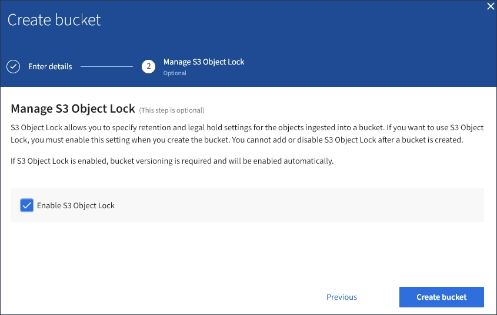

= Erstellen eines S3-Buckets
:allow-uri-read: 
:icons: font
:imagesdir: ../media/

[role="lead"]
Sie können im Mandanten-Manager S3-Buckets für Objektdaten erstellen. Wenn Sie einen Bucket erstellen, müssen Sie Namen und Region des Bucket angeben. Wenn die globale S3-Objektsperre für das StorageGRID-System aktiviert ist, können Sie optional die S3-Objektsperre für den Bucket aktivieren.

.Was Sie benötigen
* Sie müssen über einen unterstützten Browser beim Tenant Manager angemeldet sein.
* Sie müssen einer Benutzergruppe angehören, die über die Berechtigung Alle Buckets verwalten oder Root Access verfügt. Diese Berechtigungen überschreiben die Berechtigungseinstellungen in Gruppen- oder Bucket-Richtlinien.
* Wenn Sie einen Bucket mit S3-Objektsperre erstellen möchten, muss die globale S3-Objektsperre für das StorageGRID-System aktiviert worden sein und Sie müssen die Anforderungen für S3-Objektsperren-Buckets und -Objekte überprüft haben.
+
link:using-s3-object-lock.html["Verwenden der S3-Objektsperre"]

.Schritte
. Wählen Sie *STORAGE (S3)* > *Buckets* aus.
+
Die Seite Buckets wird angezeigt und listet alle Buckets auf, die bereits erstellt wurden.

+
image::../media/buckets_page.png[Seite „Buckets“]

. Wählen Sie *Eimer erstellen*.
+
Der Bucket-Assistent Erstellen wird angezeigt.

+
image::../media/bucket_create_compliance_disabled.png[Bucket Create Compliance Ist Deaktiviert]

+

NOTE: Wenn die globale S3-Objektsperre aktiviert ist, enthält Create Bucket einen zweiten Schritt zum Managen der S3-Objektsperre für den Bucket.

. Geben Sie einen eindeutigen Namen für den Bucket ein.
+

IMPORTANT: Sie können den Bucket-Namen nach dem Erstellen des Buckets nicht ändern.

+
Bucket-Namen müssen folgende Regeln einhalten:

+
** Jedes StorageGRID System muss eindeutig sein (nicht nur innerhalb des Mandantenkontos).
** Muss DNS-konform sein.
** Darf mindestens 3 und nicht mehr als 63 Zeichen enthalten.
** Kann eine Reihe von einer oder mehreren Etiketten sein, wobei angrenzende Etiketten durch einen Zeitraum getrennt sind. Jedes Etikett muss mit einem Kleinbuchstaben oder einer Zahl beginnen und enden. Es können nur Kleinbuchstaben, Ziffern und Bindestriche verwendet werden.
** Darf nicht wie eine Text-formatierte IP-Adresse aussehen.
** Perioden sollten nicht in Anforderungen im virtuellen gehosteten Stil verwendet werden. Perioden verursachen Probleme bei der Überprüfung des Server-Platzhalterzertifikats.

+

NOTE: Weitere Informationen finden Sie in der Dokumentation zu Amazon Web Services (AWS).

. Wählen Sie die Region für diesen Bucket aus.
+
Der StorageGRID-Administrator managt die verfügbaren Regionen. Die Regionen eines Buckets können die Datensicherungsrichtlinie, die auf Objekte angewendet wird, beeinflussen. Standardmäßig werden alle Buckets im erstellt `us-east-1` Werden.

+

IMPORTANT: Nach dem Erstellen des Buckets können Sie die Region nicht ändern.

. Wählen Sie *Eimer erstellen* oder *Weiter*.
+
** Wenn die globale S3-Objektsperre nicht aktiviert ist, wählen Sie *Bucket erstellen* aus. Der Bucket wird erstellt und der Tabelle auf der Seite Buckets hinzugefügt.
** Wenn die globale S3-Objektsperre aktiviert ist, wählen Sie *Weiter*. Schritt 2, S3-Objektsperre verwalten, wird angezeigt.
+

. Aktivieren Sie optional das Kontrollkästchen, um die S3-Objektsperre für diesen Bucket zu aktivieren.
+
S3-Objektsperre muss für den Bucket aktiviert sein, bevor eine S3-Client-Applikation für die dem Bucket hinzugefügten Objekte Haltungs- bis datums- und gesetzliche Aufbewahrungs-Einstellungen festlegen kann.

+

IMPORTANT: Sie können die S3-Objektsperre nach dem Erstellen des Buckets nicht aktivieren oder deaktivieren.

+

NOTE: Wenn Sie S3 Object Lock für einen Bucket aktivieren, wird die Bucket-Versionierung automatisch aktiviert.

. Wählen Sie *Eimer erstellen*.
+
Der Bucket wird erstellt und der Tabelle auf der Seite Buckets hinzugefügt.

.Verwandte Informationen
link:../ilm/index.html["Objektmanagement mit ILM"]

link:understanding-tenant-management-api.html["Das Mandantenmanagement-API von NetApp"]

link:../s3/index.html["S3 verwenden"]
