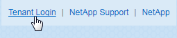
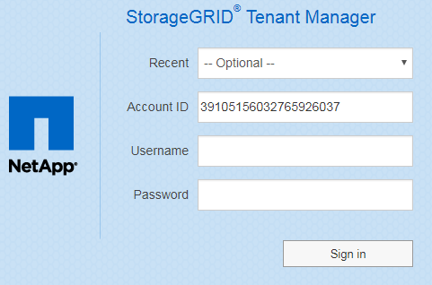

= Melden Sie sich beim Tenant Manager an
:allow-uri-read: 
:icons: font
:imagesdir: ../media/

[role="lead"]
Sie greifen auf den Tenant Manager zu, indem Sie die URL für den Mandanten in die Adressleiste eines unterstützten Webbrowsers eingeben.

.Was Sie benötigen
* Sie müssen über Ihre Anmeldedaten verfügen.
* Sie müssen über eine URL auf den Tenant Manager zugreifen können, die von Ihrem Grid-Administrator bereitgestellt wird. Die URL sieht wie ein Beispiel aus:
+
[listing]
----
https://FQDN_or_Admin_Node_IP/
----
+
[listing]
----
https://FQDN_or_Admin_Node_IP:port/
----
+
[listing]
----
https://FQDN_or_Admin_Node_IP/?accountId=20-digit-account-id
----
+
[listing]
----
https://FQDN_or_Admin_Node_IP:port/?accountId=20-digit-account-id
----
+
Die URL enthält immer entweder den vollständig qualifizierten Domänennamen (FQDN) oder die IP-Adresse, die für den Zugriff auf einen Admin-Node verwendet wird, und kann optional auch eine Portnummer, die 20-stellige Mandantenkontokennung oder beide enthalten.

* Wenn die URL die 20-stellige Konto-ID des Mandanten nicht enthält, müssen Sie über diese Konto-ID verfügen.
* Sie müssen einen unterstützten Webbrowser verwenden.
* Cookies müssen in Ihrem Webbrowser aktiviert sein.
* Sie müssen über spezifische Zugriffsberechtigungen verfügen.

.Schritte
. Starten Sie einen unterstützten Webbrowser.
. Geben Sie in der Adressleiste des Browsers die URL für den Zugriff auf Tenant Manager ein.
. Wenn Sie aufgefordert werden, eine Sicherheitswarnung zu erhalten, installieren Sie das Zertifikat mithilfe des Browser-Installationsassistenten.
. Melden Sie sich beim Tenant Manager an.
+
Der Anmeldebildschirm, den Sie sehen, hängt von der eingegebenen URL ab und davon, ob Ihr Unternehmen Single Sign-On (SSO) verwendet. Sie sehen einen der folgenden Bildschirme:

+
** Die Anmeldeseite des Grid Manager. Klicken Sie oben rechts auf den Link *Tenant Login*.
+

** Die Anmeldeseite von Tenant Manager. Das Feld *Konto-ID* ist möglicherweise bereits ausgefüllt, wie unten gezeigt.
+

+
... Wenn die 20-stellige Konto-ID des Mandanten nicht angezeigt wird, wählen Sie den Namen des Mandantenkontos aus, wenn er in der Liste der letzten Konten angezeigt wird, oder geben Sie die Konto-ID ein.
... Geben Sie Ihren Benutzernamen und Ihr Kennwort ein.
... Klicken Sie auf *Anmelden*.
+
Das Tenant Manager Dashboard wird angezeigt.

** Falls SSO-Seite Ihres Unternehmens im Grid aktiviert ist, Beispiel:
+
image::../media/sso_organization_page.gif[Beispiel für die Anmeldeseite der Organisation für SSO]

+
Geben Sie Ihre Standard-SSO-Anmeldedaten ein, und klicken Sie auf *Anmelden*.

** Die SSO-Anmeldeseite für den Tenant Manager.
+
image::../media/sign_in_sso.gif[Melden Sie sich bei einem Mandantenkonto an, wenn SSO aktiviert ist]

+
... Wenn die 20-stellige Konto-ID des Mandanten nicht angezeigt wird, wählen Sie den Namen des Mandantenkontos aus, wenn er in der Liste der letzten Konten angezeigt wird, oder geben Sie die Konto-ID ein.
... Klicken Sie auf *Anmelden*.
... Melden Sie sich mit Ihren Standard-SSO-Anmeldedaten auf der SSO-Anmeldeseite Ihres Unternehmens an.
+
Das Tenant Manager Dashboard wird angezeigt.

. Wenn Sie ein erstes Kennwort von einer anderen Person erhalten haben, ändern Sie Ihr Kennwort, um Ihr Konto zu sichern. Wählen Sie *_username_* > *Passwort ändern*.
+

NOTE: Wenn SSO für das StorageGRID-System aktiviert ist, können Sie Ihr Passwort nicht vom Mandanten-Manager ändern.

.Verwandte Informationen
link:../admin/index.html["StorageGRID verwalten"]

link:web-browser-requirements.html["Anforderungen an einen Webbrowser"]
