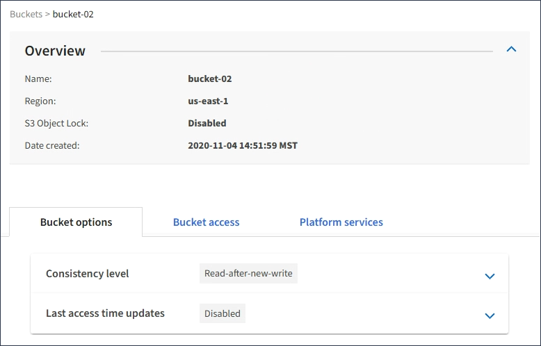

= Anzeigen von S3-Bucket-Details
:allow-uri-read: 
:icons: font
:imagesdir: ../media/

[role="lead"]
Sie können eine Liste der Buckets und Bucket-Einstellungen in Ihrem Mandantenkonto anzeigen.

.Was Sie benötigen
* Sie müssen über einen unterstützten Browser beim Tenant Manager angemeldet sein.

.Schritte
. Wählen Sie *STORAGE (S3)* > *Buckets* aus.
+
Die Seite Buckets wird angezeigt und enthält alle Buckets für das Mandantenkonto.

+
image::../media/buckets_table.png[Buckets-Tabelle]

. Überprüfen Sie die Informationen für jeden Bucket.
+
Bei Bedarf können Sie die Informationen nach einer beliebigen Spalte sortieren oder Sie können die Seite vorwärts und zurück durch die Liste blättern.

+
** Name: Der eindeutige Name des Buckets, der nicht geändert werden kann.
** S3 Object Lock: Ob S3 Object Lock für diesen Bucket aktiviert ist.
+
Diese Spalte wird nicht angezeigt, wenn die globale S3-Objektsperre deaktiviert ist. In dieser Spalte werden außerdem Informationen für alle Buckets angezeigt, die für die Konformität mit älteren Daten verwendet wurden.

** Region: Die Eimer-Region, die nicht geändert werden kann.
** Objektanzahl: Die Anzahl der Objekte in diesem Bucket.
** Verwendeter Speicherplatz: Die logische Größe aller Objekte in diesem Bucket. Die logische Größe umfasst nicht den tatsächlich benötigten Speicherplatz für replizierte oder Erasure Coding-Kopien oder für Objekt-Metadaten.
** Erstellungsdatum: Das Datum und die Uhrzeit, zu der der Bucket erstellt wurde.

+

IMPORTANT: Die angezeigten Werte für Objektanzahl und verwendeter Speicherplatz sind Schätzungen. Diese Schätzungen sind vom Zeitpunkt der Aufnahme, der Netzwerkverbindung und des Node-Status betroffen.

. Um die Einstellungen für einen Bucket anzuzeigen und zu managen, wählen Sie den Bucket-Namen aus.
+
Die Seite mit den Bucket-Details wird angezeigt.

+
Auf dieser Seite können Sie die Einstellungen für Bucket-Optionen, Bucket-Zugriff und Plattform-Services anzeigen und bearbeiten.

+
Weitere Informationen zur Konfiguration der einzelnen Einstellungen oder des Plattform-Service finden Sie in den Anweisungen.

+

.Verwandte Informationen
link:changing-consistency-level.html["Ändern der Konsistenzstufe"]

link:enabling-or-disabling-last-access-time-updates.html["Aktivieren oder Deaktivieren von Updates der letzten Zugriffszeit"]

link:configuring-cross-origin-resource-sharing-cors.html["Konfigurieren der Cross-Origin Resource Sharing (CORS)"]

link:configuring-cloudmirror-replication.html["CloudMirror-Replizierung wird konfiguriert"]

link:configuring-event-notifications.html["Ereignisbenachrichtigungen werden konfiguriert"]

link:configuring-search-integration-service.html["Konfigurieren des Suchintegrationsservice"]
