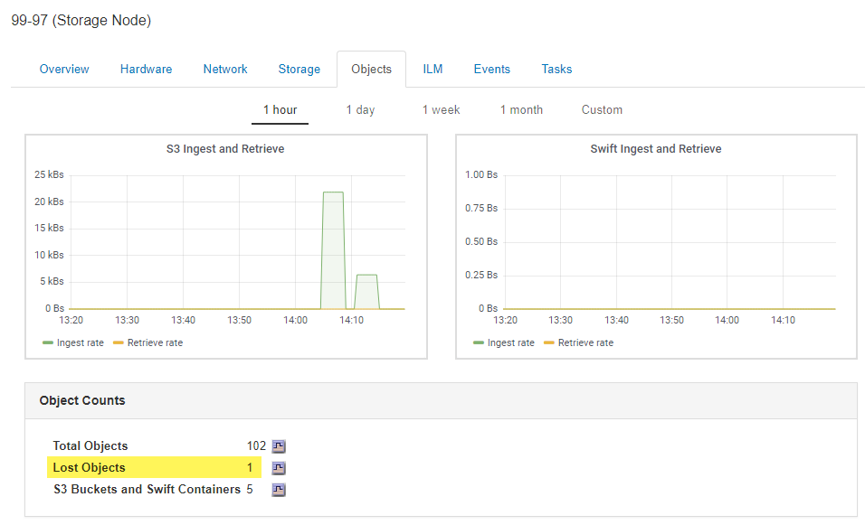

= Untersuchung verlorener Objekte
:allow-uri-read: 
:icons: font
:imagesdir: ../media/

[role="lead"]
Wenn der Alarm * Objects lost* und der Alarm Legacy LOST Objects (Lost Objects) ausgelöst werden, müssen Sie sofort untersuchen. Sammeln Sie Informationen zu den betroffenen Objekten und wenden Sie sich an den technischen Support.

.Was Sie benötigen
* Sie müssen über einen unterstützten Browser beim Grid Manager angemeldet sein.
* Sie müssen über spezifische Zugriffsberechtigungen verfügen.
* Sie müssen die haben `Passwords.txt` Datei:

.Über diese Aufgabe
Die Warnung *Objekte verloren* und der VERLORENE Alarm zeigen an, dass StorageGRID der Ansicht ist, dass es keine Kopien eines Objekts im Raster gibt. Möglicherweise sind Daten dauerhaft verloren gegangen.

Untersuchen Sie verlorene Objektalarme oder -Warnmeldungen sofort. Möglicherweise müssen Sie Maßnahmen ergreifen, um weiteren Datenverlust zu vermeiden. In einigen Fällen können Sie ein verlorenes Objekt wiederherstellen, wenn Sie eine sofortige Aktion ausführen.

Die Anzahl der verlorenen Objekte kann im Grid Manager angezeigt werden.

.Schritte
. Wählen Sie *Knoten*.
. Wählen Sie *_Speicherknoten_* > *Objekte* Aus.
. Überprüfen Sie die Anzahl der in der Tabelle Objektanzahl angezeigten verlorenen Objekte.
+
Diese Nummer gibt die Gesamtzahl der Objekte an, die dieser Grid-Node im gesamten StorageGRID-System als fehlend erkennt. Der Wert ist die Summe der Zähler Lost Objects der Data Store Komponente innerhalb der LDR- und DDS-Dienste.

+

. Greifen Sie von einem Admin-Node aus auf das Audit-Protokoll zu, um die eindeutige Kennung (UUID) des Objekts zu bestimmen, das die Meldung *Objekte verloren* und DEN VERLORENEN Alarm ausgelöst hat:
+
.. Melden Sie sich beim Grid-Node an:
+
... Geben Sie den folgenden Befehl ein: `ssh admin@grid_node_IP`
... Geben Sie das im aufgeführte Passwort ein `Passwords.txt` Datei:
... Geben Sie den folgenden Befehl ein, um zum Root zu wechseln: `su -`
... Geben Sie das im aufgeführte Passwort ein `Passwords.txt` Datei: Wenn Sie als root angemeldet sind, ändert sich die Eingabeaufforderung von `$` Bis `#`.

.. Wechseln Sie in das Verzeichnis, in dem sich die Audit-Protokolle befinden. Geben Sie Ein: `cd /var/local/audit/export/`
.. Verwenden Sie grep, um die Audit-Meldungen zu „Objekt verloren“ (OLST) zu extrahieren. Geben Sie Ein: `grep OLST audit_file_name`
.. Beachten Sie den in der Meldung enthaltenen UUID-Wert.
+
[listing]
----
>Admin: # grep OLST audit.log
2020-02-12T19:18:54.780426 [AUDT:[CBID(UI64):0x38186FE53E3C49A5][UUID(CSTR):926026C4-00A4-449B-AC72-BCCA72DD1311]
[PATH(CSTR):"source/cats"][NOID(UI32):12288733][VOLI(UI64):3222345986][RSLT(FC32):NONE][AVER(UI32):10]
[ATIM(UI64):1581535134780426][ATYP(FC32):OLST][ANID(UI32):12448208][AMID(FC32):ILMX][ATID(UI64):7729403978647354233]]
----

. Verwenden Sie die `ObjectByUUID` Befehl zum Suchen des Objekts anhand seiner ID (UUID) und bestimmen Sie, ob die Daten gefährdet sind.
+
.. Telnet für localhost 1402 für den Zugriff auf die LDR-Konsole.
.. Geben Sie Ein: `/proc/OBRP/ObjectByUUID UUID_value`
+
In diesem ersten Beispiel, das Objekt mit `UUID 926026C4-00A4-449B-AC72-BCCA72DD1311` Hat zwei Standorte aufgelistet.

+
[listing]
----
ade 12448208: /proc/OBRP > ObjectByUUID 926026C4-00A4-449B-AC72-BCCA72DD1311

{
    "TYPE(Object Type)": "Data object",
    "CHND(Content handle)": "926026C4-00A4-449B-AC72-BCCA72DD1311",
    "NAME": "cats",
    "CBID": "0x38186FE53E3C49A5",
    "PHND(Parent handle, UUID)": "221CABD0-4D9D-11EA-89C3-ACBB00BB82DD",
    "PPTH(Parent path)": "source",
    "META": {
        "BASE(Protocol metadata)": {
            "PAWS(S3 protocol version)": "2",
            "ACCT(S3 account ID)": "44084621669730638018",
            "*ctp(HTTP content MIME type)": "binary/octet-stream"
        },
        "BYCB(System metadata)": {
            "CSIZ(Plaintext object size)": "5242880",
            "SHSH(Supplementary Plaintext hash)": "MD5D 0xBAC2A2617C1DFF7E959A76731E6EAF5E",
            "BSIZ(Content block size)": "5252084",
            "CVER(Content block version)": "196612",
            "CTME(Object store begin timestamp)": "2020-02-12T19:16:10.983000",
            "MTME(Object store modified timestamp)": "2020-02-12T19:16:10.983000",
            "ITME": "1581534970983000"
        },
        "CMSM": {
            "LATM(Object last access time)": "2020-02-12T19:16:10.983000"
        },
        "AWS3": {
            "LOCC": "us-east-1"
        }
    },
    "CLCO\(Locations\)": \[
        \{
            "Location Type": "CLDI\(Location online\)",
            "NOID\(Node ID\)": "12448208",
            "VOLI\(Volume ID\)": "3222345473",
            "Object File Path": "/var/local/rangedb/1/p/17/11/00rH0%DkRt78Ila\#3udu",
            "LTIM\(Location timestamp\)": "2020-02-12T19:36:17.880569"
        \},
        \{
            "Location Type": "CLDI\(Location online\)",
            "NOID\(Node ID\)": "12288733",
            "VOLI\(Volume ID\)": "3222345984",
            "Object File Path": "/var/local/rangedb/0/p/19/11/00rH0%DkRt78Rrb\#3s;L",
            "LTIM\(Location timestamp\)": "2020-02-12T19:36:17.934425"
        }
    ]
}
----
+
Im zweiten Beispiel das Objekt mit `UUID 926026C4-00A4-449B-AC72-BCCA72DD1311` Hat keine Standorte aufgelistet.

+
[listing]
----
ade 12448208: / > /proc/OBRP/ObjectByUUID 926026C4-00A4-449B-AC72-BCCA72DD1311

{
    "TYPE(Object Type)": "Data object",
    "CHND(Content handle)": "926026C4-00A4-449B-AC72-BCCA72DD1311",
    "NAME": "cats",
    "CBID": "0x38186FE53E3C49A5",
    "PHND(Parent handle, UUID)": "221CABD0-4D9D-11EA-89C3-ACBB00BB82DD",
    "PPTH(Parent path)": "source",
    "META": {
        "BASE(Protocol metadata)": {
            "PAWS(S3 protocol version)": "2",
            "ACCT(S3 account ID)": "44084621669730638018",
            "*ctp(HTTP content MIME type)": "binary/octet-stream"
        },
        "BYCB(System metadata)": {
            "CSIZ(Plaintext object size)": "5242880",
            "SHSH(Supplementary Plaintext hash)": "MD5D 0xBAC2A2617C1DFF7E959A76731E6EAF5E",
            "BSIZ(Content block size)": "5252084",
            "CVER(Content block version)": "196612",
            "CTME(Object store begin timestamp)": "2020-02-12T19:16:10.983000",
            "MTME(Object store modified timestamp)": "2020-02-12T19:16:10.983000",
            "ITME": "1581534970983000"
        },
        "CMSM": {
            "LATM(Object last access time)": "2020-02-12T19:16:10.983000"
        },
        "AWS3": {
            "LOCC": "us-east-1"
        }
    }
}
----
.. Überprüfen Sie die Ausgabe von /proc/OBRP/ObjectByUUID, und ergreifen Sie die entsprechenden Maßnahmen:
+
[cols="2a,4a"]
|===
| Metadaten | Schlussfolgerung 

 a| 
Kein Objekt gefunden („FEHLER“:“)
 a| 
Wenn das Objekt nicht gefunden wird, wird die Meldung „FEHLER“:“ zurückgegeben.

Wenn das Objekt nicht gefunden wird, kann der Alarm sicher ignoriert werden. Das Fehlen eines Objekts bedeutet, dass das Objekt absichtlich gelöscht wurde.

 a| 
Standorte 0
 a| 
Wenn im Ausgang Positionen aufgeführt sind, kann der Alarm Lost Objects falsch positiv sein.

Vergewissern Sie sich, dass die Objekte vorhanden sind. Verwenden Sie die Knoten-ID und den Dateipfad, der in der Ausgabe aufgeführt ist, um zu bestätigen, dass sich die Objektdatei am aufgelisteten Speicherort befindet.

(Das Verfahren zum Auffinden potenziell verlorener Objekte erläutert, wie Sie die Node-ID verwenden, um den richtigen Storage-Node zu finden.)

link:troubleshooting-storagegrid-system.html["Suche nach und Wiederherstellung möglicherweise verlorenen Objekten"]

Wenn die Objekte vorhanden sind, können Sie die Anzahl der verlorenen Objekte zurücksetzen, um den Alarm und die Warnung zu löschen.

 a| 
Standorte = 0
 a| 
Wenn in der Ausgabe keine Positionen aufgeführt sind, fehlt das Objekt möglicherweise. Sie können versuchen, das Objekt selbst zu finden und wiederherzustellen, oder Sie können sich an den technischen Support wenden.

link:troubleshooting-storagegrid-system.html["Suche nach und Wiederherstellung möglicherweise verlorenen Objekten"]

Vom technischen Support bitten Sie möglicherweise, zu bestimmen, ob ein Verfahren zur Storage-Recovery durchgeführt wird. Das heißt, wurde auf jedem Storage Node ein Befehl „ _Repair-Data_“ ausgegeben, und läuft die Recovery noch? Weitere Informationen zum Wiederherstellen von Objektdaten auf einem Storage-Volume finden Sie in den Wiederherstellungsanleitungen und Wartungsanweisungen.

|===

.Verwandte Informationen
link:../maintain/index.html["Verwalten Sie  erholen"]

link:../audit/index.html["Prüfung von Audit-Protokollen"]
