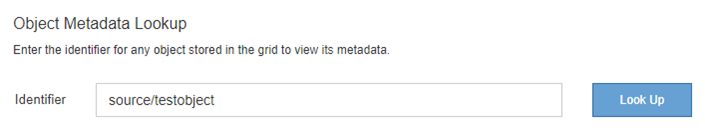

= Fehlerbehebung bei Objekt- und Storage-Problemen
:allow-uri-read: 
:icons: font
:imagesdir: ../media/

[role="lead"]
Sie können verschiedene Aufgaben ausführen, um die Ursachen von Objekt- und Storage-Problemen zu ermitteln.

== Bestätigen der Speicherorte von Objektdaten

Je nach Problem sollten Sie überprüfen, wo Objektdaten gespeichert werden. Beispielsweise möchten Sie überprüfen, ob die ILM-Richtlinie wie erwartet funktioniert und Objektdaten dort gespeichert werden, wo sie geplant sind.

.Was Sie benötigen
* Sie müssen über eine Objektkennung verfügen, die einer der folgenden sein kann:
+
** *UUID*: Der Universally Unique Identifier des Objekts. Geben Sie die UUID in allen Großbuchstaben ein.
** *CBID*: Die eindeutige Kennung des Objekts in StorageGRID. Sie können die CBID eines Objekts aus dem Prüfprotokoll abrufen. Geben Sie die CBID in allen Großbuchstaben ein.
** *S3-Bucket und Objektschlüssel*: Bei Aufnahme eines Objekts über die S3-Schnittstelle verwendet die Client-Applikation eine Bucket- und Objektschlüsselkombination, um das Objekt zu speichern und zu identifizieren.
** *Swift Container und Objektname*: Wenn ein Objekt über die Swift-Schnittstelle aufgenommen wird, verwendet die Client-Anwendung eine Container- und Objektname-Kombination, um das Objekt zu speichern und zu identifizieren.

.Schritte
. Wählen Sie *ILM* > *Objekt Metadaten Lookup* aus.
. Geben Sie die Kennung des Objekts in das Feld *Kennung* ein.
+
Sie können eine UUID, CBID, S3 Bucket/Objektschlüssel oder Swift Container/Objektname eingeben.

+

. Klicken Sie Auf *Look Up*.
+
Die Ergebnisse der Objektmetadaten werden angezeigt. Auf dieser Seite werden die folgenden Informationstypen aufgeführt:

+
** Systemmetadaten, einschließlich Objekt-ID (UUID), Objektname, Name des Containers, Mandantenkontenname oder -ID, logische Größe des Objekts, Datum und Uhrzeit der ersten Erstellung des Objekts sowie Datum und Uhrzeit der letzten Änderung des Objekts.
** Alle mit dem Objekt verknüpften Schlüssel-Wert-Paare für benutzerdefinierte Benutzer-Metadaten.
** Bei S3-Objekten sind alle dem Objekt zugeordneten Objekt-Tag-Schlüsselwert-Paare enthalten.
** Der aktuelle Storage-Standort jeder Kopie für replizierte Objektkopien
** Für Objektkopien mit Erasure-Coding-Verfahren wird der aktuelle Speicherort der einzelnen Fragmente gespeichert.
** Bei Objektkopien in einem Cloud Storage Pool befindet sich der Speicherort des Objekts, einschließlich des Namens des externen Buckets und der eindeutigen Kennung des Objekts.
** Für segmentierte Objekte und mehrteilige Objekte, eine Liste von Objektsegmenten einschließlich Segment-IDs und Datengrößen. Bei Objekten mit mehr als 100 Segmenten werden nur die ersten 100 Segmente angezeigt.
** Alle Objekt-Metadaten im nicht verarbeiteten internen Speicherformat. Diese RAW-Metadaten enthalten interne System-Metadaten, die nicht garantiert werden, dass sie über Release bis Release beibehalten werden.
+
Das folgende Beispiel zeigt die Ergebnisse für die Suche nach Objektmetadaten für ein S3-Testobjekt, das als zwei replizierte Kopien gespeichert ist.

+
image::../media/object_lookup_results.png[Ergebnisse Für Objekt-Lookup]

.Verwandte Informationen
link:../ilm/index.html["Objektmanagement mit ILM"]

link:../s3/index.html["S3 verwenden"]

link:../swift/index.html["Verwenden Sie Swift"]

== Fehler beim Objektspeicher (Storage Volume)

Der zugrunde liegende Storage auf einem Storage-Node ist in Objektspeicher unterteilt. Diese Objektspeicher sind physische Partitionen, die als Bereitstellungspunkte für den Storage des StorageGRID Systems fungieren. Objektspeicher werden auch als Storage Volumes bezeichnet.

Sie können die Objektspeicherinformationen für jeden Speicherknoten anzeigen. Objektspeicher werden unten auf der Seite *Nodes* > *_Storage Node_* > *Storage* angezeigt.

image::../media/nodes_page_storage_nodes_storage_tables.png[Knoten Seite Speicher Knoten Speichertabellen]

Führen Sie die folgenden Schritte aus, um weitere Details zu jedem Storage-Node anzuzeigen:

. Wählen Sie *Support* > *Tools* > *Grid Topology* Aus.
. Wählen Sie *_site_* > *_Storage Node_* > *LDR* > *Storage* > *Übersicht* > *Haupt*.

image::../media/storage_node_object_stores.png[Storage-Node-Objektspeicher]

Je nach Art des Ausfalls können Fehler bei einem Storage-Volume in einem Alarm über den Storage-Status oder den Zustand eines Objektspeicher gespiegelt werden. Wenn ein Speichervolume ausfällt, sollten Sie das ausgefallene Speichervolume reparieren, um den Speicherknoten so bald wie möglich wieder voll zu machen. Wenn nötig, können Sie auf die Registerkarte *Konfiguration* gehen und den Speicherknoten in einen Read‐only Zustand setzen, so dass das StorageGRID System ihn für den Datenabruf verwenden kann, während Sie sich auf eine vollständige Wiederherstellung des Servers vorbereiten.

.Verwandte Informationen
link:../maintain/index.html["Verwalten Sie  erholen"]
